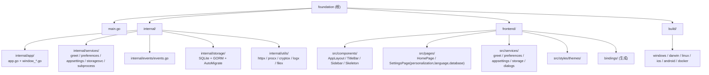

# Foundation - Wails v3 桌面应用脚手架

## 项目愿景

`foundation` 是一个开箱即用的跨平台桌面应用脚手架，基于 Wails v3 + React 19 + MUI 9，为新项目提供：

- 已分层的 Go 后端（`internal/app` + `internal/services` + `internal/events`）
- 已分平台的窗口配置（Windows/Linux 无边框前端自绘，macOS 沉浸式标题栏保留红绿灯）
- 已落地的前端 MVVM 规范（每个组件 / 页面独立文件夹，View / ViewModel / Style 三件分离）
- 已实现的 Discord 风格三栏布局（ServerList + ChannelList + Content）+ 方圆按钮主题
- README 中的「改名引导」让使用者一步把脚手架变成自己的项目

## 架构总览

- 后端：Go 1.25，`main.go` 仅做 `embed.FS` + `app.Run`，业务装配集中在 `internal/app`。
- 前端：React 19 + TypeScript（strict）+ MUI 9 + Vite 8，主题统一在 `frontend/src/styles/theme.ts`。
- 通信：通过 `wails3 generate bindings` 生成 `frontend/bindings/foundation/...`，前端 `services/` 层包装。
- 构建：根 `Taskfile.yml` 调用各平台子 Taskfile（Windows/macOS/Linux/iOS/Android/Docker）。

通信链路：

```
React 组件 (View)
    └── ViewModel (use<Page>)
        └── services/GreetService.ts
            └── @bindings/foundation/internal/services/greet (Wails 生成)
                └── 后端 internal/services/greet.Greet

后端 internal/events/events.go (RegisterEvent[string]("time"))
    └── internal/app/app.go: app.Event.Emit("time", ...)
        └── 前端 shared/hooks/useTimeEvent.ts (Events.On)
```

## 模块结构图



## 模块索引

| 模块 | 路径 | 语言/技术 | 一句话职责 |
|------|------|-----------|------------|
| 应用入口 | `main.go` | Go | 仅含 `embed.FS` 与 `app.Run(assets)`，业务下沉到 `internal/` |
| 应用启动 | `internal/app/` | Go | 服务注册、平台窗口配置、事件循环 |
| 业务服务 | `internal/services/` | Go | Wails Service（每个领域一个子包：greet / preferences / appsettings / storagesvc / subprocess） |
| 持久化层 | `internal/storage/` | Go + GORM | SQLite 打开 / PRAGMA / AutoMigrate / 路径配置 / Holder |
| 工具层 | `internal/utils/` | Go | httpx（HTTP）/ procx（子进程 + JobObject）/ cryptox（AES-GCM）/ logx（slog + rotate）/ filex（原子写） |
| 事件契约 | `internal/events/` | Go | 集中注册类型化事件，前后端共享名称 |
| 前端 UI | `frontend/` | React 19 + MUI 9 + TS | 用户界面、调用 Service、订阅事件 |
| 多平台构建 | `build/` | Taskfile / Gradle / Shell / nfpm | 各平台打包脚本与资源 |

## 运行与开发

前置条件：Go 1.25+、Node.js + pnpm、`wails3` CLI、`task` (go-task)。

| 命令 | 说明 |
|------|------|
| `wails3 dev` 或 `task dev` | 前后端热重载（Vite 端口默认 9245） |
| `wails3 generate bindings` | 重新生成 `frontend/bindings/<module>/...` |
| `task build` | 当前 OS 生产构建 |
| `task package` | 当前 OS 打包 |
| `cd frontend && pnpm install` | 首次或更新依赖后 |
| `cd frontend && pnpm typecheck` | TypeScript 类型检查 |
| `cd frontend && pnpm build` | 前端单独生产构建 |
| `go build .` | 后端单独构建（需要 `frontend/dist` 已存在） |

## 改名 / 业务化指南

由于 `foundation` 既是模块名又是 bindings 路径前缀，改名顺序很关键：

1. 改 `go.mod` 的 `module foundation` → `module <你的名字>`
2. 全局替换 `import "foundation/internal/app"` 为新模块名
3. 改前端 `services/greet/GreetService.ts` 中的 `@bindings/foundation/...` 路径
4. 跑 `go mod tidy` 与 `wails3 generate bindings`
5. 改 `build/config.yml` 的 `info.*` 字段并 `wails3 task common:update:build-assets`
6. 改 `Taskfile.yml` 的 `APP_NAME`、`internal/app/app.go` 的 `Name/Description`、`frontend/src/App.tsx` 的 title

完整对照表见 [README.md](./README.md)。

## 持久化（SQLite + GORM）

> 详细使用指南见 `.claude/skills/foundation-persistence/SKILL.md`（加表三步、业务 service 接入、路径切换、表统计与清空、Provider 异步化模式、反例）。

应用所有跨会话状态存到 `~/Library/Application Support/Foundation/foundation.db`（macOS）/ `%AppData%\Foundation\foundation.db`（Windows）/ `~/.local/share/Foundation/foundation.db`（Linux），位置可由用户在「设置 → 数据存储」里改。配置文件 `storage.json` 与默认数据库放在同目录（独立于 db）。

**驱动 / ORM**：`modernc.org/sqlite`（纯 Go，无 CGO 需求）+ `gorm.io/gorm` + `github.com/glebarez/sqlite`（GORM 对接 modernc 的适配）。

**关键 PRAGMA**：WAL / `synchronous=NORMAL` / `busy_timeout=5000` / `cache_size=-64000` / `mmap_size=256MB` / `temp_store=MEMORY` / `foreign_keys=ON`。

**模型注册中心**：`internal/storage/models.go` 的 `AllModels` 数组。**加新表零迁移文件**：

```
1. 在 internal/storage/ 写 GORM 结构体（建议新文件 models_<domain>.go 拆开）
2. 把 &YourModel{} 追加到 AllModels
3. 重启 → AutoMigrate 自动建表 / 加列 / 加索引
```

GORM AutoMigrate **不会**做：删列、删表、重命名字段；这些保留旧 schema 不丢数据。需要重命名字段时业务方手写一次性数据迁移钩子。

**业务 service 接入持久化**：

```go
// internal/services/<domain>/<domain>.go
type Service struct {
    holder *storage.Holder // 不要 capture *storage.DB —— 切换路径会替换它
}

func (s *Service) DoSomething(ctx context.Context) error {
    return s.holder.Current().GORM.WithContext(ctx).Save(...).Error
}
```

切换路径时（`storagesvc.SetCustomPath`）会原子替换 holder 内的 DB 指针，业务 service 继续从 `holder.Current()` 取永远拿到活跃句柄。

## 测试策略

当前仓库无测试代码（Go / 前端均无）。建议：

- Go：`internal/services/<domain>/<name>_test.go` 用标准 `go test`。

<!-- Content truncated to meet Windsurf 6KB limit -->

---
> Source: [FxRayHughes/foundation](https://github.com/FxRayHughes/foundation) — distributed by [TomeVault](https://tomevault.io).
<!-- tomevault:4.0:windsurf_rules:2026-06-02 -->
