# NemoNotch — CLAUDE.md

## Project Overview

NemoNotch is a macOS notch utility that provides an interactive floating panel in the MacBook notch area, integrating media controls, calendar events, AI CLI monitoring (Claude Code / Gemini CLI / opencode / zcode), multi-agent monitoring (OpenClaw / Hermes-agent), and an app launcher.

### Tech Stack

- Swift 6 + SwiftUI, macOS only, depends on CocoaLumberjack, KeyboardShortcuts, mediaremote-adapter (perl-bridge media control)
- Key frameworks: AppKit (NSWindow), MediaPlayer, EventKit, IOKit

### Project Structure

```
NemoNotch/
├── NemoNotchApp.swift           # Entry point, MenuBarExtra, global hotkeys, service assembly
├── Models/                      # Data models (Tab, AppSettings, AIProvider, PlaybackState, MultiAgentMonitor, etc.)
├── Notch/                       # Notch UI core (window, animation, event monitoring, TabBar, HUD)
├── Tabs/                        # Tab content views (AIChatTab unifies AI sessions, AgentMonitorTab unifies agents)
├── Services/                    # Background services (media, calendar, AI CLI, launcher, HermesService, etc.)
├── Settings/                    # Settings UI
└── Helpers/                     # Utilities (MarkdownRenderer, ClaudeCrabIcon, ToolStyles)
```

## Architecture

### Overview

```mermaid
graph TB
    subgraph Entry["App Entry"]
        App["NemoNotchApp<br/>@main"]
        AD["AppDelegate<br/>Lifecycle & Service Assembly"]
    end

    subgraph Services["Service Layer — all @Observable"]
        MS["MediaService<br/>MediaRemote (notifications) + NowPlayingCLI (read) + MediaRemoteCommander (control)"]
        AIM["AICLIMonitorService<br/>Unified AI entry + owns AISessionStore"]
        AISS["AISessionStore<br/>Central AI session truth source (@Observable)"]
        CCS["ClaudeCodeService<br/>AIProvider impl<br/>HookServer + ConversationParser"]
        GP["GeminiProvider<br/>AIProvider impl<br/>GeminiConversationParser"]
        REG["AgentMonitorRegistry<br/>Unifies agent monitors"]
        OCS["OpenClawService<br/>WebSocket client (MultiAgentMonitor)"]
        HES["HermesService<br/>HTTP API client (MultiAgentMonitor)"]
        CS["CalendarService<br/>EventKit"]
        LS["LauncherService<br/>App search & launch"]
        NS["NotificationService<br/>Dock Accessibility API"]
        WS["WeatherService<br/>wttr.in"]
        UQS["UsageQuotaService<br/>Claude + Codex + Gemini usage quota"]
        HUD["HUDService<br/>Volume/Brightness/Battery"]
        SYS["SystemService<br/>CPU/memory/disk sampling (SystemTab)"]
        TS["TaskStore<br/>Persistent TODO list (~/.NemoNotch/tasks.json)"]
        PHS["PomodoroHistoryStore<br/>Append-only history (~/.NemoNotch/pomodoro-history.json)"]
        PTS["PomodoroTimerService<br/>State machine + tick + end-alert pipeline"]
        NPM["NotificationPermissionMonitor<br/>UNUserNotificationCenter probe"]
        HK["Hotkeys.swift<br/>KeyboardShortcuts registration (AppDelegate.setupHotkeys)"]
        CFS["CompletionFlashService<br/>Observes AISessionStore + AgentMonitorRegistry<br/>throttle/merge → drives flash + toast"]
    end

    subgraph NotchUI["Notch UI Layer"]
        NC["NotchCoordinator<br/>Open/close state & animation"]
        NW["NotchWindow<br/>NSPanel .statusBar+8"]
        NV["NotchView<br/>SwiftUI main view"]
        EM["EventMonitor<br/>Mouse event listener"]
        CB["CompactBadge<br/>Collapsed icons"]
        TB["TabBarView<br/>Tab navigation"]
        HO["HUDOverlayView<br/>Volume/Brightness overlay"]
    end

    subgraph Tabs["Tabs"]
        OT["OverviewTab<br/>Media + Calendar + Weather"]
        AT["AIChatTab<br/>Claude + Gemini unified"]
        LT["LauncherTab"]
        OCT["AgentMonitorTab<br/>OpenClaw + Hermes unified"]
        PT["PomodoroTab<br/>Idle stats + TODO list + active pie"]
        ST["SystemTab"]
    end

    subgraph Settings["Settings"]
        AS["AppSettings<br/>UserDefaults persistence"]
        SW["SettingsWindow"]
        SV["SettingsView"]
    end

    App --> AD
    AD -->|"creates & owns"| Services
    AD -->|"creates"| NC
    AIM --> CCS
    AIM --> GP
    AIM -->|"owns"| AISS
    CCS -.->|"mutate"| AISS
    GP -.->|"mutate"| AISS
    REG -->|"registers"| OCS
    REG -->|"registers"| HES
    NC --> NW --> NV
    NV --> Tabs
    NV --> CB
    NV --> TB
    NV --> HO
    EM -->|"mouse events"| NC
    HK -->|"hotkeys"| NC
    AS --> SV

    Services -.->|"@Environment injection"| NV
    AS -.->|"@Environment injection"| NV
```



Core data flow: Service → @Observable property changes → SwiftUI auto-redraw → Tab content updates.

### AI Service Architecture

```mermaid
graph LR
    subgraph External["External Processes"]
        CC["Claude Code CLI"]
        GC["Gemini CLI"]
        OC["opencode CLI"]
        ZC["zcode CLI"]
    end

    subgraph Monitor["AICLIMonitorService — unified entry, owns the store"]
        HS["HookServer<br/>/tmp/nemonotch.sock"]
        CP["ConversationParser<br/>Claude JSONL"]
        GCP["GeminiConversationParser<br/>Gemini JSON"]

<!-- Content truncated to meet Windsurf 6KB limit -->

---
> Source: [GaoZimeng0425/NemoNotch](https://github.com/GaoZimeng0425/NemoNotch) — distributed by [TomeVault](https://tomevault.io).
<!-- tomevault:4.0:windsurf_rules:2026-07-08 -->
