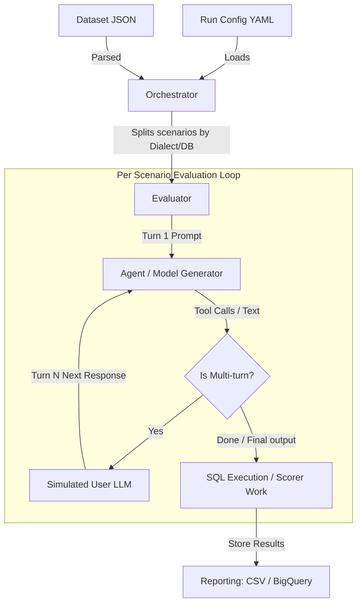

# EvalBench: Agentic Onboarding & Development Guide

Welcome to **EvalBench**! This guide is specifically designed for AI coding assistants and new developers to help you understand the repository's architecture, evaluation modes, codebase structure, and contribution flows.

---

## Table of Contents
- [Overview & Objectives](#overview--objectives)
- [Project Architecture](#project-architecture)
- [Module Directory Layout](#module-directory-layout)
- [Tool Paradigms & Generators](#tool-paradigms--generators)
- [Core Workflows & Lifecycle](#core-workflows--lifecycle)
- [Configuration Schemas](#configuration-schemas)
- [Local Development & Execution](#local-development--execution)
- [Troubleshooting & Tips](#troubleshooting--tips)

---

## Overview & Objectives

**EvalBench** is a highly flexible testing and evaluation framework designed to measure the quality of Generative AI (GenAI) workflows, specifically focusing on:
- **Database specific tasks**: Generating valid DDL, DML, and DQL across multiple database types (AlloyDB, BigQuery, Spanner, Postgres, SQLite, etc.).
- **Agent Multi-turn journeys**: Simulating complex user interactions where an LLM-based simulated user responds to the agent's questions or drives the conversation via a predetermined plan.
- **Extensible Scoring**: Evaluating outputs with a plug-and-play suite of deterministic and LLM-based scorers.

> [!NOTE]
> The core design principle of EvalBench is isolation. Each multi-turn execution runs in a sandboxed home directory (`.venv/fake_home/` or `.venv/fake_home_claude/`) to prevent local machine environment contamination.

---

## Project Architecture

EvalBench separates evaluation into distinct **orchestrators**, **evaluators**, **generators**, and **scorers**.



### Core Components
- **Orchestrators**: Manages dataset breakdown and parallel execution stages (`OneShotOrchestrator`, `InteractOrchestrator`, `AgentOrchestrator`, `DataAgentOrchestrator`).
- **Evaluators**: Executes the test scenario lifecycles for a given dialect or database (`Evaluator`, `InteractEvaluator`, `AgentEvaluator`, `DataAgentEvaluator`).
- **Generators**: Acts as the driver for the tested model or CLI (`GeminiCliGenerator`, `ClaudeCodeGenerator`, `CodexCliGenerator`, `AgyCliGenerator`, `QueryData`).
- **Simulated Users**: Drives conversations autonomously by translating conversation plans into user messages.
- **Scorers**: Computes correctness metrics (Exact Match, LLM-Rater, Trajectory Matcher, Behavioral Metrics).

---

## Module Directory Layout

```
evalbench/
├── client/           # API clients for EvalBench services
├── databases/        # Database drivers & connection pooling logic
│   ├── alloydb.py
│   ├── bigquery.py
│   ├── spanner.py
│   └── sqlite.py
├── dataset/          # Dataset format parsers & loading logic
│   ├── dataset.py
│   ├── evalinput.py
│   └── evalgeminicliinput.py
├── evalproto/        # Protobuf definitions for gRPC evaluation service
├── evaluator/        # The core execution engines
│   ├── agentevaluator.py        # Gemini CLI / Claude Code multi-turn evaluator
│   ├── agentorchestrator.py     # Multi-turn Agent orchestrator
│   ├── evaluator.py             # Base single-turn (oneshot) evaluator
│   └── oneshotorchestrator.py   # Base oneshot orchestrator
├── generators/       # Tested system adapters
│   ├── models/
│   │   ├── claude_code.py  # Claude Code driver
│   │   ├── codex_cli.py    # Codex CLI driver
│   │   ├── gemini_cli.py   # Gemini CLI driver
│   │   └── agy_cli.py      # Antigravity (agy) CLI driver
│   └── prompts/
├── mp/               # Multi-processing / multi-threading runners
│   └── mprunner.py
├── reporting/        # Output formatting and report generation
│   ├── bqstore.py
│   └── csv.py
├── scorers/          # Correctness and efficiency metrics
│   ├── exactmatcher.py
│   ├── goalcompletionrate.py
│   ├── llmrater.py
│   └── trajectorymatcher.py
├── util/             # Helper functions (Config, Rate Limits, CLI Fakes)
└── work/             # Concurrency work items (SQLGenWork, ScorerWork)
```

---

## Tool Paradigms & Generators

When evaluating agentic frameworks that leverage external tools (e.g., Gemini CLI, Claude Code), EvalBench translates and tests three primary tool paradigms:

| Paradigm | Supported Generators | How it Works |
|---|---|---|
| **MCP Servers** | `gemini_cli`, `claude_code`, `codex_cli`, `agy_cli` | Remote HTTP/SSE or local stdio-based Model Context Protocol servers |

<!-- Content truncated to meet Windsurf 6KB limit -->

---
> Source: [GoogleCloudPlatform/evalbench](https://github.com/GoogleCloudPlatform/evalbench) — distributed by [TomeVault](https://tomevault.io).
<!-- tomevault:4.0:windsurf_rules:2026-07-22 -->
