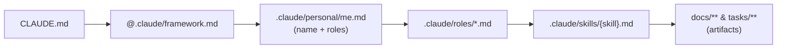

# Repository Guidelines

## Project Overview

**AI Workflow** is a Claude AI workflow framework distributed as a *template repository*. It scaffolds role definitions, task skills, a standard artifact directory structure, and a statusline into any target project via `install.sh`. The goal: let a whole software team (not just developers) use Claude AI with consistent, role-aware, artifact-driven processes.

**This repo is the framework source**, not an installed instance. Editing here means authoring the Markdown templates and shell installer that get copied into *other* projects. There is no compiled code and no application runtime — it is Bash + Markdown.

## Architecture & Data Flow

Two-layer model: **roles** (who you are) select **skills** (what to do), which produce **artifacts** (Markdown files with YAML frontmatter linked by a `parent` chain).



- **Session flow**: Claude reads `CLAUDE.md` → loads `framework.md` → reads `.claude/personal/me.md` (prompts first-time setup if missing) → loads matching `roles/*.md` → when a request matches a listed skill, reads `skills/{name}.md` and follows its phased process → writes artifacts to conventional paths.
- **Traceability**: artifacts link upstream via the frontmatter `parent` field (spec → epic → story → task → test-plan). Status changes are handoff signals between roles.
- **Status lifecycle**: `draft → in-review → approved → in-progress → done`.
- **File ownership**: *managed* files (`roles/`, `skills/`, `framework.md`, `statusline.sh`) are overwritten by the installer/`--update`; *team-owned* files (`CLAUDE.md`, `.claude/personal/`, all `docs/`+`tasks/` artifacts) are never touched.

## Key Directories

| Path | Purpose |
|------|---------|
| `install.sh` | Bash installer that scaffolds the framework into a target project |
| `template/` | Everything copied into target projects |
| `template/framework.md` | Core instructions imported via `@.claude/framework.md` |
| `template/skills/` | 30 task skills (`implement.md`, `create-design.md`, `write-spec.md`, …) |
| `template/statusline.sh` | Claude Code statusline renderer (model · context bar · cost · git branch) |
| `template/*.template`, `template/gitignore.append` | Scaffold sources for team-owned files |
| `docs/` | Framework's own documentation (architecture, roles, decisions) |

## Development Commands

There is no build/test/lint toolchain. Work is exercised by running the installer against a scratch target.

```bash
# Install into a target project (default target: current dir)
./install.sh /path/to/target

# Update managed files only (roles, skills, framework, statusline) — leaves team-owned files
./install.sh --update /path/to/target

# Preview without writing anything
./install.sh --dry-run /path/to/target

# Help
./install.sh --help

# Smoke-test a change to install.sh
./install.sh --dry-run /tmp/scratch && ./install.sh /tmp/scratch

# Exercise the statusline manually (needs jq)
echo '{"model":{"display_name":"Opus"},"workspace":{"current_dir":"'"$PWD"'"},"context_window":{"used_percentage":45},"cost":{"total_cost_usd":0.85}}' | bash template/statusline.sh
```

## Code Conventions & Common Patterns

### Shell (`install.sh`, `statusline.sh`)
- POSIX-ish Bash, strict mode: `set -euo pipefail` (`install.sh:2`).
- Always double-quote expansions: `"$var"`. Null-safe checks: `[ -n "$var" ] && [ "$var" != "null" ]`.
- `install.sh` is **idempotent**: `grep` guards prevent duplicate `.gitignore` / config appends; managed copies always overwrite, team-owned files only created when absent.
- `statusline.sh` never breaks rendering — missing `jq` prints a fallback and `exit 0`; missing git degrades silently. Only external dep is `jq`.

### Skill files (`template/skills/*.md`)
Uniform structure — match it when adding/editing skills:
```markdown
---
name: implement
description: <one-line summary>
roles: [software-developer]
trigger: <when the user request should invoke this>
output-path: docs/design/{kebab-name}.md   # or null
---
# <Title>
## When to use
## Process
### Phase 1: Context Gathering   # read first, brainstorm second
### Phase 2: ...                 # draft/plan (often "adaptive" by risk)
### Phase 3: Verification
### Phase 4: Wrap-Up             # suggest next skill (e.g. update-status)
## Constraints
```
- Skills read upstream artifacts before acting and set `status: draft` + `parent` on output.
- Phases end by suggesting the logical next skill, chaining the lifecycle.

### Role files (`template/roles/*.md`)

<!-- Content truncated to meet Windsurf 6KB limit -->

---
> Source: [haphamdev/workflow](https://github.com/haphamdev/workflow) — distributed by [TomeVault](https://tomevault.io).
<!-- tomevault:4.0:windsurf_rules:2026-09-07 -->
