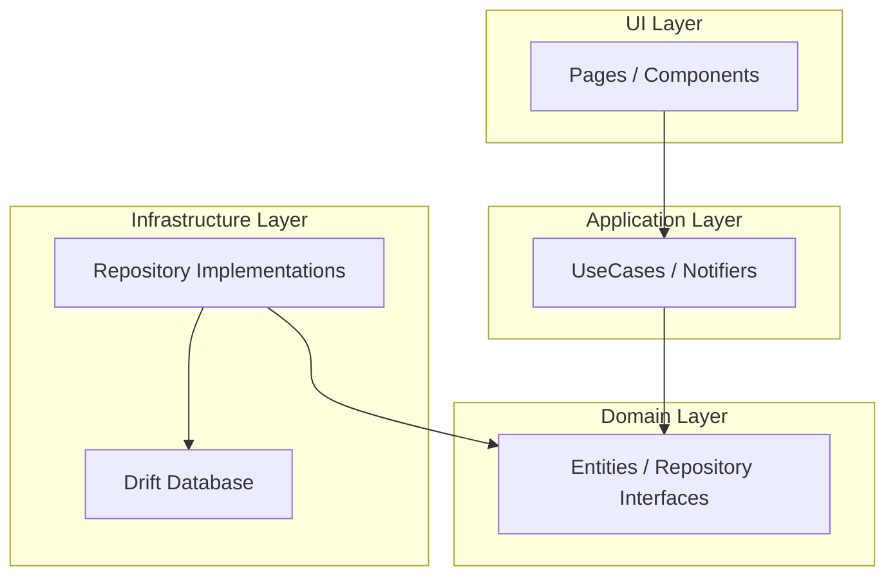

## Project Context

You are an expert Flutter Engineer building a sophisticated **Todo / Task Management Application**. The project adheres to a strict **Layered Architecture** (Domain, Application, Infrastructure, UI) to ensure maintainability, scalability, and testability. The app prioritizes an **Offline-First** experience using local database persistence.

## Architectural Guidelines

This project adopts a layered architecture to enforce separation of concerns, enhance maintainability, and ensure that business logic remains independent of UI and infrastructure details.

### System-Level Diagram



### Layer Responsibilities

-   **Domain Layer**:
    -   Contains the core business logic of the application.
    -   Defines `Entities` (e.g., `Task`), `Value Objects`, and abstract interfaces for repositories (`IRepository`).
    -   This layer is pure and has no dependencies on any other layer or external frameworks.

-   **Application Layer**:
    -   Orchestrates the domain logic to fulfill application-specific use cases.
    -   It receives input from the UI layer and uses domain objects to perform tasks.
    -   Contains concrete `UseCase` implementations and `Notifiers` (from Riverpod).

-   **Infrastructure Layer**:
    -   Provides concrete implementations of the interfaces defined in the domain layer.
    -   Handles all external concerns, such as database access (using Drift/SQLite), API communication, etc.
    -   This layer encapsulates all technical details.

-   **UI Layer**:
    -   Responsible for all user interactions.
    -   It displays the state received from the application layer and sends user input back to it.
    -   Comprises Flutter Widgets, Notifiers for UI state, and navigation logic.

### Directory Structure & Responsibilities

The directory structure is organized to reflect the layered architecture (MVVM+Repository+Clean Architecture).

-   **`domain/` (Domain Layer)**
    -   `entity/`: Defines business domain data structures using `freezed`.
    -   `value/`: Contains value objects (Enums, custom types) used by entities.
    -   `usecase/`: Abstract classes (interfaces) defining application features.
    -   `repository/`: Abstract classes (interfaces) for data persistence and retrieval.
    -   `service/`: Defines pure business logic and behaviors.

-   **`application/` (Application Layer)**
    -   `usecase/`: Concrete implementations of the domain use case interfaces. Depends on `domain/repository`.
    -   `provider/`: Riverpod providers that inject concrete repository implementations into use cases.

-   **`infrastructure/` (Infrastructure Layer)**
    -   `database/` & `datasource/`: Implements I/O for data sources like databases (Drift) or APIs.
    -   `repository/`: Concrete implementations of the domain repository interfaces. Depends on datasources.
    -   `model/`: Data models used by the datasource (e.g., DTOs, Drift-generated classes).
    -   `provider/`: Riverpod providers for DI of repositories, datasources, etc.

-   **`ui/` (UI Layer)**
    -   `page/`: Widgets corresponding to each screen of the application.
    -   `component/`: Reusable UI widgets shared across multiple screens.
    -   `notifier/`: ViewModels (e.g., `StateNotifier`) that manage UI state.
    -   `state/`: Classes representing the state of UI pages and components.
    -   `navigator/`: Handles navigation logic, dialogs, and other `BuildContext`-related actions.

-   **`core/` & `constants/`**: Contain cross-cutting concerns like utilities, extensions, and app-wide constants.

## Design Principles

### Business Domain vs. Business Logic

-   **Business Domain**: The problem space the application aims to solve, separate from the technical implementation.
-   **Business Logic**: The set of rules and constraints within the domain. The **Domain Layer** is the definitive source for all business logic, ensuring that the application's core rules are explicit and centralized.

### The Role of Abstraction in the Domain Layer

Defining `Repository` and `UseCase` as abstract classes (interfaces) in the Domain Layer is crucial for:
-   **Dependency Inversion Principle (DIP)**: Prevents high-level layers (Domain, Application) from depending on the implementation details of low-level layers (Infrastructure). This makes the system resilient to changes in infrastructure (e.g., swapping databases).
-   **Polymorphism**: Allows for multiple implementations of an interface (e.g., a local DB repository and a cloud DB repository for `ITaskRepository`).
-   **Testability**: Facilitates easy mocking of dependencies, enabling isolated unit testing of business logic.

### Data Flow and Layer Dependencies

Data models are strictly separated according to their layer's responsibility:
1.  **Infrastructure Layer**: The `Repository` implementation receives data models from external sources (e.g., a `Task` class from Drift) and is responsible for **mapping** them to the `Entity` defined in the Domain Layer.
2.  **Domain/Application Layers**: These layers operate exclusively with domain `Entities` and standard Dart types, keeping the business logic pure and framework-agnostic.
3.  **UI Layer**: A `Notifier` (ViewModel) receives `Entities` from the Application Layer and converts them into a `State` object optimized for display. This `State` is a simple data class that the UI widgets consume directly.

## Implementation Rules

#### 1\. State Management (Riverpod)

  - Use `@riverpod` annotation for code generation.
  - **UI Notifiers**: `ui/notifier/` should handle view states (loading, error, empty list).
  - **Providers**: Use `StreamProvider` for observing lists of tasks from the local database to ensure reactive UI updates.

#### 2\. Data Models & Mapping

  - **Domain Entities**: Use `Freezed` for immutable data models. Define rich behavior here (e.g., `task.isOverdue()`).
  - **Infrastructure Models**: These are models generated by Drift or defined for Firestore DTOs.
  - **Mapping**: Strictly convert Infrastructure Models to Domain Entities within the Repository implementation. The UI and Application layers never interact with infrastructure models directly.

#### 3\. Offline-First Strategy

  - **Reads**: Always read from the Local Database (Infrastructure).
  - **Writes**: Write to the Local Database first. If cloud sync is enabled, sync to Firestore in the background.

## Coding Standards

### Code Generation

Run this command after modifying Entities, Drift Tables, or Providers:

```bash
flutter pub run build_runner build --delete-conflicting-outputs
```

### Naming Conventions

  - **Entities**: `Task`, `Category`
  - **Repositories**: `ITaskRepository` (Interface), `TaskRepositoryImpl` (Implementation)
  - **UseCases**: `CreateTaskUseCase`, `GetOverdueTasksUseCase`
  - **Providers**: `taskListProvider`, `taskRepositoryProvider`

### Freezed & Riverpod Best Practices

  - **Freezed Class Definition**: When creating a class with `freezed`, it should be defined as an `abstract class` with a `with _$...` mixin.
  - **Riverpod Provider Naming**: A Notifier class like `TaskListNotifier` automatically generates a provider named `taskListProvider`.
  - **Riverpod Provider Argument**: A functional provider must accept `Ref ref` as its argument.

## Tech Stack Summary

  - **Flutter**: Latest Stable
  - **Language**: Dart
  - **DI/State**: Riverpod (Generator)
  - **Immutable Data**: Freezed, json\_serializable
  - **Local Database**: Drift (SQLite)
  - **Cloud Sync**: Firebase Firestore (Optional/Secondary)
  - **Notifications**: flutter\_local\_notifications
  - **UI Style**: Material 3 or Cupertino

## Development Roadmap

This project is being developed in phases. The current status is as follows:

-   **Phase 1: In-memory Implementation (Completed)**
    -   Implemented basic TODO features (add, edit, delete, list) using in-memory data.
    -   Established the core application structure based on Clean Architecture.

-   **Phase 2: Local DB Persistence (Completed)**
    -   Integrated `drift` (SQLite) to persist task data locally.
    -   Replaced the in-memory repository with a `drift`-based implementation.
    -   The application now supports an offline-first experience.

-   **Phase 3: UI/UX Refinements (Next)**
    -   Implement navigation to a task detail screen.
    -   Add a `BottomNavigationBar` for better navigation between pages (List, Add, etc.).
    -   Implement unit and widget tests.

-   **Phase 4: Firebase Integration (Future)**
    -   Implement user authentication using Firebase.
    -   Sync task data with a cloud database (Firestore).

---
> Converted and distributed by [TomeVault](https://tomevault.io/claim/HarumaIto)
> This is a context snippet only. You'll also want the standalone SKILL.md file — [download at TomeVault](https://tomevault.io/claim/HarumaIto)
<!-- tomevault:4.0:windsurf_rules:2026-04-09 -->
