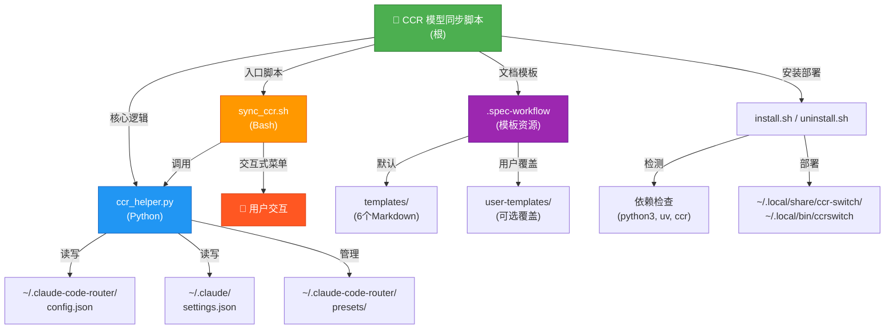

# CCR 模型同步脚本 · CLAUDE 报告

**文档版本**: 2.0 | **生成时间**: 2025-12-18 | **覆盖范围**: 完整初始化扫描

---

## 项目愿景

致力于提供一个**可重复、可审计的本地工具链**，用 **Python + Bash** 一键对 Claude Code Router (CCR) 的模型路由与 Claude Code 设置进行同步，并配套 **Spec Workflow 模板体系**，确保需求/设计文档的结构化沉淀与知识积累。

**核心价值**:
- 🔄 **自动化同步** - 一键将 CCR 路由配置与 Claude Code 客户端保持一致
- 📋 **预设管理** - 快速保存与恢复完整的路由配置快照，支持场景切换
- 🎯 **交互式管理** - 提供菜单驱动的用户界面，降低学习曲线
- 📚 **文档模板** - 内置规范化的需求/设计/任务模板，支持用户覆盖机制
- 🌐 **全局命令** - 一次安装，任何目录均可调用 `ccrswitch`

---

## 架构总览

```
Claude Code Router Switch (CCR 模型同步脚本)
│
├─ [核心引擎层]
│  ├─ ccr_helper.py (Python 助手)
│  │  └─ 职责: JSON 配置读写、路由/模型操作、预设管理、设置同步
│  │
│  └─ sync_ccr.sh (Bash 启动器)
│     └─ 职责: 交互式菜单、用户输入处理、流程编排
│
├─ [安装与部署层]
│  ├─ install.sh
│  │  └─ 检测依赖 → 复制脚本 → 创建全局命令
│  │
│  └─ uninstall.sh
│     └─ 清理已安装的所有文件
│
├─ [文档模板层] .spec-workflow/
│  ├─ templates/ (默认模板)
│  │  ├─ requirements-template.md (需求文档)
│  │  ├─ design-template.md (设计文档)
│  │  ├─ tasks-template.md (任务规划)
│  │  ├─ product-template.md (产品指南)
│  │  ├─ tech-template.md (技术指南)
│  │  └─ structure-template.md (结构指南)
│  │
│  └─ user-templates/ (用户覆盖)
│     └─ README.md (覆盖机制说明)
│
└─ [配置与文档]
   ├─ README.md / README.zh.md (项目使用指南)
   ├─ CLAUDE.md (本文档)
   ├─ LICENSE (MIT)
   ├─ .gitignore
   └─ .vscode/settings.json (IDE 配置)
```

---

## 模块结构图 (Mermaid)



---

## 模块索引与职责

| 模块路径 | 语言 | 职责概述 | 入口 | 测试现状 |
| --- | --- | --- | --- | --- |
| **`.`** (根) | Python / Bash | 核心配置管理、交互式切换、自动同步的主工具链；包括安装部署脚本 | `sync_ccr.sh`, `ccr_helper.py`, `install.sh` | ✅ 人工回归 (无自动化) |
| **`.spec-workflow`** | Markdown | 需求/设计/执行文档模板库，通过"用户优先"机制支持项目级定制 | `templates/*.md`, `user-templates/README.md` | ✅ 文档资产 (无校验脚本) |

---

## 文件清单与扫描结果

### 核心脚本 (3 个)
| 文件 | 行数 | 描述 |
| --- | --- | --- |
| `ccr_helper.py` | 460 | Python 助手：JSON 操作、路由管理、预设管理、设置同步 |
| `sync_ccr.sh` | 352 | Bash 启动器：交互菜单、参数解析、流程编排 |
| `install.sh` | 81 | 安装脚本：依赖检测、文件复制、全局命令创建 |

### 文档文件 (3 个)
| 文件 | 内容摘要 |
| --- | --- |
| `README.md` | 英文使用指南（特性、安装、命令参考、故障排除） |
| `README.zh.md` | 中文使用指南（同英文，语言本地化） |
| `CLAUDE.md` | 项目架构文档（本文档）|

### 配置文件 (2 个)
| 文件 | 描述 |
| --- | --- |
| `.vscode/settings.json` | VS Code Python 环境配置（推荐 Conda） |
| `.gitignore` | Git 忽略规则（Python、系统、IDE 文件） |

### 模板资源 (13 个)
**默认模板** (`.spec-workflow/templates/`)
- `requirements-template.md` - 需求文档模板
- `design-template.md` - 设计文档模板
- `tasks-template.md` - 任务规划模板
- `product-template.md` - 产品指南模板
- `tech-template.md` - 技术指南模板
- `structure-template.md` - 结构指南模板

**用户覆盖机制** (`.spec-workflow/user-templates/`)
- `README.md` - 覆盖使用说明

**模块文档**
- `.spec-workflow/CLAUDE.md` - 模块详细文档

### 其他文件 (2 个)
| 文件 | 描述 |
| --- | --- |
| `uninstall.sh` | 卸载脚本（清理已安装文件） |
| `LICENSE` | MIT 许可证 |

### 已扫描不计入统计的目录
- `.git/` - 版本控制元数据（50+ 文件）
- `.serena/` - 内部工具配置（2 个文件，已忽略）

---

## 运行与开发

### 快速开始 (5 分钟)

```bash
# 1. 克隆或下载仓库
cd /path/to/claude-code-router-switch

# 2. 执行安装脚本
chmod +x install.sh
./install.sh

# 3. 验证安装
ccrswitch
# 应显示菜单，选择 "1" 查看当前路由配置
```

### 本地调试

#### 方式 A: 直接调用 Python 助手 (脚本化)
```bash
# 列出所有模型
uv run python ccr_helper.py list

# 列出所有提供商
uv run python ccr_helper.py list_providers

# 显示当前路由配置
uv run python ccr_helper.py show_router

# 获取所有路由键
uv run python ccr_helper.py get_router_keys

# 添加新模型
uv run python ccr_helper.py add_model "provider_name" "model_name"

# 更新单个路由
uv run python ccr_helper.py update_router "route_key" "provider_name" "model_name"

# 批量更新所有路由
uv run python ccr_helper.py update_router_all "provider_name" "model_name"

# 更新 Claude 设置
uv run python ccr_helper.py update_settings "model_name"

# 预设管理
uv run python ccr_helper.py list_presets
uv run python ccr_helper.py save_preset "preset_name" "description"
uv run python ccr_helper.py load_preset "preset_name"
uv run python ccr_helper.py show_preset "preset_name"
uv run python ccr_helper.py delete_preset "preset_name"
```

#### 方式 B: 交互式菜单 (用户友好)
```bash
# 在仓库目录或安装后运行
./sync_ccr.sh
# 或全局命令
ccrswitch
```

**菜单选项说明**:
```
1. View Current Router Config      - 查看当前路由配置表格
2. View Models                     - 列出所有可用的模型
3. Add Model to Provider           - 向提供商添加新模型
4. Update Router (All Routes)      - 批量更新所有路由到同一模型
5. Update Router (Single Route)    - 针对单个路由更新模型
6. Apply Changes & Exit            - 应用更改、重启 CCR、同步设置
---
Presets Management:
7. View Presets                    - 列出所有已保存的预设

<!-- Content truncated to meet Windsurf 6KB limit -->

---
> Source: [hjnnjh/claude-code-router-switch](https://github.com/hjnnjh/claude-code-router-switch) — distributed by [TomeVault](https://tomevault.io).
<!-- tomevault:4.0:windsurf_rules:2026-04-25 -->
