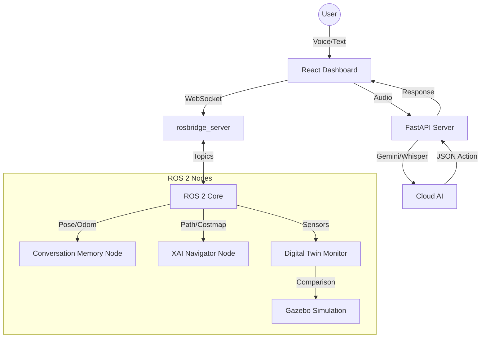

# GEMINI.md - Context & Developer Guide

## 1. Project Overview
**Intelligent Digital Twin with XAI for HRI** is a research-focused robotic system that enhances human-robot interaction through:
1.  **Conversational Memory:** Context-aware multi-turn dialogue.
2.  **Explainable AI (XAI) Navigation:** Natural language explanations for robot decisions.
3.  **Digital Twin Anomaly Detection:** Real-time behavioral monitoring using a parallel simulation.

This project extends a previous "Voice-Controlled ROS 2 Navigation" system, integrating Google's **Gemini 2.5 Flash** for high-level reasoning and command parsing.

### Key Technologies
*   **Frontend:** React 18, TypeScript, Vite, Tailwind CSS, `roslib` (WebSocket).
*   **Backend:** Python 3.10+, FastAPI, Google Gemini 2.5 Flash, OpenAI Whisper.
*   **Robotics:** ROS 2 Humble Hawksbill, Nav2, Gazebo 11, TurtleBot3 (Waffle Pi).
*   **AI/ML:** Gemini API (Reasoning), YOLOv8 (Perception), Scikit-learn (Anomaly Detection).

## 2. Architecture & Data Flow



## 3. Getting Started

### Prerequisites
*   **OS:** Ubuntu 22.04 LTS (or WSL2)
*   **ROS 2:** Humble Hawksbill (Desktop Install)
*   **API Keys:** Google Gemini API Key & OpenAI API Key (in `backend/.env`)

### Installation
1.  **Clone & Build:**
    ```bash
    git clone <repo>
    cd ros2_navigation_project
    colcon build --symlink-install
    source install/setup.bash
    ```
2.  **Environment Setup:**
    *   `backend/.env`: Add `GEMINI_API_KEY` and `OPENAI_API_KEY`.
    *   `project/.env`: Add `VITE_GEMINI_API_KEY` (for frontend-direct calls).

### Running the System

**Option A: Full XAI & Digital Twin System (Recommended)**
Use the stable "Tesla-Style" launcher which sets up a tmux session with all components (Gazebo, Nav2, XAI, YOLO):
```bash
./launch_final_working.sh
```
*   **Access:** Attaches to a tmux session.
*   **Controls:** CLI-based quick commands in Window 6.

**Option B: Simple Voice Dashboard Demo**
Runs the React dashboard and basic backend for voice control testing:
```bash
./start_robot_dashboard.sh
```
*   **Access:** Dashboard at [http://localhost:5173](http://localhost:5173)

## 4. Directory Structure

*   **`backend/`**: FastAPI application (Speech-to-Text, Gemini integration).
*   **`project/`**: React Frontend application (Dashboard, Visualization).
*   **`src/`**: ROS 2 Source Packages.
    *   `xai_navigation_pkg/`: Core XAI logic, decision logging, and explanation generation.
    *   `digital_twin_pkg/`: Anomaly detection and simulation synchronization.
    *   `conversation_memory_pkg/`: Context maintenance for dialogue.
    *   `cartographer_slam/`, `nav2_bringup/`: Navigation configurations.
*   **`scripts/`**: Utility scripts (`cleanup_demo.sh`, `dev_helpers.sh`).

## 5. Development Conventions

*   **ROS 2:**
    *   **Build:** `colcon build --symlink-install` (allows python changes without rebuild).
    *   **Source:** `source install/setup.bash` is mandatory in every new terminal.
    *   **Model:** `export TURTLEBOT3_MODEL=waffle_pi`.
*   **AI Integration:**
    *   Use `project/src/services/geminiService.ts` for frontend AI logic.
    *   Use `backend/app/services/` for backend AI logic.
    *   **Prompts:** Keep system prompts in `services/` or `config/` files, not hardcoded in logic.

## 6. Common Commands

*   **Kill All Services:** `pkill -f "ros|gz|python|node"` or use `./kill_all_services.sh`
*   **Rebuild Specific Package:** `colcon build --packages-select xai_navigation_pkg --symlink-install`
*   **View ROS Topics:** `ros2 topic list`
*   **Monitor Logs:** `rqt_console` or `ros2 topic echo /rosout`

## 7. Troubleshooting
*   **"CUDA Error":** The YOLO launch file is set to `device:=cpu` in `launch_final_working.sh` to avoid GPU crashes.
*   **"Initial Pose":** If navigation fails, ensure you've set the initial pose via RViz or the CLI command provided in the tmux session.
*   **"WebSocket Error":** Ensure `rosbridge_server` is running on port 9090.

---
> Converted and distributed by [TomeVault](https://tomevault.io/claim/howdoiusekeyboard)
> This is a context snippet only. You'll also want the standalone SKILL.md file — [download at TomeVault](https://tomevault.io/claim/howdoiusekeyboard)
<!-- tomevault:4.0:windsurf_rules:2026-04-08 -->
