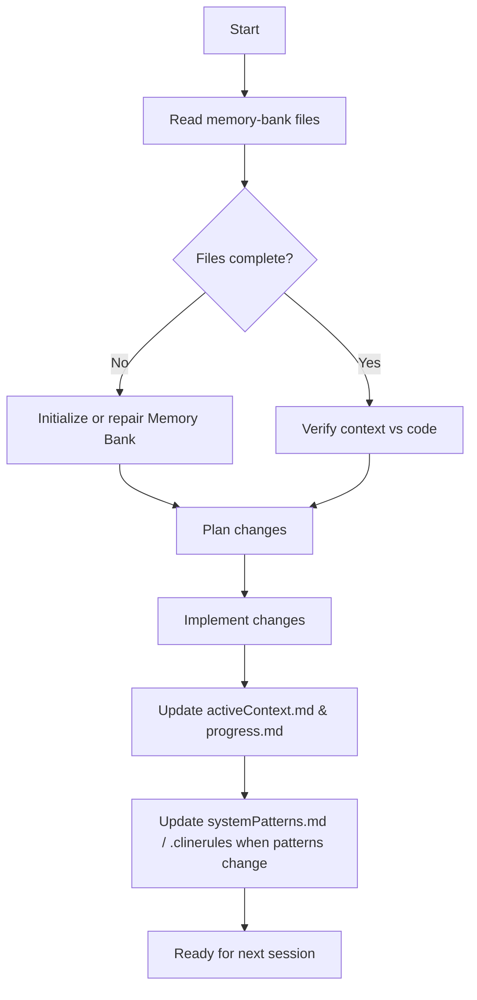

# GLOBAL WRITE SAFETY RULE (ALL AGENTS MUST HONOR THIS RULE WITH 100% COMPLIANCE)

🚫 All files/directories are read-only unless a `.write_exception` file exists in the target or parent directory.

Copilot MAY only write, modify, or delete if a `.write_exception` is present. Otherwise:
- Do NOT create, modify, rename, or delete files/subdirectories.
- STOP and notify if a directory is read-only.
- Request a `.write_exception` or an alternate location if needed.

This rule applies to all files, including `memory-bank/` and `.github/` configuration, unless explicitly overridden by a `.write_exception` file.

---

## Working Directory Rule

All execution/debugging must occur in `bin/instances/tmp`:
- Use relative paths from `bin/instances/tmp`.
- Do NOT assume execution from repo root or elsewhere.
- When suggesting commands, make it clear they should be run from `bin/instances/tmp` unless explicitly stated otherwise.

---

## Python Execution Rule

For any Python execution or example:

1. Activate the virtual environment:
   ```bash
   source ~/pyvenv/bin/activate
```

2. Then run the script:

```bash
python path/to/script.py
```


- Never suggest running Python without activating the virtualenv.
- Never suggest using system Python or a different venv path.
- If rules conflict, the most restrictive applies (read-only overrides all).

---

# GitHub Copilot Coding Agent Instructions for This Repository

You are assisting with a Python-based automation framework that uses a step engine, step node classes, and Graphviz-style workflows.

## Project Overview

Modular Python codebase for step-based workflow orchestration:

- `bin/`: Main scripts and workflow engines.
- `modules/`: Core logic, step node base classes, utilities.
- `instances/`: Environment-specific scripts, configs, demos.
- `bin/docs/`: Deep-dive documentation and analyses.

The system uses a graph-based step engine that:

- Discovers step node classes dynamically from step engine libraries.
- Uses parameter files (JSON + locks) for shared state and engine configuration.
- Can visualize workflows using Graphviz (nodes as steps, edges as transitions).


## Core Step Engine and Node Patterns

### Step Node Class Structure

Each step node class must:

- Inherit from `stepnode_baseclass` (located in `bin/modules/stepnode_baseclass.py`)
- Live in a module named `step_node_module_py_<name>.py`
- Export a `step_node_class_list` variable listing all classes in the module
- Define class attributes:
    - `step_node_graph_dict` - Node metadata including Graphviz attributes, flags
    - `step_arrow_graph_dict` - Outgoing edges with target nodes and visualization
    - `step_node_params_dict_init` - Initial parameter structure
    - `step_node_results_dict_init` - Result structure including status
    - `name` - Node identifier
    - `description` - Human-readable description
- Implement lifecycle methods:
    - `__init__(self, name, verbose_flag=False)` - Constructor
    - `step_entry(self)` - Pre-execution validation (return 0 to proceed)
    - `step_execute(self)` - Main logic execution
    - `step_advance(self)` - Returns next step arrow key from `step_arrow_graph_dict`
    - `step_exit(self)` - Cleanup (return 0 for success)
- Follow an **atomic, single-responsibility** design so complex workflows are composed by sequencing nodes

### Real Example Structure
```python
# File: step_node_module_py_000.py
step_node_class_list = ["step_node_class_000"]

class step_node_class_000:
    name = "default"
    description = "default"
    
    step_node_graph_dict = {
        "step_node_class_000": {
            "module_name_string": "step_node_module_py_000",
            "node_step_name_string": "step_node_class_000",
            "dg_node_attr_dict": {  # Graphviz attributes
                "label": "0",
                "shape": "doublecircle",
                "style": "filled",
                "fillcolor": "lightblue"
            },
            "first_node_step_bool": 1,  # Mark as entry point
            "active_node_step_bool": 1,
            "skip_step_node_execute_bool": 0
        }
    }
    
    step_arrow_graph_dict = {
        "step_arrow_graph_list_key_step_001": {
            "module_name_string": "step_node_module_py_001",
            "arrow_step_name_string": "step_node_class_001",
            "dg_edge_attr_dict": {"label": "SS(S)"},
            "active_arrow_step_bool": 1
        }
    }
    
    # ... params_dict_init, results_dict_init, and methods
```

Additional architectural rules:

- **Step Engine Runtime**
    - Atomic step node classes (single responsibility)
    - Nodes orchestrated by central engine scripts (e.g., `bin/octo_step_engine_create.py`)
    - Dynamic discovery via `octo_step_lib.py`:
        - Scans for `step_node_module_py_*.py` files in library directory
        - Imports modules and reads `step_node_class_list` 
        - Instantiates node classes and stores in `step_dictionary_node_instances`
    - Graph dictionaries define node relationships for visualization
    
- **Parameter Management**
    - All cross-step state flows through `octo_step_engine_parameters` utility
    - Uses `.octo_step_engine_parameters.json` in working directory
    - File locking via `octo_lock_json` module ensures atomic read/write operations
    - Global parameters include:
        - `step_engine_state`: INACTIVE | STARTUP | RUNNING | COMPLETE_SUCCESS | COMPLETE_ERROR
        - `current_step_module`, `current_step_node`
        - `current_step_state`: INACTIVE | ENTER | EXECUTE | ADVANCE | EXIT | JUMP
        - `run_loop_count`, `run_step_count`, loop/step limits
    - **Critical**: Never bypass the parameter system with ad-hoc globals or direct file manipulation
    
- **Graph Visualization**
    - Use `octo_graph_steps.py` to render workflows as DOT/PNG
    - Graphviz node attributes: shape, color, style, fillcolor, label
    - Graphviz edge attributes: label, color, style, dir
    - Reference: https://graphviz.org/docs/nodes/ and https://graphviz.org/docs/edges/
    - Keep workflows human-readable: avoid "hidden" transitions or complex branching
    
- **Step Node Libraries**
    - Located in `bin/modules/step_engine_library/step_engine_library_XXX/`
    - Examples:
        - `step_engine_library_002/` - Basic workflow demos
        - `step_engine_library_004_swimms_sldp/` - Multi-step SWIMM workflow
        - `step_engine_library_curDev/` - Current development nodes
        - `step_engine_library_demo/` - Core class and CLI examples


## Developer Workflow

### Running Workflows

Always activate venv first, then run from `bin/instances/tmp`:

```bash
cd /home/tester/Projects/octo/bin/instances/tmp
source ~/pyvenv/bin/activate
python ../../octo_step_engine_create.py  # Or other scripts
```

Example workflow entry points:
- `bin/octo_step_engine_create.py` - Main step engine orchestrator
- `instances/demo/demo_error_workflow.py` - Error handling demo
- `instances/dan/tmux_predefined_layout.py` - Tmux layout automation
- `bin/octo_graph_steps.py` - Visualize workflow graphs

### Debugging Step Nodes

- Step nodes can be debugged in isolation
- Focus on class definitions and their graph dictionary configurations
- Use verbose flags in constructors: `node = StepNodeClass("name", verbose_flag=True)`
- Check parameter state: inspect `.octo_step_engine_parameters.json`
- Visualize flow: run `octo_graph_steps.py` on the step library

### Key Utilities

- `bin/octo_step_lib.py` - Dynamic module discovery and loading
- `bin/octo_step_engine_parameters.py` - Parameter store access
- `bin/modules/octo_lock_json.py` - Atomic JSON file operations
- `bin/octo_graph_steps.py` - Workflow visualization (DOT/PNG)
- `bin/octo_banner.py` + `modules/octo_banner_module.py` - ASCII banners

### Testing & Validation

- **No standard unit test framework** - validation is manual and script-driven
- Tutorial series in `bin/docs/tutorials/` outlines integration test approach
- Goal: 100% coverage per step node with zero warnings
- Test each node's lifecycle: entry → execute → advance → exit
- See `bin/docs/tutorials/tutorial_001_overview.md` for quality targets


## Conventions

### Step Node Classes
- Single responsibility and composable design
- Clear `name` and `description` fields
- Conform to expected dictionaries: `step_node_graph_dict`, `step_arrow_graph_dict`, `step_node_params_dict_init`, `step_node_results_dict_init`
- Lifecycle methods must return appropriate codes (0 for success)
- Use `verbose_flag` for debugging output

### Step Node Modules
- **Strict naming**: `step_node_module_py_{name}.py` for dynamic discovery
- Must export `step_node_class_list = ["ClassName1", "ClassName2", ...]`
- One or more node classes per module
- All classes must inherit from `stepnode_baseclass`

### Graphviz Conventions
- **Node shapes**: `doublecircle` for entry, `circle` for standard steps
- **Colors**: `lightblue` for entry, `lightgreen` for success paths, `crimson` for errors
- **Edge labels**: Use concise labels like "SS(S)" for "Step Success (Start)" or "SS(E)" for error paths
- **Attributes**: Use `dg_node_attr_dict` and `dg_edge_attr_dict` for all styling
- See `step_engine_library_002/step_node_module_py_000.py` for reference

### Integration Patterns
- Shell scripts under `bin/` or `instances/` may be invoked by Python modules
- Data and configuration flow: `instances/` → `bin/` → `modules/`
- Use tmux for terminal multiplexing in automation workflows
- Pexpect for interactive shell/SSH automation (see `step_engine_library_curDev/pexpect_test/`)

### When in Doubt
- Prefer small, composable nodes over large, monolithic ones
- Ensure new nodes and graphs can be visualized and reasoned about easily
- Check existing step libraries for patterns before creating new approaches
- Consult `memory-bank/systemPatterns.md` for established conventions

---

## Memory Bank: Persistent Project Context

This repository uses a **Memory Bank** folder to persist project knowledge across sessions and help AI tools regain context quickly.

- Folder: `memory-bank/`
- Core files (Markdown):
    - `projectbrief.md` – High-level goals, scope, and constraints.
    - `productContext.md` – Users, problems, use cases, and value.
    - `systemPatterns.md` – System architecture, important step-engine patterns, Graphviz conventions, and node design rules.
    - `techContext.md` – Tech stack, development environment, how to run and test the step engine, external tools, and environment assumptions.
    - `activeContext.md` – Current focus (which step libraries, flows, or modules are in play), recent changes, upcoming work.
    - `progress.md` – What is working, what remains, open issues, and milestones.
- Optional file:
    - `.clinerules` (or a similar “project intelligence” file) – Conventions, preferences, workflow shortcuts, non-obvious patterns, and lessons learned that AI tools should remember.

Remember: The **Global Write Safety Rule** still applies to the `memory-bank/` directory. Only modify these files if a `.write_exception` is present in the appropriate directory or parent.

---

## Memory Bank Lifecycle: How You Should Work

Whenever you perform a non-trivial task (feature, refactor, bug fix, or new step node), follow this lifecycle.

### 1. Read / Rebuild Context

- If `memory-bank/` exists, read all of:
    - `projectbrief.md`
    - `productContext.md`
    - `systemPatterns.md`
    - `techContext.md`
    - `activeContext.md`
    - `progress.md`
- If the folder or key files are missing:
    - Propose a minimal, well-structured initial set.
    - Create them based on the current repository and any user notes, but only where `.write_exception` allows.


### 2. Verify and Clarify

- Check for inconsistencies between the Memory Bank files and the current code / project structure.
- Call out any mismatches (for example, new step engine libraries or workflows not mentioned in `systemPatterns.md`).
- Suggest concrete documentation updates to resolve inconsistencies.


### 3. Plan Before Coding (Plan Mode)

Before modifying code:

- Outline a short plan that references relevant Memory Bank sections:
    - **Context summary**
        - 1–3 bullets referencing `projectbrief.md` and `productContext.md`.
    - **Technical approach**
        - 1–3 bullets referencing `systemPatterns.md` and `techContext.md`.
    - **Concrete steps**
        - 1–5 bullets describing what you will change, in which files, and any Memory Bank updates you will make.
- Present the plan in chat first, then wait for confirmation when appropriate.


### 4. Act and Keep Docs in Sync (Act Mode)

When implementing changes:

- Make code changes that:
    - Respect the step engine architecture and atomic node design.
    - Use the step engine parameter system for shared state.
    - Preserve or improve graph visualizability.
- After any meaningful change:
    - Update `activeContext.md` with:
        - What you just worked on (files, step libraries, nodes).
        - Current focus and any open questions.
        - Next steps.
    - Update `progress.md` with:
        - What now works.
        - What remains to be done.
        - Any newly discovered issues or risks.
- When you introduce or change important patterns (for example, new workflow structures, node types, or integration approaches):
    - Update `systemPatterns.md` with a short description.
    - Append insights to `.clinerules` (or the chosen intelligence file) so future work can reuse those learnings.

All documentation updates remain subject to the Global Write Safety Rule (.write_exception requirement).

### 5. Prepare for Future Sessions

Assume a future AI session will start with **no prior memory** and will reconstruct context only by reading the Memory Bank files.

Keep documentation:

- Concise but precise.
- Focused on:
    - What this project is.
    - How the step engine and step nodes are structured.
    - What is currently in progress.
    - How to run and validate changes.

---

## Visual Workflow (Optional, for Reasoning)

When helpful, you may use Mermaid diagrams in comments or Markdown to reason about workflows. For example, a high-level Memory Bank process:



Use such diagrams to:

- Make workflows explicit and unambiguous.
- Clarify states, transitions, and decision points.
- Avoid ambiguous natural-language-only descriptions for complex processes.

---
## Pexpect Interactive Development Mode

When the user invokes "pexpect-interactive" mode or asks to "start pexpect development session":

1. **Initialize Monitoring Session**
   - Create a structured log file: `.pexpect_sessions/session_YYYYMMDD_HHMMSS.log`
   - Generate a SESSION_ID: `PEXPECT_SESSION_<timestamp>`
   - Remind user that session ends only on objective completion or "GOODBYE"

2. **Terminal I/O Capture Protocol**
   - Prefix all user-sent commands with: `[INPUT]` + timestamp
   - Prefix all terminal output with: `[OUTPUT]` + timestamp  
   - Prefix error conditions with: `[ERROR]` + timestamp
   - Prefix detected prompts with: `[PROMPT]` + timestamp
   - Prefix timeout events with: `[TIMEOUT]` + timestamp

3. **Resume Point Management**
   - When user says "SAVE CHECKPOINT", create a RESUME_POINT entry with:
     - Current spawn parameters (command, args, env)
     - Last successful expect pattern
     - Current expect buffer snapshot
     - User-defined checkpoint name
   - To restore: Replay spawn creation and fast-forward to checkpoint

4. **Development Assistance Patterns**
   - Suggest script skeletons based on observed command sequences
   - Highlight problematic patterns (flaky prompts, timing issues)
   - Propose expect patterns using exact strings from OUTPUT logs
   - Include before/after buffer comparisons in suggestions

5. **Session Termination**
   - Only terminate when: objective met OR "GOODBYE" received
   - On termination: Generate summary report with:
     - Total commands executed
     - Unique patterns discovered
     - Timing statistics (min/avg/max response times)
     - Suggested pexpect script structure

## Examples and References

- Multi-step workflow example:
    - `bin/modules/step_engine_library/step_engine_library_004_swimms_sldp/step_node_module_py_swimssldp.py`
- Demo:
    - `python instances/demo/demo_error_workflow.py`
- Module and compliance analysis:
    - `bin/docs/step_node_module_compliance_spec.md`

For questions:

- Review relevant scripts/modules or `bin/docs/`.
- Reference `memory-bank/` for project patterns and active work.
- Reference `.github/instructions/step_node_module_py.instructions.md` for additional, module-specific instructions if present.

# Pexpect Development Governance

### tmux Usage Policy (Development Only)
- Session name: `pexpect_dev`
- Window index: `0`
- Two visible panes, one bash shell per pane
- Do not hide panes
- Shells remain alive until user sends `GOODBYE`
- On GOODBYE: terminate panes, kill session, flush logs

### Production Scripts Must NOT Depend on tmux
- Standalone Python/pexpect only
- No tmux commands
- Must run without tmux installed
- Handle interactive shells natively

### Logging Standardization
- Logs under `logs/`
- ISO 8601 timestamp
- `[INPUT]`, `[OUTPUT]`, `[ERROR]`, `[PROMPT]`, `[TIMEOUT]`

### Memory Isolation for Pexpect Development
- memory-bank/: read-only
- pexpect-memory/: evolving AI knowledge
- Validate schema and increment version
- Never overwrite memory-bank

### Knowledge Accumulation Pipeline
1. Capture raw logs
2. Extract patterns and commands
3. Update pexpect-memory
4. Increment version
5. Recompute compatibility
6. Preserve memory-bank

### AI Governance & Priority
1. Global Write Safety Rule
2. Memory Isolation Rule
3. Production No-Tmux Rule
4. Stability, Determinism, Observability
5. Maintainable, composable automation scripts

### Mission
- Build self-improving AI-assisted pexpect framework
- Learn from interactive sessions
- Accumulate structured intelligence in pexpect-memory
- Maintain backward compatibility
- Never modify memory-bank
- Produce standalone, deterministic scripts

---
> Converted and distributed by [TomeVault](https://tomevault.io/claim/htn332805)
> This is a context snippet only. You'll also want the standalone SKILL.md file — [download at TomeVault](https://tomevault.io/claim/htn332805)
<!-- tomevault:4.0:windsurf_rules:2026-04-08 -->
