# Memento - 跨平台个人助手应用

> 项目愿景：终身使用的个人数据管理与分析平台，利用 AI 驱动数据价值

## 项目概览

**Memento** 是一个基于 Flutter 构建的跨平台个人助手应用，采用插件化架构，支持 25+ 功能模块，涵盖聊天、日记、活动追踪、账单管理、习惯养成、AI 对话等多个领域。

### 核心特性

| 特性 | 说明 |
|------|------|
| **跨平台支持** | Android、iOS、Web、Windows、macOS、Linux |
| **插件化架构** | 动态加载、独立开发、热插拔 |
| **本地优先** | 数据存储在本地，支持 WebDAV 同步 |
| **AI 集成** | 内置多 AI 服务商，支持工具调用和数据分析 |
| **JavaScript 引擎** | 支持自定义脚本和小程序扩展 |
| **端到端加密同步** | 基于 Shelf 框架的自建同步服务器 |

### 技术栈

| 分类 | 技术 |
|------|------|
| **框架** | Flutter 3.7+, Dart 3.0+ |
| **状态管理** | GetX 4.7+ |
| **存储** | JSON 文件存储 + IndexedDB (Web) |
| **同步** | WebDAV + 自建服务器 (Dart Shelf) |
| **AI** | OpenAI API、腾讯云 ASR、自定义 TTS 服务 |
| **国际化** | 内置中英双语 |

---

## 模块结构图

```mermaid
graph TD
    A["(根) Memento"] --> B["lib/core"]
    A --> C["lib/plugins"]
    A --> D["lib/screens"]
    A --> E["lib/widgets"]
    A --> F["lib/utils"]
    A --> G["shared_models"]
    A --> H["server"]

    C --> C1["activity"]
    C --> C2["agent_chat"]
    C --> C3["bill"]
    C --> C4["calendar"]
    C --> C5["calendar_album"]
    C --> C6["chat"]
    C --> C7["checkin"]
    C --> C8["contact"]
    C --> C9["database"]
    C --> C10["day"]
    C --> C11["diary"]
    C --> C12["goods"]
    C --> C13["habits"]
    C --> C14["nfc"]
    C --> C15["nodes"]
    C --> C16["notes"]
    C --> C17["openai"]
    C --> C18["scripts_center"]
    C --> C19["store"]
    C --> C20["timer"]
    C --> C21["todo"]
    C --> C22["tracker"]
    C --> C23["tts"]
    C --> C24["webview"]

    D --> D1["home_screen"]
    D --> D2["settings_screen"]
    D --> D3["js_console"]
    D --> D4["widgets_gallery"]

    click B "#核心层-core" "查看核心层文档"
    click C "#功能插件-plugins" "查看功能插件文档"
    click D1 "#主屏幕-home_screen" "查看 home_screen 文档"
    click D2 "#设置界面-settings_screen" "查看 settings_screen 文档"
    click D3 "#JavaScript控制台-js_console" "查看 js_console 文档"
    click E "#通用组件-widgets" "查看 widgets 文档"
    click H "#同步服务器-server" "查看 server 文档"
```

---

## 模块索引

### 核心层 (Core)

| 模块 | 路径 | 说明 | 文档 |
|------|------|------|------|
| **插件系统** | `lib/core/plugin_manager.dart` | 插件注册、生命周期管理、访问追踪 | [查看](lib/core/CLAUDE.md) |
| **存储管理** | `lib/core/storage/` | 跨平台文件存储抽象（移动端 + Web） | [查看](lib/core/CLAUDE.md) |
| **配置管理** | `lib/core/config_manager.dart` | 应用级与插件级配置 | [查看](lib/core/CLAUDE.md) |
| **事件系统** | `lib/core/event/` | 全局事件总线，插件间通信 | [查看](lib/core/CLAUDE.md) |
| **JS Bridge** | `lib/core/js_bridge/` | JavaScript 引擎与双向通信 | [查看](lib/core/CLAUDE.md) |
| **悬浮球系统** | `lib/core/floating_ball/` | 悬浮球组件与动作管理 | [查看](lib/core/CLAUDE.md) |
| **动作系统** | `lib/core/action/` | 自定义动作与快捷操作 | [查看](lib/core/CLAUDE.md) |

### 功能插件 (Plugins)

#### 已有详细文档的插件 (25个)

| 插件 | 说明 | 入口文件 | 文档 |
|------|------|----------|------|
| **activity** | 活动记录：时间轴、标签、统计 | `activity_plugin.dart` | [查看](lib/plugins/activity/CLAUDE.md) |
| **agent_chat** | Agent聊天：工具调用、语音识别 | `agent_chat_plugin.dart` | [查看](lib/plugins/agent_chat/CLAUDE.md) |
| **bill** | 账单：多账户、统计、订阅管理 | `bill_plugin.dart` | [查看](lib/plugins/bill/CLAUDE.md) |
| **calendar** | 日历：8种视图、Todo集成 | `calendar_plugin.dart` | [查看](lib/plugins/calendar/CLAUDE.md) |
| **calendar_album** | 日记相册：照片标签 | `calendar_album_plugin.dart` | [查看](lib/plugins/calendar_album/CLAUDE.md) |
| **chat** | 聊天：多频道、消息管理 | `chat_plugin.dart` | [查看](lib/plugins/chat/CLAUDE.md) |
| **checkin** | 签到：分组、统计、连续签到 | `checkin_plugin.dart` | [查看](lib/plugins/checkin/CLAUDE.md) |
| **contact** | 联系人：信息管理、互动历史 | `contact_plugin.dart` | [查看](lib/plugins/contact/CLAUDE.md) |
| **database** | 自定义数据库：11种字段类型 | `database_plugin.dart` | [查看](lib/plugins/database/CLAUDE.md) |
| **day** | 纪念日：倒计时/正计时 | `day_plugin.dart` | [查看](lib/plugins/day/CLAUDE.md) |
| **diary** | 日记：日历视图、Markdown | `diary_plugin.dart` | [查看](lib/plugins/diary/CLAUDE.md) |
| **goods** | 物品管理：分类、使用记录 | `goods_plugin.dart` | [查看](lib/plugins/goods/CLAUDE.md) |
| **habits** | 习惯管理：技能关联、一万小时 | `habits_plugin.dart` | [查看](lib/plugins/habits/CLAUDE.md) |
| **nfc** | NFC：近场通信读写 | `nfc_plugin.dart` | [查看](lib/plugins/nfc/CLAUDE.md) |
| **nodes** | 节点：笔记本树结构 | `nodes_plugin.dart` | [查看](lib/plugins/nodes/CLAUDE.md) |
| **notes** | 笔记：无限层级、全文搜索 | `notes_plugin.dart` | [查看](lib/plugins/notes/CLAUDE.md) |
| **openai** | AI助手：多服务商、数据分析 | `openai_plugin.dart` | [查看](lib/plugins/openai/CLAUDE.md) |
| **scripts_center** | 脚本中心：JS脚本管理 | `scripts_center_plugin.dart` | [查看](lib/plugins/scripts_center/CLAUDE.md) |
| **store** | 物品兑换：积分系统 | `store_plugin.dart` | [查看](lib/plugins/store/CLAUDE.md) |
| **timer** | 计时器：多种计时方式 | `timer_plugin.dart` | [查看](lib/plugins/timer/CLAUDE.md) |
| **todo** | 任务：子任务、优先级、日期范围 | `todo_plugin.dart` | [查看](lib/plugins/todo/CLAUDE.md) |
| **tracker** | 目标追踪：量化目标、数据记录 | `tracker_plugin.dart` | [查看](lib/plugins/tracker/CLAUDE.md) |
| **tts** | 文本转语音：系统TTS + HTTP API | `tts_plugin.dart` | [查看](lib/plugins/tts/CLAUDE.md) |
| **webview** | WebView：浏览器、应用商店 | `webview_plugin.dart` | [查看](lib/plugins/webview/CLAUDE.md) |

### 界面层 (UI)

| 模块 | 说明 | 文档 |
|------|------|------|
| **lib/screens** | 应用屏幕层：主页、设置、测试页面等 | [查看](lib/screens/CLAUDE.md) |
| **lib/widgets** | 通用组件库：编辑器、选择器、对话框等 | [查看](lib/widgets/CLAUDE.md) |

### 主屏幕子模块

| 模块 | 说明 | 文档 |
|------|------|------|

<!-- Content truncated to meet Windsurf 6KB limit -->

---
> Source: [hunmer/Memento](https://github.com/hunmer/Memento) — distributed by [TomeVault](https://tomevault.io).
<!-- tomevault:4.0:windsurf_rules:2026-05-19 -->
