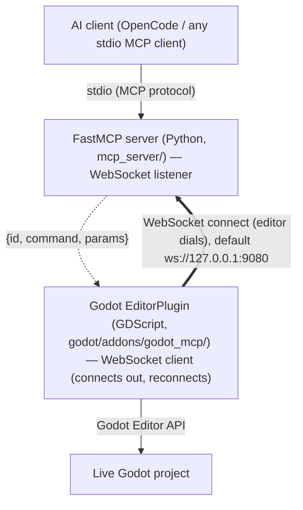

# AGENTS.md

Entry point for AI agent harnesses working in **godot-mcp**.

> **Reading this as an LLM agent?** The documentation site ships an
> agent-friendly mirror: [`llms.txt`](https://hybridindie.github.io/godot-mcp/llms.txt)
> (index) and [`llms-full.txt`](https://hybridindie.github.io/godot-mcp/llms-full.txt)
> (everything as one markdown document).

## Independent & harness-agnostic

godot-mcp is a **standalone MCP server** — generic Godot editor control over the Model Context Protocol. It is usable by **any** AI agent harness (OpenCode, or any MCP client over stdio or Streamable HTTP) and is **game-agnostic** (no built-in game vocabulary).

It has **no dependency on any specific consumer.** Other projects depend on godot-mcp, never the reverse — e.g. the `godot-agents` orchestrator is coded specifically against this server's tool surface, but godot-mcp must **never** couple back to it (no agent-harness-specific tools, prompts, assumptions, or imports). Keep the surface generic; let consumers adapt to it.

## Current state

The planned ecosystem is **feature-complete**: the engine (scaffold #1, addon + dock #2, bridge #3, server #4, inspection #5, safety #14, mutation #6, scripts #10, `godot://` resources #11, runtime loop #13, toolset gating #26) plus every content domain and capability — physics #41, animation #39, 3D scene #40, particles #42, navigation #43, audio #44, tilemap #45, theme/UI #46, shaders #47, the runtime session bridge #66 (live inspection #35, input sim #36 + recording #68, profiling #38), play-testing/QA #37, batch refactor #48, static analysis #49, and export #50 — are merged. TileSet authoring #82 and MeshLibrary authoring #83 add the resource-authoring tools that let the tilemap and gridmap surfaces place real content. 192 tools across 29 categories — always-on `core` plus 28 toggleable toolsets, of which only `inspection` is enabled by default (the other 27 gated off). New work now means new GitHub issues; the issues remain the authoritative spec, so read the relevant one before implementing. `docs/tool-contracts.md` is the source of truth for the current tool surface.

The **documentation site** (architecture, reasoning, setup, tool reference) is published at
https://hybridindie.github.io/godot-mcp/ — rebuilds on every `docs/site/**` push to `main` via
`.github/workflows/deploy-docs.yml` (VitePress, dead-link checked). For LLM agents, the site ships
[`llms.txt`](https://hybridindie.github.io/godot-mcp/llms.txt) (page index) and
[`llms-full.txt`](https://hybridindie.github.io/godot-mcp/llms-full.txt) (the whole site as one
markdown document, generated by `docs/site/llms-gen.mjs`) — point agents at those URLs
instead of crawling HTML.

## Grounding rules

The constitutional rules live in `.opencode/rules/` and are the source of truth for *how* to build here. Each is path-scoped (frontmatter `paths:`) so it surfaces on the files it governs. Read the relevant rule before writing code in that area:

| Rule | Article | Governs |
|------|---------|---------|
| `architecture.md` | I & II | Library-first; the addon/server boundary (only the addon touches Godot, only the server owns safety) |
| `mcp-tools.md` | VI + safety | Tool/resource/prompt contract; safety classes, `dry_run`/`confirm`, preconditions |
| `error-handling.md` | IV | The versioned JSON envelope (`{id, ok, result, error, hint}`); structured errors |
| `async-patterns.md` | V | Async FastMCP; bridge timeouts, reconnect/backoff, `id` correlation |
| `addon.md` | — | GDScript addon: `@tool`, command router, UndoRedo, JSON-safe serialization, `type_coerce.gd` |
| `testing.md` | III | TDD; contract→integration→unit; suite health (zero skips) |
| `workflow.md` | — | Issue → red test → green → preflight → PR → merge pipeline |
| `enforcement.md` | IX | Gates, PR checklist, CalVer |
| `graphify.md` | — | Graphify LLM-extraction policy: always run graphify via `scripts/graphify.sh` so the repo `.env` (local ollama backend/model) is observed |

These rules are path-scoped; apply the one(s) matching the files you touch. When a rule and this file disagree, the rule wins.

## Architecture

The defining feature is a **four-layer transport chain** (issue #3). Every agent action crosses all four layers:

The editor **dials** the connection (bold) and reconnects; the server still **initiates every command** (dashed). The bridge inversion (#276) changed only who connects, not the request/response direction.

<!-- Content truncated to meet Windsurf 6KB limit -->

---
> Source: [hybridindie/godot-mcp](https://github.com/hybridindie/godot-mcp) — distributed by [TomeVault](https://tomevault.io).
<!-- tomevault:4.0:windsurf_rules:2026-09-23 -->
