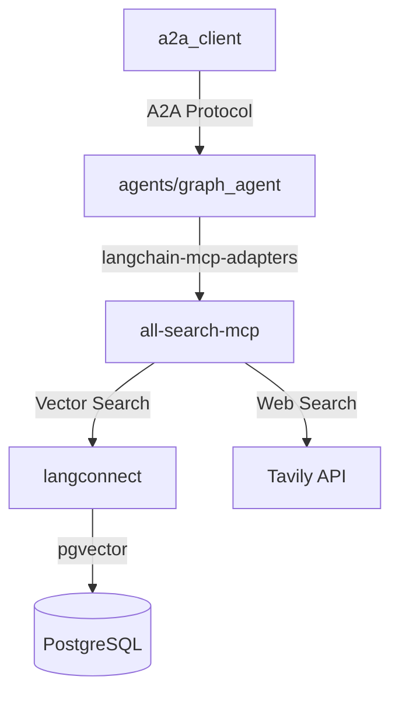

# CLAUDE.md

This file provides guidance to Claude Code (claude.ai/code) when working with code in this repository.

## 프로젝트 개요

TTimes Guide Coding은 웹 검색과 보고서 작성을 자동화하는 LangGraph 기반 멀티 에이전트 시스템입니다. 여러 전문 에이전트들이 A2A(Agent-to-Agent) 프로토콜을 통해 협력하여 고품질의 연구 보고서를 생성합니다.

## 모듈 구조 및 역할

### 📁 /langconnect 

**LangConnect RAG 서비스**

- LangConnect는 FastAPI와 LangChain으로 구축된 RAG(Retrieval-Augmented Generation) 서비스
- PostgreSQL과 pgvector를 활용한 벡터 저장소
- Docker Compose를 통해 pg_vector 데이터베이스와 API 서버를 함께 실행
- 컬렉션과 문서 관리를 위한 REST API 제공
- 벡터 검색 및 문서 처리 기능 지원

### 📁 /all-search-mcp

**통합 MCP 서버**

- FastMCP를 활용한 Model Context Protocol 서버 구현
- 두 가지 주요 API 통합:
  - LangConnect API: 벡터 데이터베이스 검색
  - Tavily Search API: 웹 검색
- 단일 MCP 서버에서 벡터 검색과 웹 검색을 모두 지원
- AI 에이전트가 사용할 통합 검색 도구 제공

### 📁 /agents

**LangGraph 에이전트 개발 모듈**

#### 🔧 /agents/base/

- `BaseAgent`: 모든 LangGraph 에이전트가 상속받아야 하는 기본 클래스
- `BaseState`: 에이전트 상태 관리를 위한 기본 상태 클래스
- 표준화된 에이전트 개발 패턴 제공

#### 🤖 /agents/graph_agent/

- BaseAgent를 상속받은 실제 LangGraph 에이전트 구현체 개발
- 각 에이전트는 특정 도메인이나 작업에 특화
- `langgraph dev` 명령어로 개별 에이전트 동작 테스트
- `langgraph.json` 설정을 통한 서버 실행

#### 🛠️ 도구 통합

- `langchain-mcp-adapters` 라이브러리를 활용하여 all-search-mcp 서버와 연동
- 에이전트는 MCP 서버를 통해 벡터 검색과 웹 검색 기능 활용

### 📁 /a2a_client

**A2A 클라이언트**

- Google ADK(Application Development Kit) 기반 클라이언트 구현
- LangGraph로 개발된 에이전트들을 A2A 서버로 감싸서 개별 서버화
- A2AClient를 통해 분산된 에이전트 서버들과 통신
- Agent2Agent(A2A) 프로토콜을 따르는 에이전트 간 통신 지원

## 시스템 아키텍처



### 포트 할당

- **오케스트레이터**: 8000
- **웹 검색 에이전트**: 8001
- **벡터 검색 에이전트**: 8002
- **계획 에이전트**: 8003
- **보고서 작성 에이전트**: 8004
- **메모리 에이전트**: 8005
- **LangConnect API**: 8080
- **LangGraph Studio**: 8123
- **PostgreSQL**: 5432
- **Redis**: 6379

## 개발 환경 설정

### 필수 요구사항

- Python 3.13 이상
- uv (Python package manager)
- Docker Compose
- LangChain, LangGraph, FastMCP, A2A SDK

### 환경 변수 설정

```bash
# .env.example을 .env로 복사
cp .env.example .env
```

필수 환경 변수:

- `AZURE_OPENAI_API_KEY`: Azure OpenAI API 키
- `AZURE_OPENAI_ENDPOINT`: Azure OpenAI 엔드포인트
- `AZURE_OPENAI_API_VERSION`: API 버전 (기본: 2024-02-15-preview)
- `AZURE_OPENAI_DEPLOYMENT_NAME`: 배포 이름 (기본: gpt-4o-preview)
- `TAVILY_API_KEY`: Tavily Search API 키
- `LANGSMITH_API_KEY`: LangSmith API 키 (선택사항)
- `GOOGLE_API_KEY`: Google API 키 (선택사항)
- 데이터베이스 설정: `POSTGRES_USER`, `POSTGRES_PASSWORD`, `POSTGRES_DB`
- Redis 설정: `REDIS_PASSWORD`

### 의존성 설치

```bash
# 기본 의존성 설치
uv sync

# 개발 의존성 포함 설치
uv sync --dev
```

## 주요 명령어

### 전체 프로젝트 관리

```bash
# 전체 의존성 설치
uv sync --dev

# 코드 품질 관리, 타입 체크
ruff check .
ruff format .
```

### 📁 /langconnect 관련 명령어

```bash
cd langconnect

# Docker 컨테이너 빌드
make build

# 서비스 시작 (백그라운드)
make up

# 개발 모드로 시작 (로그 출력)
make up-dev

# 로그 확인
make logs

# 서비스 재시작
make restart

# 서비스 중지
make down

# 컨테이너 및 볼륨 삭제
make clean

# 코드 포맷팅
make format

# 코드 린팅
make lint

# 테스트 실행
make test

# 특정 테스트 파일만 실행
make test TEST_FILE=tests/unit_tests/test_collections_api.py
```

서비스 접속:

- API 서버: http://localhost:8080
- PostgreSQL: localhost:5432

### 📁 /all-search-mcp 관련 명령어

```bash
# MCP 서버 개발 및 테스트
cd all-search-mcp
# TODO: (FastMCP 서버 실행 명령어들이 여기 추가될 예정)

# MCP 서버 유효성 검사
# mcp validate server.py
```

### 📁 /agents 관련 명령어

```bash
# LangGraph 개발 서버 시작
./scripts/dev_run_langgraph_platform.sh

# LangGraph Studio 접속
# URL: http://localhost:8123

# 새 에이전트 생성 (템플릿 복사)
cp agents/agent/template/base_agent_template.py agents/agent/my_new_agent.py
```

사용 가능한 그래프 (langgraph.json에 정의):

- `planning`: 계획 수립 에이전트
- `memory`: 메모리 관리 에이전트
- `report_writing`: 보고서 작성 에이전트

#### 🚀 빠른 에이전트 개발 시작

1. **템플릿 복사**: `cp agents/agent/template/base_agent_template.py agents/agent/새에이전트.py`
2. **클래스명 변경**: `NewAgentTemplate` → `MyAgent`
3. **노드 추가**: `NODE_NAMES`에 노드 이름 정의
4. **엣지 연결**: `init_edges()`에서 워크플로우 구성
5. **로직 구현**: 각 노드 함수에 비즈니스 로직 추가

> 📖 자세한 내용은 [LangGraph 에이전트 개발 가이드](/docs/langgraph-agent-development-guide.md) 참조

### 📁 /docker 통합 환경

```bash
cd docker

# 전체 시스템 시작 (오케스트레이터 + 모든 에이전트)
docker compose up -d

# 특정 서비스만 시작
docker compose up postgres redis -d

# 로그 확인
docker compose logs -f [service_name]

# 전체 중지
docker compose down

# 볼륨 포함 전체 삭제
docker compose down -v
```

서비스 구성:

- **인프라**: PostgreSQL(pgvector 로 벡터DB 지원), Redis
- **MCP 서버**: tavily-mcp-server, langconnect-mcp-server
- **에이전트**: web-search-agent, vector-search-agent, planning-agent, report-writing-agent, memory-agent
- **오케스트레이터**: 메인 조정자

### 📁 /a2a_client 관련 명령어

```bash
# A2A 클라이언트 실행
cd a2a_client
uv run python research_client.py

# A2A 서버 상태 확인
# TODO: A2A 관련 명령어들이 여기 추가될 예정
```

## 테스트

```bash
# 전체 테스트 실행
pytest

# 특정 디렉토리 테스트
pytest tests/test_agents/

# 커버리지 포함 테스트
pytest --cov=agents tests/

# 비동기 테스트 모드
pytest -m asyncio
```

## 기술 스택

- **LangChain**: AI/LLM 애플리케이션 개발 프레임워크
- **LangGraph**: 상태 기반 AI 에이전트 및 워크플로우 구축
- **FastMCP**: Model Context Protocol 서버 구현용
- **A2A SDK**: AI 에이전트 간 통신 통합 도구
- **LLM 제공자**: Azure OpenAI (gpt-4o-preview)
- **벡터 DB**: PostgreSQL with pgvector, Qdrant
- **캐시**: Redis
- **웹 검색**: Tavily Search API
- **패키지 관리**: uv (Python 3.13+)

## 아키텍처 가이드라인


<!-- Content truncated to meet Windsurf 6KB limit -->

---
> Source: [HyunjunJeon/vibecoding-lg-mcp-a2a](https://github.com/HyunjunJeon/vibecoding-lg-mcp-a2a) — distributed by [TomeVault](https://tomevault.io).
<!-- tomevault:4.0:windsurf_rules:2026-05-13 -->
