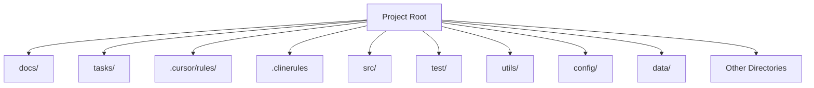

---
description: the top-level directory structure for the project
globs: 
alwaysApply: false
---     
# Directory Structure

---
> Source: [inakianduaga/clockify-mcp](https://github.com/inakianduaga/clockify-mcp) — distributed by [TomeVault](https://tomevault.io).
<!-- tomevault:4.0:windsurf_rules:2026-05-22 -->
