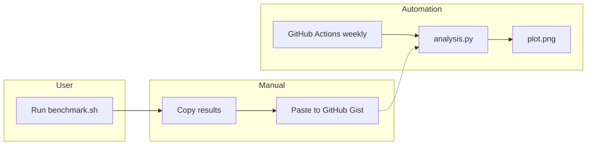
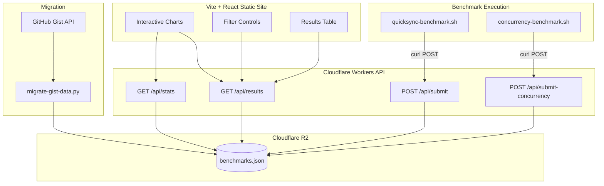
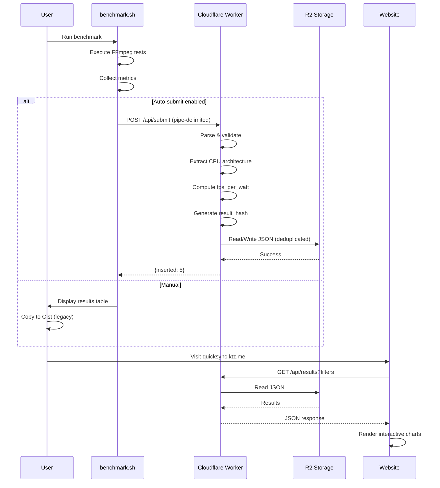
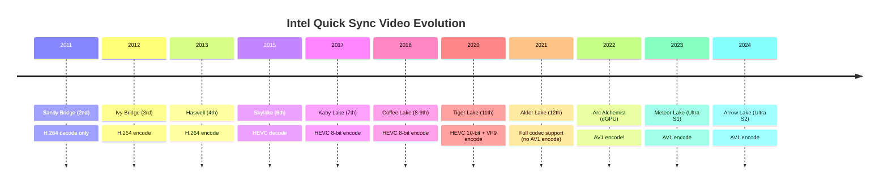

# QuickSync Benchmark - Interactive Website & Database Plan

## GitHub

PRs should be created against `ironicbadger/quicksync_calc` (NOT `cptmorgan-rh`).

## Python

Use `uv` for Python dependency management. Use `uv run --with <package>` to run Python scripts with dependencies without installing them globally.

## Project Overview

Transform the QuickSync Video benchmarking tool from GitHub Gist-based data collection into a modern interactive web application with proper database storage, API submission, and rich visualization.

## Current Architecture



**Problems:**
- Manual copy/paste workflow
- No filtering or interactivity
- Gist comments are hard to query
- Intel's new CPU naming breaks generation parsing

## Proposed Architecture



## Technology Stack

| Component | Technology | Why |
|-----------|------------|-----|
| Storage | Cloudflare R2 | Free tier, global edge, simple JSON storage |
| API | Cloudflare Workers | Free tier, global edge, native R2 support |
| Frontend | React 19 + Vite 7 + Chart.js | Fast SPA, predictable state, no imperative DOM |
| Hosting | Cloudflare Pages | Free, global CDN, custom domain support |

### Storage: Cloudflare R2

Using Cloudflare R2 with a single JSON file (`benchmarks.json`):

**Why R2:**
- Zero infrastructure to manage
- Global edge distribution
- Simple JSON file format (easy to backup/restore)
- Versioned backups on each write
- No query language needed - just read/write JSON

## Data Flow



## Data Schema

The `benchmarks.json` file stored in R2 contains all data in a single JSON structure:

```typescript
interface BenchmarkData {
  version: number;
  lastUpdated: string;
  meta: {
    totalResults: number;
    uniqueCpus: number;
    architecturesCount: number;
    uniqueTests: number;
  };
  architectures: CpuArchitecture[];
  results: BenchmarkResult[];
  concurrencyResults: ConcurrencyResult[];
  cpuFeatures: Record<string, CpuFeatures>;
}
```

## Intel CPU Architecture Timeline

Intel's naming scheme is now chaotic. We use a lookup table to map CPU strings to architectures.



## Hardware Codec Encoding Support

Source: [Intel Quick Sync Video - Wikipedia](https://en.wikipedia.org/wiki/Intel_Quick_Sync_Video)

| Architecture | Gen | Release | H.264 | HEVC 8-bit | HEVC 10-bit | VP9 | AV1 |
|--------------|-----|---------|-------|------------|-------------|-----|-----|
| Sandy Bridge | 2nd | 2011 | decode | - | - | - | - |

<!-- Content truncated to meet Windsurf 6KB limit -->

---
> Source: [ironicbadger/quicksync_calc](https://github.com/ironicbadger/quicksync_calc) — distributed by [TomeVault](https://tomevault.io).
<!-- tomevault:4.0:windsurf_rules:2026-07-24 -->
