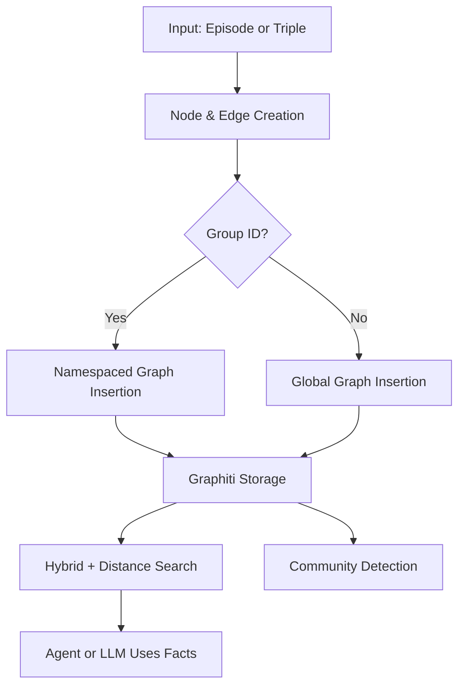

---
title: Graphiti Knowledge Graph Framework 
description: Graphiti is a framework for building temporal knowledge graphs designed for use with LLM-powered agents
---

# Graphiti Knowledge Graph Framework

## Overview
Graphiti is a framework for building temporal knowledge graphs designed for use with LLM-powered agents. It supports:

- Episodic ingestion of structured/unstructured data
- Custom ontologies with typed nodes
- Temporal fact tracking via edges
- Namespaced multi-tenant graphs (group_id)
- Hybrid search: semantic + keyword + graph distance
- Community detection using the Leiden algorithm

## System Architecture


## Configuration
```python
from graphiti_core import Graphiti
graphiti = Graphiti(uri, user, password)
await graphiti.build_indices_and_constraints()
```

Environment variables required:
- NEO4J_URI
- NEO4J_USER
- NEO4J_PASSWORD

## Core Operations

### Adding Episodes
Supported types: text, message, json

```python
await graphiti.add_episode(
    name="Product Update",
    episode_body={"name": "Shoes", "category": "Footwear"},
    source=EpisodeType.json,
    source_description="Product catalog update",
    reference_time=datetime.now(),
    group_id="tenant_xyz"  # Optional
)
```

Bulk ingestion:
```python
await graphiti.add_episode_bulk(list_of_RawEpisodes)
```

### CRUD Operations

#### Save Node
```python
await entity_node.save(driver)
```

#### Delete Node
```python
await entity_node.delete(driver)
```

#### Get Node by UUID
```python
node = await EntityNode.get_by_uuid(driver, uuid)
```

### Adding Fact Triples
```python
await graphiti.add_triplet(source_node, edge, target_node)

edge = EntityEdge(
    name="LIKES",
    fact="Alice likes Apples",
    source_node_uuid=source.uuid,
    target_node_uuid=target.uuid,
    group_id="namespace",  # optional
    created_at=datetime.now()
)
```

### Custom Entity Types
```python
class Customer(BaseModel):
    name: str
    email: str
    tier: str

entity_types = {"Customer": Customer}

await graphiti.add_episode(
    name='Customer Signup',
    episode_body="Alice signed up for premium",
    source=EpisodeType.text,
    entity_types=entity_types
)
```

### Searching
```python
# Hybrid Search (BM25 + Semantic + RRF)
results = await graphiti.search("query")

# Reranking by Node Distance
results = await graphiti.search("query", focal_node_uuid="uuid")
```

### Communities
```python
# Build communities using Leiden algorithm
await graphiti.build_communities()

# Auto-update communities
await graphiti.add_episode(..., update_communities=True)
```

## LangGraph Integration

### Agent Architecture
```python
graph_builder.add_node("agent", chatbot)
graph_builder.add_node("tools", tool_node)
graph_builder.add_edge(START, "agent")
graph_builder.add_conditional_edges("agent", should_continue, {"continue": "tools", "end": END})
graph_builder.add_edge("tools", "agent")
```

### Tool Example
```python
@tool
async def get_data(query: str) -> str:
    results = await graphiti.search(query, center_node_uuid="uuid", num_results=10)
    return "\n".join([edge.fact for edge in results])
```

## Best Practices

1. Use clear group_ids for tenant separation
2. Normalize custom ontologies with fine-grained fields
3. Use add_episode_bulk() for speed when no edge invalidation needed
4. Rebuild communities periodically
5. Combine graph and semantic search for best results
6. Implement proper error handling and retries
7. Use typed entities for structured data
8. Maintain clear naming conventions for nodes and edges
9. Regularly update and maintain indices
10. Monitor and optimize query performance

## Links and references and Documentation

- https://help.getzep.com/graphiti/graphiti/overview

- Documentation: https://help.getzep.com/concepts

---
> Converted and distributed by [TomeVault](https://tomevault.io/claim/jgabriellima)
> This is a context snippet only. You'll also want the standalone SKILL.md file — [download at TomeVault](https://tomevault.io/claim/jgabriellima)
<!-- tomevault:4.0:windsurf_rules:2026-04-08 -->
