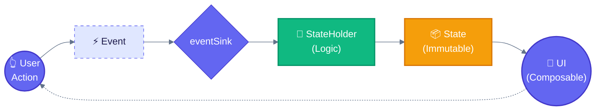

# MESA-Android Project Guide

> **For AI Agents**: This document provides comprehensive context for understanding and contributing to the MESA-Android codebase. Read this entire document before making changes.

## Build & Test Commands

```bash
# Build everything
./gradlew build

# Run all checks (all platform-specific test tasks + verification)
./gradlew check

# Run all Android instrumented tests (requires emulator/device)
./gradlew connectedAndroidTest

# Run tests for a specific module
./gradlew :strata:jvmTest                                       # Strata (pure Kotlin/JVM)
./gradlew :trapeze:jvmTest                                      # Trapeze JVM tests
./gradlew :trapeze-test:jvmTest                                 # Trapeze Test JVM tests
./gradlew :trapeze:connectedAndroidTest                         # Trapeze Compose tests
./gradlew :trapeze-navigation:connectedAndroidTest              # Navigation tests
./gradlew :features:counter:presentation:connectedAndroidTest   # Counter feature tests
./gradlew :features:summary:presentation:connectedAndroidTest   # Summary feature tests

# Run a single JVM test class
./gradlew :strata:jvmTest --tests "com.jkjamies.strata.StrataInteractorTest"

# Run a single Android test class
./gradlew :trapeze:connectedAndroidTest \
  -Pandroid.testInstrumentationRunnerArguments.class=com.jkjamies.trapeze.TrapezeCompositionLocalsTest
```

## Project Overview
A Pure-Compose driven architectural library implementing the **MESA framework** (Modular, Explicit, State-driven, Architecture). The library facilitates a rigid UDF (Unidirectional Data Flow) where the UI is a stateless projection of a single State object.

All library modules are **Kotlin Multiplatform (KMP)** compatible, targeting: Android, JVM (Desktop), iOS, macOS, and WASM. Platform-specific concerns (like `Parcelable` on Android) are handled via `expect/actual` declarations following the Circuit pattern.

## Libraries
| Library | Artifact | Purpose | Key Exports |
|---------|----------|---------|-------------|
| **Trapeze** | `com.jkjamies:trapeze` | Core architecture | `TrapezeStateHolder`, `TrapezeState`, `TrapezeScreen`, `TrapezeEvent`, `TrapezeContent`, `Trapeze`, `TrapezeCompositionLocals`, `TrapezeMessage`, `TrapezeMessageManager`, `TrapezeNavigationResult` |
| **Trapeze Navigation** | `com.jkjamies:trapeze-navigation` | Navigation layer | `NavigableTrapezeContent`, `TrapezeBackStack`, `TrapezeNavigator`, `LocalTrapezeNavigator`, `LocalTrapezeBackStack`, `rememberNavigationResult` |
| **Strata** | `com.jkjamies:strata` | Business logic layer | `StrataInteractor`, `StrataSubjectInteractor`, `StrataResult`, `strataLaunch` |
| **Trapeze Test** | `com.jkjamies:trapeze-test` | Test utilities | `TrapezeStateHolder.test`, `FakeTrapezeNavigator`, `TestEventSink`, `TrapezeReceiveTurbine`, `NavigationEvent` |
| **MESA BOM** | `com.jkjamies:mesa-bom` | Bill of Materials | Aligns versions of all MESA libraries |

## MESA Pillars
- **Modular**: Feature isolation by design; components are decoupled and portable.
- **Explicit**: All interactions are defined through the Screen, State, and Event contracts.
- **State-driven**: The State object is the Single Source of Truth (SSoT) and contains the event processing hook.
- **Architecture**: Provides the structural "Trapeze" to swing between Logic and UI.

---

## Technical Contract

### The Five Components
| Component | Role | Type Requirements |
|-----------|------|-------------------|
| **Screen** | Routing key / destination identifier (pure key, not passed into StateHolder) | Implements `TrapezeScreen` (`Parcelable` on Android via `expect/actual`, plain interface on other platforms) |
| **State** | Immutable display data + event sink | Implements `TrapezeState`, contains `eventSink: (E) -> Unit` |
| **Event** | User interactions | Implements `TrapezeEvent`, typically `sealed interface` |
| **StateHolder** | Logic layer producing State | Extends `TrapezeStateHolder<S, T, E>` |
| **UI** | Stateless Composable | Signature: `@Composable (Modifier, State) -> Unit` |

### Data Flow


---

## Factory Pattern (Circuit-Style)

Trapeze uses a **Circuit-style factory pattern** for decoupled UI and StateHolder creation.

### Core Classes
- **`Trapeze`**: Central registry holding `StateHolderFactory` and `UiFactory` sets. Built via `Trapeze.Builder()`.
- **`TrapezeCompositionLocals`**: Provides `Trapeze` instance down the composition tree via `LocalTrapeze`.
- **`TrapezeContent`**: Resolves factories from `LocalTrapeze` and renders the screen.

### Factory Interfaces
```kotlin
// In Trapeze.kt
interface StateHolderFactory {
    fun create(screen: TrapezeScreen, navigator: TrapezeNavigator?): TrapezeStateHolder<*, *, *>?
}

interface UiFactory {
    fun create(screen: TrapezeScreen): TrapezeUi<*>?
}
```

### Creating Factories (per feature)
The factory is responsible for extracting navigation args from the screen and passing them as plain constructor params to the StateHolder:
```kotlin
// In features/foo/presentation/FooFactories.kt
@ContributesIntoSet(AppScope::class)
class FooStateHolderFactory @Inject constructor(
    private val factory: FooStateHolder.Factory
) : Trapeze.StateHolderFactory {
    override fun create(screen: TrapezeScreen, navigator: TrapezeNavigator?): TrapezeStateHolder<*, *, *>? {
        return if (screen is FooScreen && navigator != null) {
            factory.create(screen.someArg, navigator)  // Extract screen args here
        } else null
    }
}

@ContributesIntoSet(AppScope::class)
class FooUiFactory @Inject constructor() : Trapeze.UiFactory {
    override fun create(screen: TrapezeScreen): TrapezeUi<*>? {
        return if (screen is FooScreen) ::FooUi else null
    }
}
```

### Assisted Inject for StateHolders
Use `@AssistedInject` for runtime dependencies (extracted screen args, navigator, interop), regular injection for graph dependencies (use cases). The screen type parameter `T` preserves compile-time coupling, but the screen instance is never stored:

```kotlin
class FooStateHolder @AssistedInject constructor(
    @Assisted private val someArg: Int,                 // Extracted from screen by factory
    @Assisted private val navigator: TrapezeNavigator,  // Runtime - from factory call
    private val fooUseCase: Lazy<FooUseCase>            // Graph - from DI
) : TrapezeStateHolder<FooScreen, FooState, FooEvent>() {

    @AssistedFactory
    fun interface Factory {
        fun create(someArg: Int, navigator: TrapezeNavigator): FooStateHolder
    }
}
```

---

## Navigation (TrapezeNavigation)

### Components
| Component | Purpose |
|-----------|---------|
| `NavigableTrapezeContent` | Main entry point - renders current screen from backstack |
| `TrapezeBackStack` | Saveable navigation stack (Parcelable-backed on Android, in-memory on other platforms) |
| `rememberSaveableBackStack(root)` | Creates saveable backstack with root screen |
| `rememberTrapezeNavigator(backStack)` | Creates navigator backed by backstack |
| `LocalTrapezeNavigator` | CompositionLocal for accessing navigator |
| `LocalTrapezeBackStack` | CompositionLocal for accessing backstack (used internally by `rememberNavigationResult`) |
| `rememberNavigationResult(key)` | Composable that consumes a navigation result by key |
| `TrapezeNavigationResult` | Marker interface (`Parcelable` on Android via `expect/actual`, plain interface on other platforms) |

### Usage Pattern
```kotlin
// In Activity
TrapezeCompositionLocals(trapeze) {
    val backStack = rememberSaveableBackStack(root = HomeScreen)
    val navigator = rememberTrapezeNavigator(backStack)

    NavigableTrapezeContent(navigator, backStack)
}
```

### TrapezeNavigator Interface
```kotlin
interface TrapezeNavigator {
    fun navigate(screen: TrapezeScreen)
    fun pop()
    fun <R : TrapezeNavigationResult> popWithResult(key: String, result: R)
    fun popToRoot()
    fun popTo(screen: TrapezeScreen): Boolean
}
```

### Navigation Result Passing
Allows Screen B to return data to Screen A when popping.

**Define a result type:**
```kotlin
@Parcelize
data class EditResult(val name: String) : TrapezeNavigationResult
```

**Screen B (produces result):**
```kotlin
// In StateHolder eventSink
EditEvent.Save -> navigator.popWithResult("edit_result", EditResult(name))
```

**Screen A (consumes result):**
```kotlin
val editResult = rememberNavigationResult("edit_result")
LaunchedEffect(editResult) {
    editResult?.let { result -> (result as? EditResult)?.let { name = it.name } }
}
```

Results are single-consumption (consumed on first read) and survive configuration changes/process death on Android.

---

## Clean Architecture & Modules

### Module Structure (per feature)
```
features/foo/
  ├── api/           # Public interfaces. Stable API surface.
  │   ├── FooScreen.kt
  │   └── FooUseCase.kt
  ├── domain/        # Business logic. Internal.
  │   ├── FooUseCaseImpl.kt
  │   └── FooRepository.kt
  ├── data/          # Repository implementations.
  │   └── FooRepositoryImpl.kt
  └── presentation/  # UI + StateHolder + DI bindings.
      ├── FooStateHolder.kt
      ├── FooFactories.kt
      └── FooUi.kt
```

### Dependency Rules
- `presentation` → depends on → `api`, `domain`
- `domain` → depends on → `api`, `data`
- `api` → no internal dependencies

---

## Strata Patterns

### Interactor Types
| Type | Use Case | Return |
|------|----------|--------|
| `StrataInteractor<P, R>` | One-shot async (API calls, DB writes) | `StrataResult<R>` |
| `StrataSubjectInteractor<P, T>` | Streams/flows (observe data) | `Flow<T>` via `.flow` |

### Launch Utilities

`strataLaunch` runs on `Dispatchers.Default` by default (override via `context` parameter):
```kotlin
// Default dispatcher
strataLaunch {
    saveData(params).onFailure { error: StrataException -> /* handle */ }
}

// Override dispatcher
strataLaunch(Dispatchers.Main) {
    // runs on main thread
}
```

`strataLaunchWithResult` combines launch + automatic error wrapping, returning `Deferred<StrataResult<T>>`:
```kotlin
val deferred = strataLaunchWithResult {
    fetchData(params)  // result is automatically wrapped in StrataResult
}
val result = deferred.await()
```

### StrataResult Extensions

| Extension | Description |
|-----------|-------------|
| `onSuccess { }` | Side-effect on success, returns original result |
| `onFailure { }` | Side-effect on failure, returns original result |
| `getOrNull()` | Returns value or null on failure |
| `getOrDefault(default)` | Returns value or a provided default on failure |
| `getOrElse { error -> }` | Returns value or computes fallback from the error |
| `map { }` | Transforms success value, passes failure through |
| `fold(onSuccess, onFailure)` | Produces a single value for both outcomes |

```kotlin
strataLaunch {
    val result = saveData(params)

    // map: transform Success<Unit> to carry additional context
    val savedCount = result.map { params.count }.getOrDefault(0)

    // fold: produce a message for both success and failure
    val message = result.fold(
        onSuccess = { "Saved $savedCount successfully!" },
        onFailure = { error -> "Save failed: ${error.message ?: "Unknown error"}" }
    )

    // getOrElse: compute a fallback from the error
    val display = result.map { "OK" }.getOrElse { error -> "Error: ${error.message}" }
}
```

### Triggering Subject Interactors
- MUST invoke in UI/Logic layer (e.g., `LaunchedEffect`)
- Do NOT trigger in UseCase `init` blocks

```kotlin
LaunchedEffect(Unit) {
    observeData(params)  // Starts the flow
}
val data by observeData.flow.collectAsState(initial = null)
```

---

## Dependency Injection (Metro)

### Graph Setup
```kotlin
@DependencyGraph(AppScope::class)
interface AppGraph : MetroAppComponentProviders {
    @Multibinds val stateHolderFactories: Set<Trapeze.StateHolderFactory>
    @Multibinds val uiFactories: Set<Trapeze.UiFactory>

    val trapeze: Trapeze
        @Provides get() = Trapeze.Builder()
            .apply { stateHolderFactories.forEach { addStateHolderFactory(it) } }
            .apply { uiFactories.forEach { addUiFactory(it) } }
            .build()
}
```

### Key Annotations
| Annotation | Purpose |
|------------|---------|
| `@ContributesBinding(AppScope::class)` | Bind implementation to interface |
| `@ContributesIntoSet(AppScope::class)` | Add to multibinding set (factories) |
| `@AssistedInject` / `@AssistedFactory` | Runtime dependency injection |
| `@Inject` | Standard constructor injection |

### Member Injection (Activities)
```kotlin
class MainActivity : ComponentActivity() {
    @Inject lateinit var trapeze: Trapeze
}
```

---

## Coding Standards

### Required Practices
- **UDF Flow**: UI → Event → eventSink → StateHolder → State → UI
- **No ViewModels**: Logic belongs in `TrapezeStateHolder`
- **Stateless UI**: Composables never hold business logic or persistent state
- **Inject Interfaces**: Never inject concrete implementations
- **Use `Lazy<T>`**: For heavy dependencies to delay initialization

### License Headers
All source files MUST include Apache 2.0 license header:
```kotlin
/*
 * Copyright 2026 Jason Jamieson
 *
 * Licensed under the Apache License, Version 2.0 (the "License");
 * ...
 */
```
Year format: `2026` (if current year) or `2026-<currentYear>`.

---

## Common Patterns

### Event Safety
Wrap event sink to ensure CoroutineScope is active:
```kotlin
val wrappedSink = wrapEventSink(eventSink)
```

### State Persistence
Use `rememberSaveable` in StateHolder for state that survives process death:
```kotlin
var count by rememberSaveable { mutableIntStateOf(0) }
```

### Interop (Activity Communication)
```kotlin
interface AppInterop : TrapezeInterop {
    fun send(event: AppInteropEvent)
}

// Bound via @ContributesBinding
@ContributesBinding(AppScope::class)
class AppInteropImpl @Inject constructor(private val context: Context) : AppInterop
```

### Transient UI Messages
Use `TrapezeMessage` and `TrapezeMessageManager` to handle one-off events (snackbars, toasts) complying with UDF.

**StateHolder:**
```kotlin
val messageManager = remember { TrapezeMessageManager() }
val message by messageManager.message.collectAsState(initial = null)

// Emit a message
messageManager.emitMessage(TrapezeMessage(Throwable("Something went wrong")))

// Clear all messages
messageManager.clearAll()
```

**UI:**
```kotlin
state.trapezeMessage?.let { msg ->
    Snackbar(
        action = { Button(onClick = { state.eventSink(ClearError(msg.id)) }) { Text("Dismiss") } }
    ) { Text(msg.message) }
}
```

**Note**: `ExperimentalUuidApi` is globally opted-in via the root build configuration.

---

## Testing

### Test Style
- **JVM tests** (`src/jvmTest/`): Use **Kotest BehaviorSpec** (Given/When/Then) with `coroutineTestScope = true` for virtual time control. Used by Trapeze core, Strata, and Trapeze Test modules.
- **Android instrumented tests** (`src/androidInstrumentedTest/`): Use **JUnit4** with `createComposeRule()` and **kotest assertions** (`shouldBe`, `shouldBeInstanceOf`, etc.). Required for tests that need a real Compose runtime (TrapezeNavigation, feature modules, Trapeze core Compose tests).

This split is necessary because `androidTest` requires JUnit4 as the test runner, while Kotest BehaviorSpec runs on JUnit Platform (JUnit5) which is only available in JVM `test/` source sets.

### Trapeze Test Library (`trapeze-test`)
Shared test utilities for fast, JVM-only StateHolder testing:

- **`TrapezeStateHolder.test {}`**: Molecule-backed extension that runs `produceState` in a headless Compose runtime and pipes state through Turbine with distinct-until-changed filtering.
- **`FakeTrapezeNavigator`**: Shared fake with synchronous assertions (`navigatedScreens`, `popCount`, `results`) and Turbine-backed async assertions (`awaitNavigate()`, `awaitPop()`, `awaitPopWithResult()`, `awaitPopToRoot()`, `awaitPopTo()`). Accepts `popToReturns` constructor parameter (default `true`) to control `popTo` return value.
- **`TestEventSink`**: Records events for assertion, usable as an `eventSink` lambda.
- **`NavigationEvent`**: Sealed hierarchy (`Navigate`, `Pop`, `PopWithResult`, `PopToRoot`, `PopTo`) recording all navigator actions.

```kotlin
// Example: JVM StateHolder test with Molecule + Turbine
val holder = MyStateHolder(initialCount = 0, navigator = FakeTrapezeNavigator())
holder.test {
    val initial = awaitItem()
    initial.count shouldBe 0

    initial.eventSink(MyEvent.Increment)
    awaitItem().count shouldBe 1
}
```

---

## Publishing

### Maven Coordinates
| Module | Group | Artifact | Version |
|--------|-------|----------|---------|
| `:trapeze` | `com.jkjamies` | `trapeze` | `0.2.0` |
| `:trapeze-navigation` | `com.jkjamies` | `trapeze-navigation` | `0.2.0` |
| `:strata` | `com.jkjamies` | `strata` | `0.2.0` |
| `:trapeze-test` | `com.jkjamies` | `trapeze-test` | `0.1.0` |
| `:mesa-bom` | `com.jkjamies` | `mesa-bom` | `0.2.0` |

### Versioning
Each library module is versioned **independently** via its own `gradle.properties` file:
- `trapeze/gradle.properties`
- `trapeze-navigation/gradle.properties`
- `strata/gradle.properties`
- `trapeze-test/gradle.properties`

The BOM module (`mesa-bom/gradle.properties`) has its own version that drives release tags (`v{BOM_VERSION}`). Bump the BOM version when creating a new release.

To bump a version, update the `publishingVersion` property in the relevant file.

### Consumer Usage (BOM)
```kotlin
dependencies {
    implementation(platform("com.jkjamies:mesa-bom:0.2.0"))
    implementation("com.jkjamies:trapeze")              // version from BOM
    implementation("com.jkjamies:trapeze-navigation")   // version from BOM
    implementation("com.jkjamies:strata")               // version from BOM
}
```

### Publishing Workflow
Artifacts are published to **GitHub Packages** automatically via GitHub Actions when a **release is created** on the repository. The workflow is defined in `.github/workflows/publish.yml`.

### Local Verification
To verify publishing locally (publishes to `~/.m2/repository`):
```bash
./gradlew :trapeze:publishToMavenLocal
./gradlew :trapeze-navigation:publishToMavenLocal
./gradlew :strata:publishToMavenLocal
./gradlew :trapeze-test:publishToMavenLocal
./gradlew :mesa-bom:publishToMavenLocal
```

### Key Files
| File | Purpose |
|------|---------|
| `gradle/publishing.gradle.kts` | Shared publishing configuration applied to each library module |
| `.github/workflows/publish.yml` | CI workflow that publishes all modules on release creation |
| `{module}/gradle.properties` | Per-module coordinates: group, artifactId, version, name, description |

---
> Converted and distributed by [TomeVault](https://tomevault.io/claim/jkjamies)
> This is a context snippet only. You'll also want the standalone SKILL.md file — [download at TomeVault](https://tomevault.io/claim/jkjamies)
<!-- tomevault:4.0:windsurf_rules:2026-04-07 -->
