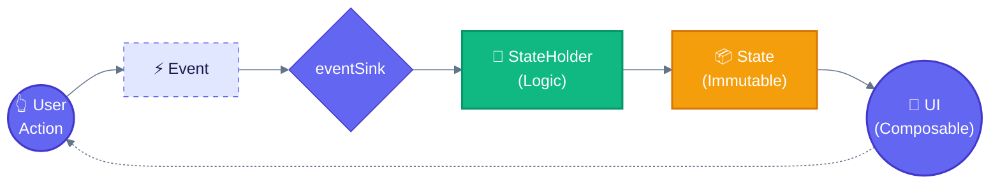

# MESA-Android Project Guide

> **For AI Agents**: This document provides comprehensive context for understanding and contributing to the MESA-Android codebase. Read this entire document before making changes.

## Build & Test Commands

```bash
# Build everything
./gradlew build

# Run all checks (all platform-specific test tasks + verification)
./gradlew check

# Run all Android instrumented tests (requires emulator/device)
./gradlew connectedAndroidTest

# Run tests for a specific module
./gradlew :strata:jvmTest                                       # Strata (pure Kotlin/JVM)
./gradlew :trapeze:jvmTest                                      # Trapeze JVM tests
./gradlew :trapeze-test:jvmTest                                 # Trapeze Test JVM tests
./gradlew :trapeze:connectedAndroidTest                         # Trapeze Compose tests
./gradlew :trapeze-navigation:connectedAndroidTest              # Navigation tests
./gradlew :features:counter:presentation:connectedAndroidTest   # Counter feature tests
./gradlew :features:summary:presentation:connectedAndroidTest   # Summary feature tests

# Run a single JVM test class
./gradlew :strata:jvmTest --tests "com.jkjamies.strata.StrataInteractorTest"

# Run a single Android test class
./gradlew :trapeze:connectedAndroidTest \
  -Pandroid.testInstrumentationRunnerArguments.class=com.jkjamies.trapeze.TrapezeCompositionLocalsTest
```

## Project Overview
A Pure-Compose driven architectural library implementing the **MESA framework** (Modular, Explicit, State-driven, Architecture). The library facilitates a rigid UDF (Unidirectional Data Flow) where the UI is a stateless projection of a single State object.

All library modules are **Kotlin Multiplatform (KMP)** compatible, targeting: Android, JVM (Desktop), iOS, macOS, and WASM. Platform-specific concerns (like `Parcelable` on Android) are handled via `expect/actual` declarations following the Circuit pattern.

## Libraries
| Library | Artifact | Purpose | Key Exports |
|---------|----------|---------|-------------|
| **Trapeze** | `com.jkjamies:trapeze` | Core architecture | `TrapezeStateHolder`, `TrapezeState`, `TrapezeScreen`, `TrapezeEvent`, `TrapezeContent`, `Trapeze`, `TrapezeCompositionLocals`, `TrapezeMessage`, `TrapezeMessageManager`, `TrapezeNavigationResult` |
| **Trapeze Navigation** | `com.jkjamies:trapeze-navigation` | Navigation layer | `NavigableTrapezeContent`, `TrapezeBackStack`, `TrapezeNavigator`, `LocalTrapezeNavigator`, `LocalTrapezeBackStack`, `rememberNavigationResult` |
| **Strata** | `com.jkjamies:strata` | Business logic layer | `StrataInteractor`, `StrataSubjectInteractor`, `StrataResult`, `strataLaunch` |
| **Trapeze Test** | `com.jkjamies:trapeze-test` | Test utilities | `TrapezeStateHolder.test`, `FakeTrapezeNavigator`, `TestEventSink`, `TrapezeReceiveTurbine`, `NavigationEvent` |
| **MESA BOM** | `com.jkjamies:mesa-bom` | Bill of Materials | Aligns versions of all MESA libraries |

## MESA Pillars
- **Modular**: Feature isolation by design; components are decoupled and portable.
- **Explicit**: All interactions are defined through the Screen, State, and Event contracts.
- **State-driven**: The State object is the Single Source of Truth (SSoT) and contains the event processing hook.
- **Architecture**: Provides the structural "Trapeze" to swing between Logic and UI.

---

## Technical Contract

### The Five Components
| Component | Role | Type Requirements |
|-----------|------|-------------------|
| **Screen** | Routing key / destination identifier (pure key, not passed into StateHolder) | Implements `TrapezeScreen` (`Parcelable` on Android via `expect/actual`, plain interface on other platforms) |
| **State** | Immutable display data + event sink | Implements `TrapezeState`, contains `eventSink: (E) -> Unit` |
| **Event** | User interactions | Implements `TrapezeEvent`, typically `sealed interface` |
| **StateHolder** | Logic layer producing State | Extends `TrapezeStateHolder<S, T, E>` |
| **UI** | Stateless Composable | Signature: `@Composable (Modifier, State) -> Unit` |

### Data Flow

```mermaid
%%{init: {'theme': 'base', 'themeVariables': { 'primaryColor': '#6366f1', 'primaryTextColor': '#fff', 'primaryBorderColor': '#4338ca', 'lineColor': '#64748b', 'secondaryColor': '#f1f5f9', 'tertiaryColor': '#e0e7ff'}}}%%
flowchart LR
    A(("👆 User<br/>Action")) --> B["⚡ Event"]
    B --> C{"eventSink"}
    C --> D["🧠 StateHolder<br/>(Logic)"]
    D --> E["📦 State<br/>(Immutable)"]
    E --> F(("📱 UI<br/>(Composable)"))
    F -.-> A

    style A fill:#6366f1,stroke:#4338ca,stroke-width:2px,color:#fff,shadow:true
    style F fill:#6366f1,stroke:#4338ca,stroke-width:2px,color:#fff,shadow:true
    style D fill:#10b981,stroke:#059669,stroke-width:2px,color:#fff,shadow:true
    style E fill:#f59e0b,stroke:#d97706,stroke-width:2px,color:#fff,shadow:true
    style B fill:#e0e7ff,stroke:#6366f1,color:#1e1b4b,stroke-dasharray: 5 5
```

---

## Factory Pattern (Circuit-Style)

Trapeze uses a **Circuit-style factory pattern** for decoupled UI and StateHolder creation.

### Core Classes

<!-- Content truncated to meet Windsurf 6KB limit -->

---
> Source: [jkjamies/MESA-Android](https://github.com/jkjamies/MESA-Android) — distributed by [TomeVault](https://tomevault.io).
<!-- tomevault:4.0:windsurf_rules:2026-05-03 -->
