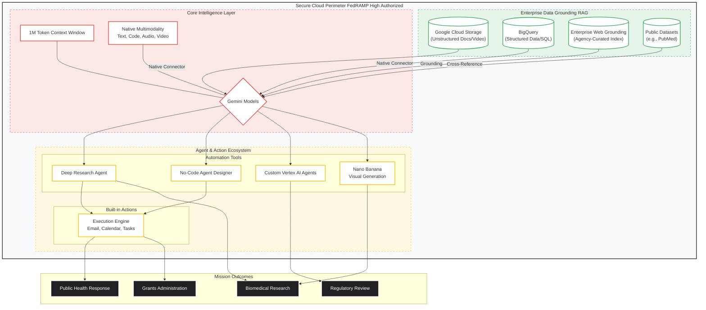

---
> Converted and distributed by [TomeVault](https://tomevault.io/claim/joelrader-google)
> This is a context snippet only. You'll also want the standalone SKILL.md file — [download at TomeVault](https://tomevault.io/claim/joelrader-google)
<!-- tomevault:4.0:windsurf_rules:2026-04-07 -->
