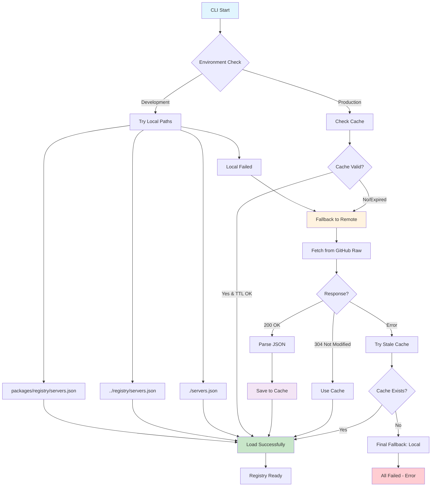

# MCP Installer Project

## Project Vision

The **MCP Installer** is a comprehensive platform designed to solve the complexity of installing MCP (Model Context Protocol) servers across different AI clients. The goal is to create an "App Store" experience for MCPs where users can browse, discover, and install MCP servers with minimal technical knowledge.

### Core Principles

- **Simplicity is Paramount**: Abstract away all technical complexity
- **Client-Agnostic**: Support all major MCP clients (Claude Desktop, Cursor, VS Code, etc.)
- **Trust and Security**: Open-source, transparent, with minimal permissions
- **One-Click Experience**: Evolve from CLI commands to true one-click installation

## Technical Architecture

### The Core Challenge

Web applications cannot directly access local files due to browser security sandbox. Our solution bridges this gap through a phased approach:

1. **Phase 1**: CLI Companion Tool (`@mcp-installer/cli`)
2. **Phase 2**: Web Marketplace with copy-paste commands
3. **Phase 3**: Desktop Agent with custom protocol handlers

### System Architecture

```
Web Frontend (Next.js) ↔ Local CLI Tool ↔ Client Config Files
     ↕                        ↕                ↕
MCP Server Registry     Command Generation    ~/.claude/, ~/.cursor/, etc.
```

### Registry Distribution Architecture

The MCP Server Registry uses a hybrid approach for maximum reliability and performance:



**Key Features:**

- **Development**: Local-first approach with automatic detection
- **Production**: Remote-first with intelligent caching (24h TTL)
- **Resilience**: Multiple fallback strategies prevent total failure
- **Efficiency**: HTTP ETags minimize bandwidth usage
- **User Control**: Manual cache management and force refresh

**Cache Strategy:**

- **Location**: `~/.mcp-installer/cache/registry-cache.json`
- **TTL**: 24 hours (configurable)
- **Validation**: HTTP ETags for conditional requests
- **Fallback**: Stale cache when remote unavailable
- **Management**: CLI commands for cache control

## Implementation Plan

### Phase 1: CLI Foundation (1-2 weeks)

**Objective**: Build a robust CLI tool that handles all MCP installation logic

**Core Modules**:

1. **ClientManager**: Detect installed AI clients and their config paths
2. **ConfigEngine**: Safely read, parse, modify, and write JSON configurations
3. **ServerRegistry**: Manage available MCP servers and their installation configs

**Key Commands**:

```bash
mcp-installer install <server-name> --clients <client1>,<client2>
mcp-installer uninstall <server-name> --clients all
mcp-installer list --available
mcp-installer list --installed
mcp-installer doctor
mcp-installer backup --client=all
mcp-installer restore --backup=<timestamp>
```

**Tech Stack**: Node.js, TypeScript, yargs/commander, fs-extra

### Phase 2: Web App & User Experience (2 weeks)

1. **WebApp - The Marketplace**:
   - Build the Next.js application.
   - Design the sleek, minimal UI with Tailwind CSS.
   - Fetch and display the MCP servers from the public servers.json file.
   - Implement the search/filter functionality.
   - Create the "Installation Modal" that generates the correct CLI commands.
2. **Documentation**:
   - Write a clear README.md for the project, explaining the vision and usage.
   - Deploy the web app to Vercel or Netlify.

### Phase 3: Seamless Integration & Growth (Ongoing)

1. **Evolve to Desktop Agent**:
   - Begin work on turning the CLI into a background agent.
   - Investigate custom protocol registration for macOS (.app bundle Info.plist) and Windows (Registry keys).
   - Update the website to use mcp-install:// links, with a fallback to showing the CLI command if the agent isn't detected.
2. **Expand the Registry**:
   - Actively look for new and useful MCP servers.
   - Create a clear CONTRIBUTING.md guide explaining how developers can submit their own MCP servers to the registry via a pull request.
3. **Expand Client Support**:
   - Add support for VS Code, Windsurf, and other clients as their MCP configuration methods become clear.

## Client Support Matrix


<!-- Content truncated to meet Windsurf 6KB limit -->

---
> Source: [joobisb/mcp-installer](https://github.com/joobisb/mcp-installer) — distributed by [TomeVault](https://tomevault.io).
<!-- tomevault:4.0:windsurf_rules:2026-05-13 -->
