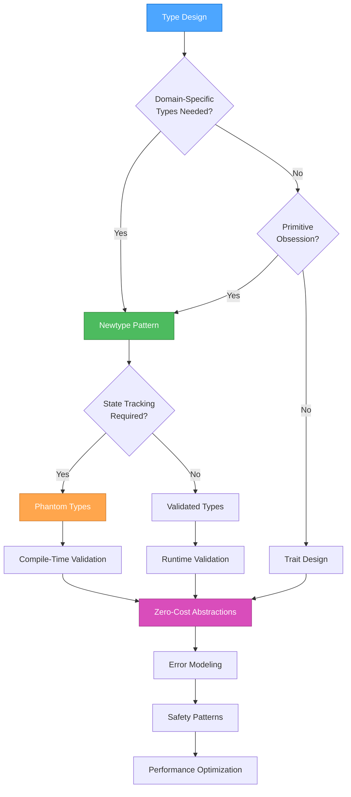

# 🔍 RUST TYPE SYSTEM BEST PRACTICES

> **TL;DR:** Leverage Rust's powerful type system for safety, performance, and expressiveness through newtype patterns, phantom types, and zero-cost abstractions.

## 🔍 TYPE SYSTEM DESIGN STRATEGY



## 🎯 TYPE SAFETY PRINCIPLES

### Newtype Pattern for Domain Modeling
```rust
use derive_more::{Constructor, Display, From, Into};
use serde::{Deserialize, Serialize};
use std::fmt;

// ✅ Strong typing for domain concepts
#[derive(Debug, Clone, Copy, PartialEq, Eq, Hash, Serialize, Deserialize, Constructor, Display, From, Into)]
pub struct UserId(uuid::Uuid);

#[derive(Debug, Clone, Copy, PartialEq, Eq, Hash, Serialize, Deserialize, Constructor, Display, From, Into)]
pub struct ProductId(uuid::Uuid);

#[derive(Debug, Clone, Copy, PartialEq, Eq, Hash, Serialize, Deserialize, Constructor, Display, From, Into)]
pub struct OrderId(uuid::Uuid);

// ✅ Prevents mixing up IDs at compile time
fn process_order(user_id: UserId, product_id: ProductId) -> OrderId {
    // Compiler prevents: process_order(product_id, user_id)
    OrderId(uuid::Uuid::new_v4())
}

// ❌ Weak typing - prone to errors
// fn process_order(user_id: String, product_id: String) -> String
```

### Validated Types with Builder Pattern
```rust
use typed_builder::TypedBuilder;
use validator::Validate;

#[derive(Debug, Clone, Serialize, Deserialize, TypedBuilder, Validate)]
#[serde(rename_all = "camelCase")]
pub struct Email {
    #[validate(email)]
    #[builder(setter(into))]
    value: String,
}

impl Email {
    pub fn new(value: impl Into<String>) -> Result<Self, ValidationError> {
        let email = Self { value: value.into() };
        email.validate()?;
        Ok(email)
    }

    pub fn as_str(&self) -> &str {
        &self.value
    }
}

impl fmt::Display for Email {
    fn fmt(&self, f: &mut fmt::Formatter<'_>) -> fmt::Result {
        write!(f, "{}", self.value)
    }
}

// ✅ Usage - compile-time guarantee of valid email
let email = Email::new("user@example.com")?;
```

### Phantom Types for Compile-Time State
```rust
use std::marker::PhantomData;

// State types
pub struct Draft;
pub struct Published;
pub struct Archived;

// Document with compile-time state tracking
#[derive(Debug, Clone)]
pub struct Document<State> {
    id: DocumentId,
    title: String,
    content: String,
    _state: PhantomData<State>,
}

impl<State> Document<State> {
    pub fn id(&self) -> DocumentId {
        self.id
    }

    pub fn title(&self) -> &str {
        &self.title
    }
}

impl Document<Draft> {
    pub fn new(title: String, content: String) -> Self {
        Self {
            id: DocumentId::new(),
            title,
            content,
            _state: PhantomData,
        }
    }

    pub fn publish(self) -> Document<Published> {
        Document {
            id: self.id,
            title: self.title,
            content: self.content,
            _state: PhantomData,
        }
    }
}

impl Document<Published> {
    pub fn archive(self) -> Document<Archived> {
        Document {
            id: self.id,
            title: self.title,
            content: self.content,
            _state: PhantomData,
        }
    }

    pub fn content(&self) -> &str {
        &self.content
    }
}

impl Document<Archived> {
    pub fn restore(self) -> Document<Draft> {
        Document {
            id: self.id,
            title: self.title,
            content: self.content,
            _state: PhantomData,
        }
    }
}

// ✅ Usage - compiler prevents invalid state transitions
let draft = Document::<Draft>::new("Title".to_string(), "Content".to_string());
let published = draft.publish();
let archived = published.archive();
// Compiler error: draft.archive() - can't archive a draft
```

## 🔄 TRAIT DESIGN PATTERNS

### Trait Objects vs Generic Bounds
```rust
// ✅ Use generics for known types at compile time
pub fn process_items<T: Processable>(items: &[T]) -> Vec<T::Output> {
    items.iter().map(|item| item.process()).collect()
}


<!-- Content truncated to meet Windsurf 6KB limit -->

---
> Converted and distributed by [TomeVault](https://tomevault.io/claim/JunaYa) — claim your Tome and manage your conversions.
<!-- tomevault:4.0:windsurf_rules:2026-04-14 -->
