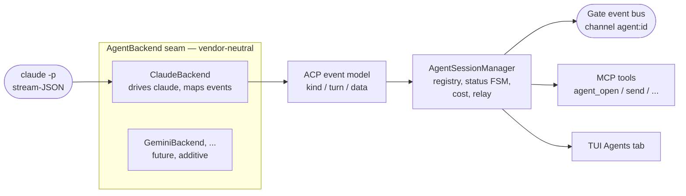

# AI Agent Sessions

Kaimon can spawn and own **AI agent sessions** -- a headless `claude` process that
you talk to programmatically. Kaimon launches the agent, normalizes its output into
a vendor-neutral event model, streams those events on the gate event bus, and tracks
each agent's lifecycle and token usage. The natural sibling of a gate REPL session
and a managed extension.

An agent session is "an AI you can drive": open one in a directory, send it turns,
and consume the streamed assistant text, reasoning, and tool calls as it works.
You drive it with a small set of MCP tools and consume one event channel per agent.

## How It Works



1. **`ClaudeBackend`** drives the local `claude` CLI in headless multi-turn
   stream-JSON mode (`claude -p --input-format stream-json --output-format stream-json`),
   reading events over a pipe.
2. The backend maps Claude's native stream-JSON events into the **ACP update model**
   -- Kaimon's vendor-neutral lingua franca (modeled on the
   [Agent Client Protocol](https://agentclientprotocol.com) update schema). A future
   `GeminiBackend` / `ACPClientBackend` slots in by implementing the same handful of
   methods; everything above the seam is written once.
3. The **`AgentSessionManager`** owns the process, runs the status FSM, accumulates
   per-session cost, and relays every event onto the gate event bus on channel
   `agent:<id>` as a `{kind, turn, data}` envelope.

!!! tip "Authentication"
    Agents authenticate with the **host's own `claude` login** (your subscription) --
    Kaimon never touches credentials. You must be logged in to the `claude` CLI. No API
    keys are required.

!!! warning "Cost"
    Agent turns run through your logged-in `claude` CLI, so their usage counts against
    **whatever that CLI is authenticated with** -- normally your Claude **subscription**
    (Pro/Max/Team), exactly like driving Claude Code interactively, and subject to the
    same plan usage limits. It is *not* separate Agent-SDK / per-token API billing (unless
    you've pointed the CLI at an API key yourself). A per-session **dollar** figure is
    **work in progress**: claude's reported `total_cost_usd` is unreliable on subscription
    plans, so `costUsd` is held at `0.0` rather than shown — token usage *is* tracked and
    surfaced in `agent_status`. The default model is the `sonnet` family alias, which
    resolves to the CLI's latest Sonnet (pass a pinned id like `claude-sonnet-5` for
    reproducibility). Images returned in tool results are the biggest token consumer
    (roughly `width × height / 750` tokens), so tool-result PNGs are box-downsampled to a
    max long edge before they reach the agent -- `agent_image_max_long_edge` in
    `~/.config/kaimon/config.json` (default 1568 px, the model's own effective cap; lower
    it to trade image quality for usage).

## Opening an Agent

Open an agent with `agent_open`, giving it a working directory. It returns an
`agent_id`; events then stream on `agent:<id>`.

```jsonc
// agent_open
{ "cwd": "/path/to/project", "model": "sonnet", "permission": "default" }
// → {"agent_id": "9f3a1c20"}
```

Then send it turns and consume the `agent:9f3a1c20` channel:

```jsonc
// agent_send
{ "agent_id": "9f3a1c20", "text": "Summarize the failing tests in this repo." }
// → {"turn": 1}
```

## The MCP Tools

All are registered as Kaimon MCP tools, callable by your own Claude Code and by
extensions via the service endpoint. Returns are JSON strings.

| Tool | Arguments | Returns |
|---|---|---|
| `agent_open` | `cwd` (req), `model`, `effort`, `permission`, `permission_mode`, `allowed_tools`, `disallowed_tools`, `mcp_config`, `system_prompt`, `id` | `{"agent_id": "<id>"}` -- spawns & owns the process |
| `agent_send` | `agent_id` (req), `text` (req) | `{"turn": <n>}` -- writes a user turn (async); events stream on `agent:<id>` |
| `agent_run` | `agent_id` (req), `text` (req), `timeout` | `{"text": "…"}` -- sends a turn and **blocks** until it ends, returning the assistant text |
| `agent_output` | `agent_id` (req), `turn`, `which` ("last_message"/"full_turn"/"all"), `include_tools`, `max_chars` | `{agent_id, turn, status, done, text, truncated, dropped_chars, usage}` -- **non-blocking** read of an agent's output (partial while still working). Pair with `agent_send` to dispatch-then-poll instead of blocking on `agent_run` |
| `agent_status` | `agent_id` (req) | `{status, model, cwd, turn, created_at, last_activity, session_id, transcript, event_log, usage}` |
| `agent_list` | -- | `{"agents": [ …status… ]}` |

<!-- Content truncated to meet Windsurf 6KB limit -->

---
> Source: [kahliburke/Kaimon.jl](https://github.com/kahliburke/Kaimon.jl) — distributed by [TomeVault](https://tomevault.io).
<!-- tomevault:4.0:windsurf_rules:2026-09-09 -->
