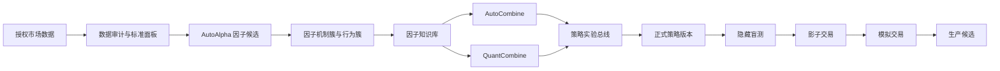

# AutoAlpha 二次开发与智能体接手指南

本文件是仓库级开发入口，面向接手本项目的编码智能体、维护者和二次开发者。目标是让新参与者在不破坏研究证据、数据时点或策略治理边界的前提下，快速定位代码、运行服务、实施改动并完成验证。

适用范围为整个仓库。若未来某个子目录增加更近层级的 `AGENTS.md`，子目录文件只补充该模块的局部约束。用户的明确要求、许可证、安全策略和版本化研究协议始终优先。

## 1. 一分钟认识项目

AutoAlpha 不是单一的“LLM 生成公式”脚本，而是一套由三个服务共享证据和运行状态的 A 股截面研究平台：

| 组件 | 默认端口 | 责任 | 决策方式 |
|---|---:|---|---|
| AutoAlpha | `8788` | 数据中心、自动因子研究、因子知识库、选股、回测、策略库、模拟交易、作业中心 | 确定性治理 + 受约束 LLM 建议 |
| AutoCombine | `8888` | 在冻结因子范围内探索因子组合与权重 | LLM 辅助搜索 + 确定性门禁 |
| QuantCombine | `8889` | SFFS、NSGA-II、贝叶斯和自适应采样等组合优化 | 非 LLM 的确定性/随机优化 |

三个服务默认共享：

- `AUTOALPHA_RUNTIME` 指向的运行目录；
- 同一个 `autoalpha.sqlite3`；
- 因子库、组合证据、策略实验对象和收藏状态；
- 同一套纯多主评价协议和策略生命周期。

核心链路是：



当前成熟度应按下面的事实理解：

| 能力 | 当前状态 | 不应宣称 |
|---|---|---|
| 因子生成、统一评价、知识库 | 本地可运行并有持久化证据 | 自动产生可实盘 Alpha |
| AutoCombine、QuantCombine | 可复用同一因子库并保存组合实验 | 搜索领先等于独立样本外通过 |
| 策略实验总线和策略库 | 已有统一谱系、版本和晋级状态机 | 已完成券商生产发布 |
| 手动回测、选股、模拟交易 | 可用于研究与纸面执行观察 | 已验证真实成交和资金托管 |
| SQLite | 当前完整本地运行后端 | 已具备多节点高并发能力 |
| PostgreSQL | 迁移工具和部分控制面适配可用 | 主 `ServiceStore` 已完成切换 |

## 2. 首要不变量

任何功能开发都必须保留以下边界。若需求与其中一项冲突，应先显式说明并修改版本化协议，不得在局部代码中静默绕过。

1. **纯多是主协议。** 排名、晋级、组合优化和页面默认指标使用 `long_only_*`；Rank IC、IC 和多空收益只用于诊断。
2. **信号时点不可穿越。** 当前默认是收盘后形成信号，最早在下一交易日开盘执行。滚动窗口必须只使用信号时点已知数据。
3. **隐藏区对研究者不可见。** LLM 只能得到有限分类反馈，不能获得精确隐藏测试指标，也不能根据隐藏结果继续调参。
4. **硬门禁不可平均掉。** 数据污染、未来函数、时点错误、执行不可行、盲测失败和证据缺失不能被高夏普抵消。
5. **公开 walk-forward 不是永久样本外。** 一旦被反复用于模型反馈，它就是自适应研究证据，不得描述为 untouched OOS。
6. **非 PIT 数据只能用于研究代理。** 缺失历史 ST、上市退市、停复牌、涨跌停、开盘可交易状态等字段时，生产晋级必须 fail closed。
7. **LLM 不拥有最终裁决权。** LLM 可以提出假设、表达式、证伪方案和组合建议，但不得修改门禁、审批生产、推断缺失市场状态或下实盘订单。
8. **手动实验不污染自动研究。** 手动回测、选股和截图不能写回隐藏证据或自动研究记忆，除非走显式、可审计的导入协议。
9. **证据必须可复现。** 数据指纹、协议版本、代码版本、随机种子、因子 ID、权重和成本口径必须随实验保留。
10. **当前没有实盘下单通道。** 策略库、影子交易和模拟交易不是券商生产执行证明。

权威定义位于：

- [评价宪章](AutoAlpha/evaluation.md)
- [机构级研究控制](AutoAlpha/docs/INSTITUTIONAL_RESEARCH_CONTROLS.md)
- [生产运行手册](AutoAlpha/docs/PRODUCTION_RUNBOOK.md)
- [数据就绪标准](AutoAlpha/docs/DATA_READINESS.md)

## 3. 接手后的前十分钟

先观察，再修改。不要假设工作树干净，也不要删除不认识的运行状态。

```bash
git status --short
git branch --show-current
git log -5 --oneline

uv sync --frozen --all-groups
(cd AutoAlpha && uv sync --frozen --all-groups)

uv run pytest -q
(cd AutoAlpha && uv run pytest -q)
```

启动服务：

```bash
cd AutoAlpha
./start-services.sh --no-resume
```

检查服务：

```bash
curl -fsS http://127.0.0.1:8788/health
curl -fsS http://127.0.0.1:8788/ready
curl -fsS http://127.0.0.1:8888/api/health
curl -fsS http://127.0.0.1:8889/api/health
```

停止服务：

```bash
cd AutoAlpha
./stop-services.sh
```

日志和 PID 位于：

```text
AutoAlpha/runtime-full-llm/logs/
AutoAlpha/runtime-full-llm/pids/
```

`--no-resume` 只启动服务，不恢复历史研究任务。只有显式提供 `AUTOALPHA_RESUME_TASK_ID` 或 `AUTOCOMBINE_RESUME_TASK_ID` 时才应恢复任务。

启动脚本继承当前 shell 的环境变量，但不会自动加载 `.env.example`。该文件只是配置契约模板。需要本地覆盖时，应在启动前显式导出：

```bash
REPO_ROOT="$(git rev-parse --show-toplevel)"
export AUTOALPHA_DATA_PATH="$REPO_ROOT/data"
export AUTOALPHA_RUNTIME="$REPO_ROOT/AutoAlpha/runtime-full-llm"
export AUTOALPHA_CONFIG="$REPO_ROOT/AutoAlpha/config/research.toml"
```

OpenAI-compatible 和 Tushare 凭证优先通过系统设置页写入 OS Keychain，也可以通过环境变量注入。任何非 loopback 部署都必须设置 `AUTOALPHA_SERVICE_TOKEN`，并在反向代理层配置 TLS 与访问控制。完整变量见
[`AutoAlpha/.env.example`](AutoAlpha/.env.example)。

## 4. 仓库地图

```text
.
├── src/multifactor_ashare/        数据审计与标准面板 CLI
├── tests/                         数据工程测试
├── data/                          本地数据工作区，永不提交
├── AutoAlpha/
│   ├── src/autoalpha/
│   │   ├── agents/                LLM 编排与角色治理
│   │   ├── backtest/              向量、现金账本、成本和时点
│   │   ├── data/                  数据契约、PIT、快照和研究字段
│   │   ├── dsl/                   因子表达式、语义校验和编译
│   │   ├── execution/             成交模拟、容量和 TCA
│   │   ├── governance/            审计链、盲测和发布控制
│   │   ├── operations/            工件、监控和幂等管线
│   │   ├── portfolio/             产品、优化和风险
│   │   ├── registry/              因子卡、指标和生命周期
│   │   ├── research/              统计、切分、门禁和多重检验
│   │   ├── security/              沙箱与安全守卫
│   │   └── service/               API、持久化、任务循环和静态页面
│   ├── config/research.toml        默认版本化研究协议
│   ├── docs/                       设计、运行和迁移文档
│   ├── tests/                      模块、服务、集成和对抗测试
│   ├── start-services.sh
│   └── stop-services.sh
├── examples/public_research_snapshot/
├── docs/assets/screenshots/
└── scripts/                        发布检查与公开样例导出
```

根包与 `AutoAlpha/` 是两个独立 Python 项目，分别有自己的 `pyproject.toml`、`uv.lock` 和虚拟环境。运行命令时先确认当前目录。

## 5. 服务与页面拓扑

### AutoAlpha 控制面

关键页面和后端入口：

| 页面 | 路由 | 静态实现 |
|---|---|---|
| 自动研究 | `/`、`/research/{task_id}` | `service/static/index.html`、`app.js` |
| 任务总表 | `/research-tasks` | `research_tasks.html/js/css` |
| 因子知识库 | `/factors` | `factors.html/js/css` |
| 手动回测 | `/backtest` | `backtest.html/js/css` |
| 选股器 | `/screener` | `screener.html/js/css` |
| 模拟交易 | `/paper-trading` | `paper_trading.html/js/css` |
| 策略库 | `/strategies` | `formal_strategies.html/js/css` |
| 数据中心 | `/data` | `data_center.html/js/css` |

<!-- Content truncated to meet Windsurf 6KB limit -->

---
> Source: [khakhasshi/LLM_QUANT_FACTORY](https://github.com/khakhasshi/LLM_QUANT_FACTORY) — distributed by [TomeVault](https://tomevault.io).
<!-- tomevault:4.0:windsurf_rules:2026-07-29 -->
