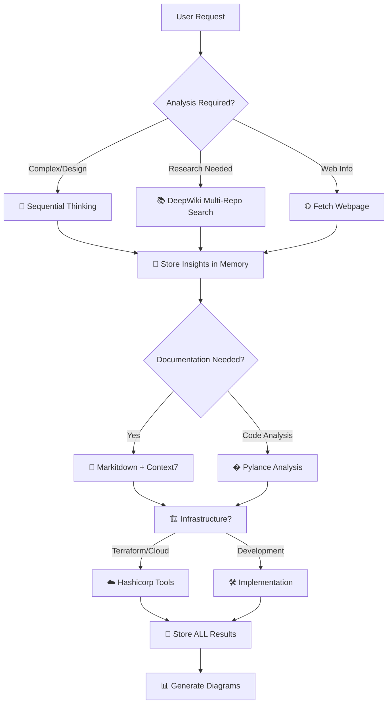

# 🤖 AI Agent Instructions for NotebookLM MCP Server

## 🎯 Project Overview
NotebookLM MCP Server is a professional Model Context Protocol (MCP) server for automating interactions with Google's NotebookLM. Features persistent browser sessions, streaming response support, and comprehensive automation capabilities using Selenium WebDriver with undetected-chromedriver.

## 🚨 **CRITICAL VALIDATION REQUIREMENTS**

### **🔬 FOR ALL REFACTOR/ENHANCE REQUESTS:**

**MANDATORY**: Always validate code changes with proper testing:

1. **Unit tests với pytest** - NOT bash terminal testing
2. **Integration tests** - Real functionality testing
3. **Import validation** - All modules must import correctly
4. **Dependency check** - All required packages available
5. **Function-by-function validation** - Each component tested individually

### **📝 Testing Standards:**
```python
# ✅ CORRECT: Proper unit testing
def test_config_validation():
    config = ServerConfig(timeout=-1)
    with pytest.raises(ConfigurationError):
        config.validate()

# ❌ WRONG: Bash terminal testing
# python -c "print('Test passed')"
```

### **� ABSOLUTE FUNCTION CHANGE CONSTRAINTS:**

**⚠️ CRITICAL RULE: NO FUNCTION CHANGES WITHOUT TESTS**

1. **ANY function modification** → MUST run `task enforce:test`
2. **Coverage requirement**: ≥95% or change is REJECTED
3. **All tests must pass** before function changes are accepted
4. **Breaking changes** require integration test validation

```bash
# MANDATORY after ANY function change
task enforce:test    # Runs coverage + lint + validation
task test:coverage   # Must show ≥95% coverage
```

### **🎯 Task Management with Taskfile:**

We use [Taskfile.dev](https://taskfile.dev/) instead of Makefile for better cross-platform support:

```bash
# Quick commands (memorize these)
task                    # Show all tasks
task test:quick        # Single test validation
task test:unit         # Full unit test suite
task test:coverage     # Coverage validation (≥95%)
task dev:check         # Pre-commit validation
task enforce:test      # MANDATORY after function changes
```

### **💾 Memory Documentation Strategy:**

**ENHANCED MEMORY REQUIREMENTS**: Store project-specific patterns, not just results:

**🔍 STORE METHODOLOGY & WORKFLOW PATTERNS:**
- **User Environment**: conda vs local, uv vs poetry vs pip
- **Debug Patterns**: How user prefers to debug (print, logger, debugger)
- **Testing Patterns**: Which test commands user runs most
- **Development Flow**: User's typical development workflow
- **Deployment Preferences**: Docker, local, cloud preferences

**📊 PROJECT INSIGHTS TO REMEMBER:**
```python
# Example memory entities
development_environment = {
    "package_manager": "pip",  # vs poetry, uv
    "python_env": "conda",     # vs venv, pyenv
    "debug_style": "loguru",   # vs print, pdb
    "test_preference": "task test:unit",  # vs pytest directly
    "deployment": "docker"     # vs local, cloud
}
```

### **�💾 Memory Documentation:**
**ALWAYS** store significant findings in Memory MCP server:
- Bug solutions and patterns
- Architecture decisions and rationale
- Performance results and configurations
- Research insights and SOTA techniques
- **USER WORKFLOW PATTERNS** (new requirement)
- **PROJECT-SPECIFIC METHODOLOGIES** (new requirement)

## 🧠 **COMPREHENSIVE MCP TOOLCHAIN STRATEGY**

### **🎯 MANDATORY: Always Use ALL Available MCP Tools Systematically**

**NEVER work in isolation - ALWAYS leverage the full MCP ecosystem for maximum effectiveness!**



### **🔧 COMPLETE MCP SERVER ARSENAL - 500+ TOOLS AVAILABLE**

**🔥 COMPREHENSIVE ECOSYSTEM - NEVER WORK IN ISOLATION!**

| 🎯 Category | MCP Servers | Primary Use | Integration Examples |
|-------------|-------------|-------------|---------------------|
| **🧠 Cognitive** | Sequential Thinking, Think Tools | Complex reasoning, multi-step analysis | Plan architecture, debug complex issues |
| **💾 Knowledge** | Memory, Extended Memory, LSpace | Store/retrieve insights, project continuity | Track experiments, save decisions |
| **📚 Research** | DeepWiki, GitHub, arXiv, PubMed, bioRxiv | Multi-repo research, academic papers | SOTA techniques, code patterns |
| **📊 Documentation** | Context7, Markitdown, Docy | Library docs, format conversion | Best practices, API documentation |
| **🔍 Code Analysis** | Pylance, Sourcerer, Language Server | Python analysis, semantic search | Code quality, imports, refactoring |

<!-- Content truncated to meet Windsurf 6KB limit -->

---
> Source: [khengyun/notebooklm-mcp](https://github.com/khengyun/notebooklm-mcp) — distributed by [TomeVault](https://tomevault.io).
<!-- tomevault:4.0:windsurf_rules:2026-05-05 -->
