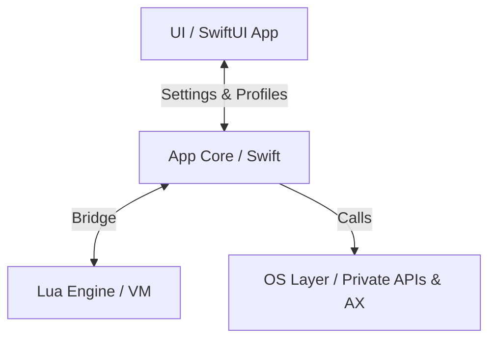

# KiwiDesk — Agent & Contributor Guidelines

Binding rules for human developers and AI agents working on this
repository. Read this file before modifying any code. Every agent
(Claude Code, Cursor, Codex) and human reads it directly.

## How this file is organized

This file is the **hub**: the project shape, the rules that apply
everywhere, and an index of the subsystem guardrails (§5).

The guardrails themselves — the long "here is why this bit us"
arguments — live one level down, in
[`.claude/rules/*.md`](.claude/rules/), **one file per subsystem**.
Each rule file is the canonical text for its subsystem; §5 carries
the rule in one line and links to it. When they would disagree,
the **rule file wins** and the §5 row is the thing to fix.

One deliberate exception to "state it once": the handful of
guardrails at the top of §5 are repeated verbatim in their rule
file. They are the ones that destroy something before a rule file
would ever load — a tree in the state model, a shipped `.app` that
`fatalError`s — so they earn a tripwire in the file every agent
already has. Aim to state everything else exactly once, and see
[rule-authoring.md](.claude/rules/rule-authoring.md) for which
kinds of sentence may be repeated safely and which may not.

§5 also carries **one** prose rule rather than a one-line row:
how to write a rule at all (#614). It is there because it is the
only rule whose subject is this delivery mechanism, and because a
reader who never edits a rule file — Cursor, Codex, a human
skimming the hub — would otherwise meet it nowhere. Its argument
still lives one level down, in
[rule-authoring.md](.claude/rules/rule-authoring.md). Do not read
it as licence for a second long paragraph in §5.

They live in `.claude/` because Claude Code auto-loads a rule file
whose `paths:` glob matches a file you are editing — so the right
guardrails arrive when they are relevant and cost nothing when
they are not. That placement is *only* about the loader. The files
are ordinary Markdown: humans and other agents reach them through
the §5 links, and §5 lists every one of them.

Two shelves, don't confuse them:

- **`docs/`** — the product: Lua reference, user guide, CLI,
  design decisions, accepted limitations. Ships to users through
  the site.
- **`.claude/rules/`** — the workshop: engineering guardrails for
  whoever changes the code.

---

## 1. Project Overview

KiwiDesk is a tiling window manager for macOS (Swift, SwiftUI,
Lua). It manages windows in a **flat, one-dimensional array per
space** — never in hierarchical trees. Layout algorithms are pure
functions over that array.

Module layout (SwiftPM targets):

| Target | Path | Responsibility |
|---|---|---|
| `KiwiDeskCore` | `Sources/KiwiDeskCore` | State, events, OS bridge |
| `KiwiDesk` | `Sources/KiwiDesk` | Executable, menu bar, GUI |
| `KiwiDeskCoreTests` | `Tests/KiwiDeskCoreTests` | Unit tests |
| `KiwiDeskGuiTests` | `Tests/KiwiDeskGuiTests` | GUI tests, plus the source-scanning parity guards (`SourceScan`) — which scan **both** trees, so a `KiwiDeskCore` invariant may be guarded from here |

The Swift core must stay strictly separated from the SwiftUI GUI
and (later) the Lua VM.

Subsystem map (`Sources/KiwiDeskCore/*`) — directory-level, not a
file list; grep within a subsystem for specifics:

| Dir | Responsibility |
|---|---|
| `State` | Flat `[WindowID]`-per-space window state |
| `Tiling` | Placing windows from state into layouts |
| `Layouts` | Pure layout algorithms over the flat array |
| `Commands` | Command dispatch (the `set_*` verbs), plus the z-order raise machinery every command path shares (`ZOrderDrain` and its policy) |
| `Config` | Decoding the Lua/profile config into settings |
| `Profiles` | Profile JSON load/save & defaults |
| `Appearance` | Color palettes (bundled + user, one-shot apply) |
| `Lua` | Lua VM bridge, watchdog, registry refs |
| `AX` | Accessibility bridge & `AXObserver` callbacks |
| `OS` | Private SkyLight/CGS symbols via `dlsym`, AX fallback |
| `Keys` | Carbon hotkey registration |
| `Events` | Event listening / mouse drag taps |
| `Tabs` | Native-tab reconciliation (`windowRekeyed` coalescing) |
| `Animation` | Per-monitor `DisplayLink` animation |
| `IPC` | CLI / external command IPC |
| `Bar` | In-app App Bar & Space Bar overlays |
| `Borders` | Focus & sticky overlays (rings, sticky marks) |
| `Power` | Power / display-state handling |
| `Permissions` | AX / permission prompts |
| `Localization` | `L()` string routing & locale catalogs |
| `App` | Core bootstrap & wiring |
| `Models` | Shared value types |
| `Service` | Long-running service glue |
| `Resources` | Bundled assets (locales, vendored app font, palettes) (assets, not code) |

The GUI lives in `Sources/KiwiDesk` — layout conventions in
[`.claude/rules/gui.md`](.claude/rules/gui.md).

This table is the *where*. For the *how* — end-to-end pipelines
(event→placement, command dispatch, config resolve, animation)
traced at directory altitude — see **`docs/architecture.md`**.

## 2. Code Rules

1. **File size:** target **100–250 lines** per Swift file. Hard

<!-- Content truncated to meet Windsurf 6KB limit -->

---
> Source: [KiwiCanopy/KiwiDesk](https://github.com/KiwiCanopy/KiwiDesk) — distributed by [TomeVault](https://tomevault.io).
<!-- tomevault:4.0:windsurf_rules:2026-09-06 -->
