# md2visio Mermaid转Visio工具

## 变更记录 (Changelog)

| 日期 | 版本 | 变更内容 | 作者 |
|------|------|----------|------|
| 2025-12-23 | v2.0.0 | 完整架构分析与模块索引文档重构，新增时序图支持 | Claude |

---

## 项目愿景

**md2visio** 是一个将 Mermaid.js 图表语法转换为 Microsoft Visio (.vsdx) 文件的工具，基于 .NET 8 和 C# 开发。系统通过状态机解析 Mermaid 语法，构建抽象语法树(AST)，然后通过 COM Interop 调用 Visio API 生成专业的 Visio 图表文件。

**核心特性**：
- **状态机解析引擎**：基于正则表达式的逐字符状态机解析器，支持多种图表语法
- **TypeMap调度架构**：通过类型映射表实现解析器、构建器、绘制器的松耦合
- **COM对象生命周期管理**：精细控制 Visio 应用程序实例的创建、复用与释放
- **YAML配置系统**：支持样式配置、主题切换、FrontMatter覆盖
- **GUI/CLI双模式**：提供 Windows Forms 图形界面和命令行两种使用方式

---

## 架构总览

### 硬件/运行环境架构
```
    ┌─────────────────────────────────────────────────────────────┐
    │                   .NET 8 Runtime (Windows)                   │
    │  ┌─────────────┐  ┌─────────────┐  ┌─────────────────────┐  │
    │  │   md2visio   │  │ md2visio.GUI │  │  COM Interop Layer  │  │
    │  │   核心库     │  │    WinForms  │  │  Visio Automation   │  │
    │  └─────────────┘  └─────────────┘  └─────────────────────┘  │
    └─────────────────────────────────────────────────────────────┘
                              │
           ┌──────────────────┼──────────────────┐
           │                  │                  │
    ┌─────────────┐    ┌─────────────┐   ┌─────────────┐
    │   输入解析    │    │   数据结构    │   │   输出绘制    │
    │   Mermaid    │    │   AST模型    │   │   Visio COM   │
    │   状态机     │    │   Figure层   │   │   绘制引擎    │
    └─────────────┘    └─────────────┘   └─────────────┘
```

### 软件分层架构

系统采用**三层状态机驱动架构**：

- **解析层 (mermaid/)**：状态机逐字符解析 Mermaid 语法，生成状态序列
- **数据层 (struc/)**：抽象语法树与图表数据模型，构建器模式生成 Figure 对象
- **绘制层 (vsdx/)**：COM Interop 调用 Visio API，将 Figure 对象渲染为 .vsdx 文件

---

## 模块结构图

```mermaid
graph TD
    A["(根) md2visio"] --> B["md2visio<br/>核心库"];
    A --> C["md2visio.GUI<br/>图形界面"];

    B --> D["main/<br/>入口与配置"];
    B --> E["mermaid/<br/>解析引擎"];
    B --> F["struc/<br/>数据结构"];
    B --> G["vsdx/<br/>绘制引擎"];
    B --> H["default/<br/>配置文件"];

    D --> D1["AppConfig.cs<br/>全局配置/CLI入口"];
    D --> D2["AppTest.cs<br/>测试入口"];
    D --> D3["ConsoleApp.cs<br/>控制台入口"];

    E --> E1["@cmn/<br/>通用状态机组件"];
    E --> E2["graph/<br/>流程图解析器"];
    E --> E3["sequence/<br/>时序图解析器"];
    E --> E4["journey/<br/>旅程图解析器"];
    E --> E5["pie/<br/>饼图解析器"];
    E --> E6["packet/<br/>数据包图解析器"];
    E --> E7["xy/<br/>XY图表解析器"];

    E1 --> E1a["SynContext.cs<br/>解析上下文"];
    E1 --> E1b["TypeMap.cs<br/>类型映射表"];
    E1 --> E1c["SynState.cs<br/>状态基类"];
    E1 --> E1d["SttIterator.cs<br/>状态迭代器"];

    F --> F1["figure/<br/>图表基础架构"];
    F --> F2["graph/<br/>流程图数据结构"];
    F --> F3["sequence/<br/>时序图数据结构"];
    F --> F4["journey/<br/>旅程图数据结构"];
    F --> F5["pie/<br/>饼图数据结构"];
    F --> F6["packet/<br/>数据包图数据结构"];
    F --> F7["xy/<br/>XY图数据结构"];

    F1 --> F1a["FigureBuilderFactory.cs<br/>构建器工厂(核心调度)"];
    F1 --> F1b["Figure.cs<br/>图表基类"];
    F1 --> F1c["Config.cs<br/>配置加载器"];

    G --> G1["@base/<br/>绘制基础组件"];
    G --> G2["@tool/<br/>绘制工具"];
    G --> G3["VBuilderG/VDrawerG<br/>流程图绘制"];
    G --> G4["VBuilderSeq/VDrawerSeq<br/>时序图绘制"];
    G --> G5["其他图表绘制器"];

    G1 --> G1a["VBuilder.cs<br/>Visio应用管理"];
    G1 --> G1b["VFigureBuilder.cs<br/>图表构建器基类"];
    G1 --> G1c["VFigureDrawer.cs<br/>图表绘制器基类"];

    H --> H1["flowchart.yaml<br/>流程图配置"];
    H --> H2["sequence.yaml<br/>时序图配置"];
    H --> H3["theme/<br/>主题配置"];

    C --> C1["Forms/<br/>窗体"];
    C --> C2["Services/<br/>服务层"];
    C1 --> C1a["MainForm.cs<br/>主窗体"];
    C2 --> C2a["ConversionService.cs<br/>转换服务"];
```



---

## 模块索引

### 核心模块索引

| 模块路径 | 职责描述 | 关键文件 | 关键类/接口 |
|----------|----------|----------|-------------|
| `md2visio/main/` | **应用入口**：命令行参数解析、全局配置、COM对象生命周期管理 | `AppConfig.cs` | `AppConfig` (单例模式) |
| `md2visio/mermaid/@cmn/` | **解析核心**：状态机基础设施、类型映射、解析上下文 | `SynContext.cs`, `TypeMap.cs`, `SynState.cs` | `SynContext`, `TypeMap`, `SttIterator` |
| `md2visio/struc/figure/` | **数据核心**：图表基类、构建器工厂、配置系统 | `FigureBuilderFactory.cs`, `Figure.cs`, `Config.cs` | `FigureBuilderFactory`, `Figure`, `FigureBuilder` |
| `md2visio/vsdx/@base/` | **绘制核心**：Visio应用管理、绘制器基类 | `VBuilder.cs`, `VFigureBuilder.cs`, `VFigureDrawer.cs` | `VBuilder`, `VFigureBuilder<T>`, `VFigureDrawer<T>` |
| `md2visio.GUI/Services/` | **GUI服务层**：异步转换服务、事件通知、COM对象管理 | `ConversionService.cs` | `ConversionService`, `ConversionResult` |

### 解析器模块索引 (mermaid/)

| 图表类型 | 模块路径 | 关键文件 | 状态类 |
|----------|----------|----------|--------|
| 流程图 | `mermaid/graph/` | `GSttKeyword.cs`, `GSttText.cs`, `GSttLinkStart.cs` | `GSttKeyword`, `GSttChar`, `GSttText`, `GSttLinkStart`, `GSttLinkEnd` |
| 时序图 | `mermaid/sequence/` | `SeqSttKeyword.cs`, `SeqSttMessage.cs`, `SeqSttParticipantId.cs` | `SeqSttKeyword`, `SeqSttChar`, `SeqSttMessage`, `SeqSttParticipantDecl` |
| 旅程图 | `mermaid/journey/` | `JoSttKeyword.cs`, `JoSttTriple.cs` | `JoSttKeyword`, `JoSttChar`, `JoSttTriple`, `JoSttWord` |
| 饼图 | `mermaid/pie/` | `PieSttKeyword.cs`, `PieSttTuple.cs` | `PieSttKeyword`, `PieSttChar`, `PieSttTuple` |
| 数据包图 | `mermaid/packet/` | `PacSttKeyword.cs`, `PacSttTuple.cs` | `PacSttKeyword`, `PaSttChar`, `PacSttTuple` |
| XY图表 | `mermaid/xy/` | `XySttKeyword.cs`, `XySttWord.cs` | `XySttKeyword`, `XySttChar`, `XySttWord` |

### 数据结构模块索引 (struc/)

| 图表类型 | 模块路径 | 关键文件 | 数据类 |
|----------|----------|----------|--------|

<!-- Content truncated to meet Windsurf 6KB limit -->

---
> Source: [konbakuyomu/md2visio-gui](https://github.com/konbakuyomu/md2visio-gui) — distributed by [TomeVault](https://tomevault.io).
<!-- tomevault:4.0:windsurf_rules:2026-05-04 -->
