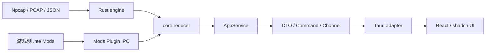

# AGENTS.md

## 0. 最小行为守则（动手前必读）

本节是全文的强制摘要；与后文冲突时，以后文更具体的条款为准。

1. **先确认影响层再动手**：修改前先判断工作属于 Rust 领域核心、Tauri 适配层、React 前端、Windows 平台层、Mod 系统、资源或文档，并遵守 §4 的边界。
2. **Rust 核心保持唯一事实源**：抓包、协议解析、战斗归并、历史、资源、更新、Mod IPC 和系统集成继续由 Rust 实现；React 负责展示与交互。
3. **Tauri/React 是唯一桌面 UI**：新功能、交互修复和视觉规范落在 Tauri/React；Rust 保持业务权威；不得恢复已移除的旧桌面 UI、`gui` Feature 或根 crate 桌面 Binary。
4. **保持 CLI 纯净**：`nte-core` 的 CLI-only 依赖树不得出现 Tauri、WebView、React 构建、egui、eframe、wgpu 或窗口库。
5. **跨边界只传稳定契约**：Rust 与 React、游戏 Mod 与桌面程序之间只传显式 DTO、事件、命令和错误码；禁止把内部领域类型、裸指针、窗口句柄或可变状态直接暴露给前端。
6. **高频数据必须批量传输**：逐包、逐 hit、逐帧 IPC 属于禁止实现；使用有序 Channel、状态代次、增量批次、分页和节流。
7. **文案统一走 i18n**：英文字符串作为稳定 key，简体中文继续以 `res/languages/zh-CN.json` 为源；React 与桌面 Rust 契约使用同一翻译资源或稳定 key。
8. **信任边界完整校验一次**：网络字节、文件、Tauri command 参数、Mod manifest、FFI 和系统调用在入口完成校验；边界内部保持类型驱动和简洁实现。
9. **默认禁止清单**（除非用户当次明确要求）：`git commit`、`git push`、批量重构、整仓格式化、同时改动多个独立窗口或主题、升级大版本依赖、改写更新协议、修改 `vendor/`。
10. **改完必验证**：执行与影响面匹配的 Rust、Tauri、TypeScript、前端构建和测试命令；任何未运行项都要在最终回复中写明原因。
11. **UI 由用户人工验收**：智能体不启动桌面程序、不模拟点击、不截图验证。透明、穿透、置顶、快捷键、多屏 DPI 和窗口恢复必须列入人工验证。
12. **保留无关工作树内容**：只修改当前任务直接涉及的文件；发现其他问题只记录，不顺手修复。
13. **局部修复默认走 25 分钟快速通道**：小范围 UI、交互、窗口切换、展示算法和既有契约内的修复按 §0.1 执行；禁止把局部修复扩展成全仓审计、通用框架、依赖清理或完整发布验证。

## 0.1 25 分钟快速通道

### 适用条件

用户一次指出 1～4 个明确的局部差异，并且修改满足以下条件时，默认目标为从开始执行到交付不超过 25 分钟：

- 只涉及现有页面、组件、窗口 command、展示投影或小型确定性算法；
- 继续使用既有 DTO、command、配置字段和依赖；
- 预计净改动不超过 200 行、直接涉及不超过 8 个源码或测试文件；
- 不涉及协议解析、reducer 语义、历史迁移、更新安装、原生插件、`unsafe`、发布或 CI。

用户描述为“简单修改”“这几个差异”“直接修复”时，优先按快速通道判断，不先做全仓架构审计。

### 时间预算

1. **0～3 分钟：定位**。只看用户指出的入口、相邻实现、当前相关 diff 和最近对照代码；找到唯一事实源后立即动手。
2. **3～15 分钟：实现**。优先最小直接修复；第三处重复出现前不抽通用 Hook、trait、service 或新模块。
3. **15～22 分钟：定向验证**。先跑修改模块的 focused test/typecheck/check；同一套全量测试在代码未变化时不得重复运行。
4. **22～25 分钟：交付**。检查任务 diff，给出简短结果和受影响行为的人工验收点。

到第 20 分钟仍未完成时，立即停止扩展范围：保留已确认实现，只补阻断交付的编译或测试；文档整理、命名清理、依赖瘦身和额外抽象另列后续项。若单次干净编译或外部工具等待本身越过预算，最终回复只报告该实际阻塞，不再追加其它验证矩阵。

### 快速通道验证矩阵

- **React 局部改动**：任务文件 Prettier、`typecheck`、最相关的 Vitest；只有改到入口、路由、资源导入或构建配置时才跑 `build`。
- **Tauri command/窗口局部改动**：任务 Rust 文件 rustfmt check、`cargo check --manifest-path src-tauri/Cargo.toml`；只有改到可测试状态机、契约或共享状态时才跑对应 focused test。
- **根 Rust 小算法或投影**：任务文件 rustfmt check、精确测试过滤器、相关 Binary 的一次 `cargo check`；不默认跑全量 test/Clippy/CLI tree。
- **前后端同时改动但契约不变**：分别跑一次前端 typecheck/focused test 和 Tauri check，不追加 no-bundle 打包。

只有以下情况进入 §15 完整矩阵：新增或修改依赖/Feature、DTO 或配置 schema、协议解析或 reducer、历史迁移、更新器、原生/FFI/`unsafe`、发布/CI、跨 Binary 共享边界，或用户明确要求全量验证。

### 快速通道范围纪律

- 修 bug 时保留现有函数名、模块边界和依赖；除非修复本身要求，不顺手重命名共享 API、清理 Feature 或移动文件。
- 两处调用允许少量重复，第三处才评估抽象；抽象必须比直接修复更少代码且不增加验证层级。
- 普通局部修复不新增阶段文档、handoff 章节、截图、性能报告、补丁包或回滚包；用户明确要求、配置/数据迁移或破坏性操作时再生成。
- 工作树很脏时只保存和检查任务文件的前后 diff，不重复输出整仓 status，也不为无关改动建立基线快照。
- 颜色、布局等可枚举结果在实现完成后先用一个小探针确认实际样例，再进入最终验证，避免产物生成后返工。

## 1. 适用范围与优先级

- 本文适用于整个 `NTE DPS TOOL` 仓库，包括 Rust 核心、Tauri 主程序、React 前端、原生 Mods Plugin、资源、构建、测试和文档。
- 优先级：用户当次明确指令 > 更深层目录中的 `AGENTS.md` > 本文。
- 本文中的“必须 / 禁止”是规范性要求；描述性架构与代码现状不一致时，以代码为准，并报告偏差。
- Tauri/React 是产品唯一 UI；根 Rust crate 只提供共享领域能力、CLI 与 updater 所需能力，不拥有桌面 UI 入口。

## 2. 项目定位与产品架构

`NTE DPS TOOL` 是 Windows 桌面实时 DPS 工具。Rust 负责 Npcap 抓包、UE 网络协议解析、战斗模型、资源、历史、更新、Mod IPC 和 Windows 集成；现行桌面界面采用：

```text
Tauri 2
Vite
React
TypeScript
Tailwind CSS
shadcn/ui
```

产品产物保持：

- `nte-dps-tool`：由 Tauri 承载的完整桌面程序；
- `nte-core`：无 GUI 的 stdio sidecar，Feature `cli`；
- `nte-updater`：现有签名更新事务的独立执行程序；
- `dwmapi.dll`：游戏侧 NTE Mods Plugin；
- `desktop` Feature：提供 Tauri 桌面适配所需的共享平台能力，不包含 UI 框架或桌面 Binary。

业务规则不翻译到 TypeScript。Rust 核心保持唯一事实源，Tauri 只做命令、Channel、窗口和平台适配，React 负责产品展示与交互；新增桌面能力必须通过稳定契约跨越边界。

## 3. 不可破坏的约束

- 不提交 `target/`、`logs/`、`data/`、`NTE_Assets/`、`nte-resource-exporter/`、`Dumper-7/`、`tools/`、C# `bin/obj`、Node `node_modules/`、前端临时缓存、`.env`、抓包样本、资源导出 key 或完整解包数据。
- 不把 PCAP 内容、完整网络载荷、用户本机路径、授权资源路径、密钥或 token 写入日志、前端错误、测试快照或提交说明。
- `src/support/encrypted_ini.rs` 中长期稳定的加密 INI 协议 key 可保留；资源导出 key 不进入源码。
- 实时抓包、JSON 导入和 PCAPNG 回放尽量复用同一解析与 reducer 流程。
- `master` 主线不重新启用敌方目标识别显示；相关研究留在明确的 research 分支。
- 当前自定义签名更新与 Mods Plugin 组件更新语义保持稳定；引入 Tauri updater 时不得静默替换现有组件更新协议。
- `plugins/nte-mods` 和 `plugins/nte-mods.enabled` 是软件侧 Mod 工作区。编辑与查看不依赖游戏安装检测，部署插件时才检查游戏路径。
- Mod 热更新保持事务式：完整候选集合成功后原子替换；失败保留上一工作版本；单 Mod 故障隔离。
- 资源导出和离线维护工具属于独立仓库；主程序普通运行不依赖这些工具。

## 4. 总体架构与目录边界

### 4.1 运行分层



各层职责：

| 性质 | 归属 | 禁止 |
| --- | --- | --- |
| 网络字节、PCAPNG、Npcap | `src/engine/` | 依赖 Tauri、React、egui |
| 战斗模型和事件归并 | `src/engine/model.rs`、`src/core/reducer.rs` | 前端状态、窗口逻辑 |
| 抓包环境与控制 | `src/core/` | 读写 WebView、调用 i18n |
| CLI JSON-RPC | `src/api/`、`src/cli/` | Tauri command、React 类型 |
| 稳定桌面 DTO、命令、流式消息 | Rust 前端无关契约模块 | 暴露 `DpsApp`、`CombatState` 可变引用 |
| Tauri command/channel/window 适配 | `src-tauri/src/` | 复制解析、战斗聚合、历史规则 |
| React 页面与状态展示 | `frontend/src/` | 解析原始包、直接访问 Npcap/Win32 |
| Windows 热键、穿透、窗口属性 | Rust 平台层 / Tauri window 适配 | 在 React 中实现 Win32 业务 |
| 文件、配置、历史、资源、i18n | `src/storage/` | 依赖 React 或 WebView |
| Mod 编辑器 UI | `frontend/src/features/mods/` | 把游戏安装检测作为加载前置 |

<!-- Content truncated to meet Windsurf 6KB limit -->

---
> Source: [kongbaiz/nte-dps-toolkit](https://github.com/kongbaiz/nte-dps-toolkit) — distributed by [TomeVault](https://tomevault.io).
<!-- tomevault:4.0:windsurf_rules:2026-08-06 -->
