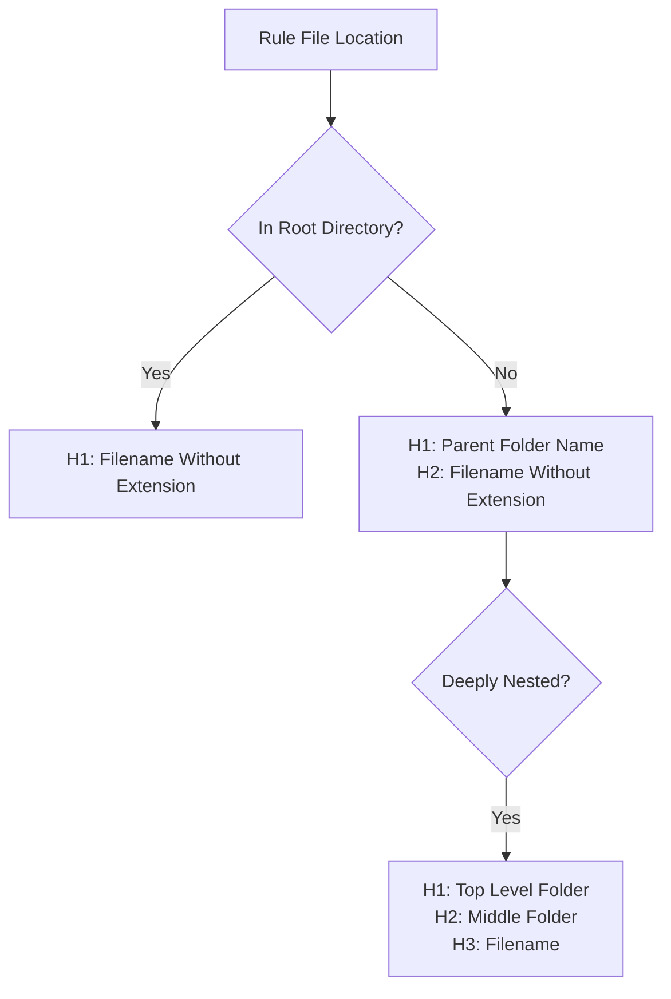

# Rule Generation Standards

This document establishes standards for creating and managing rules in the `.cursor/rules` directory structure.

## ⚠️ CRITICAL REQUIREMENTS

1. ⚠️ **File naming and title MUST match**:
   - For files in root directories (not in subfolders): The first heading MUST exactly match the filename (without extension).
     - Example: For file `agent/messages.mdc`, the first heading MUST be `# Messages`.

2. ⚠️ **Subfolder heading structure is MANDATORY**:
   - For files in subfolders: Headings MUST follow the folder hierarchy.
   - First heading (#) MUST match parent folder name.
   - Second heading (##) MUST match the filename (without extension).
   - Example: For file `agent/memory-bank/core.mdc`, the headings MUST be:

     ```
     # Memory Bank
     ## Core
     ```

3. ⚠️ **IMPORTANT! NEVER create files in the `generated` directory**: Files in this directory are only created through automated processes, not by direct agent actions. Only create files in the `.cursor/rules/always/`, `.cursor/rules/auto/`, `.cursor/rules/agent/`, or `.cursor/rules/manual/` directories.

4. **ONLY create files explicitly requested by the user**: Do not create additional files that weren't specifically requested, even if they seem complementary or helpful.

5. **ALWAYS create proper directory structure before creating files**: When creating a new rule file, ensure that the target directory exists first. Use `mkdir -p` command to ensure directories exist before creating files.

## Directory Structure

Rules must be organized in the following directory structure:

```bash
.cursor/rules/
  ├── always/      # Rules that are always applied
  ├── auto/        # Rules triggered automatically by file patterns, based on globs header
  ├── agent/       # Rules triggered automatically by context/intent, based on the description header
  └── manual/      # Rules only loaded when manually invoked (@manual/rule-name.mdc)
      ├── tool-name/ # Subdirs for organization allowed
      └── ...        # Other category folders as needed
```

Subdirectories *can* be created for scope (e.g., `manual/jest/`, `auto/node/`)

## Heading Structure Requirements

The correct heading structure depends on the file's location in the directory hierarchy:



### Examples by Nesting Level

**Root level file**: `.cursor/rules/agent/curl.mdc`

  ```markdown
  # Curl
  ```

**One level deep**: `.cursor/rules/agent/memory-bank/core.mdc`

  ```markdown
  # Memory Bank
  ## Core
  ```

**Two levels deep**: `.cursor/rules/always/_critical/mandatory-instructions.mdc`

  ```markdown
  # _Critical
  ## Mandatory Instructions
  ```

## Frontmatter Format

Every rule file **MUST** begin with frontmatter in this exact format:

```mdc
---
description: {desc}
globs: {paths}
alwaysApply: {bool}
---
```

- `desc`: Basing on this description another AI Agent will decide when this rule should be applied. MUST be set for `agent` rules ONLY, otherwise MUST be blank
- `paths`: should be a list of file paths. MUST be set for `auto` rules ONLY, otherwise MUST be blank
- `alwaysApply`: Set to `true` for rules intended to always apply (like those in `always/`) and `false` otherwise.

## Rule Content Guidelines

**Structure:**

- Rule content *after* the frontmatter MUST use standard Markdown.
- Content headings should continue the hierarchy established by the required headings.
  - For example, in a subfolder file, content sections should start at `###` level.

**Content:**

- Focus on actionable, clear directives.
- Avoid unnecessary explanations in the Markdown sections.
- Use concise markdown optimized for agent context window.
- Include valid and invalid examples where appropriate, using Markdown code fences.
- Use emojis and Mermaid diagrams when they enhance understanding.
- Be judicious with content length to optimize performance.
- Indent content within XML sections (if used, prefer YAML) with 2 spaces.
- NEVER use quotes around paths or desc patterns in the frontmatter.
- NEVER group glob extensions with `{}` in the frontmatter.

**Advanced Logic:**

- To represent complex flows, conditional logic (`if/then`), loops, or decision trees within a rule, **prioritize using Mermaid diagrams** (e.g., flowcharts, sequence diagrams) embedded in Markdown code fences. This enhances readability for both humans and AI.
- If a diagram is not suitable or too complex, represent the logic within **structured YAML blocks**
- As a last resort, if neither a diagram nor a structured YAML block can clearly represent the logic, describe it using **clear, unambiguous plain text** in the Markdown body.
- The execution engine/AI is expected to interpret these representations (Mermaid, YAML, or text) to understand the intended logic.

## Examples: Valid and Invalid Rules

### Valid: Root Level Agent Rule

**File:** `.cursor/rules/agent/curl.mdc`

```mdc
---
description: curl tool usage rules
globs:
alwaysApply: false
---

# Curl

...
```

### Valid: Subfolder Rule

**File:** `.cursor/rules/agent/memory-bank/core.mdc`

```mdc
---
description: memory bank core functionality
globs:
alwaysApply: false
---

# Memory Bank

## Core

...
```

### Valid: Deeply Nested Rule

**File:** `.cursor/rules/always/_critical/mandatory-instructions.mdc`

```mdc
---
description:
globs:
alwaysApply: true
---

# _Critical

## Mandatory Instructions

...
```

### Invalid: Incorrect Subfolder Structure

**File:** `.cursor/rules/agent/memory-bank/update.mdc`

```mdc
---
description: memory bank update functionality
globs:
alwaysApply: false
---

# Update  <!-- INCORRECT: Should be "# Memory Bank" -->

Information about updating the memory bank.
```

### Invalid: Missing Second Level Heading

**File:** `.cursor/rules/agent/memory-bank/progress.mdc`

```mdc
---
description: memory bank progress tracking
globs:
alwaysApply: false
---

# Memory Bank
<!-- INCORRECT: Missing "## Progress" heading -->

Information about tracking progress.
```

### Invalid: Manual Rule with Incorrect Frontmatter

**File:** `.cursor/rules/manual/component-accessibility.mdc`

```mdc
---
description: Make components accessible  <!-- INCORRECT: Description should be empty -->
globs: ["src/components/**/*.{tsx,jsx}"] <!-- INCORRECT: Globs should be empty -->
alwaysApply: true <!-- INCORRECT: Should be false -->
---

# Component Accessibility Guidelines

Components should be accessible.
```

## Common Mistakes and How to Avoid Them

### Heading Structure Errors

| ❌ Incorrect | ✅ Correct | Explanation |
|-------------|-----------|-------------|
| `# Rule Name` (in subfolder) | `# Parent Folder\n## Rule Name` | Files in subfolders must follow folder hierarchy |
| `# Parent Folder\n# Rule Name` | `# Parent Folder\n## Rule Name` | Use proper heading hierarchy (##, not #) for second level |
| `# Rule Name\n## Content` (in root) | `# Rule Name\n## Content` | Root files only need to match filename in first heading |

### Frontmatter Errors

| ❌ Incorrect | ✅ Correct | Explanation |
|-------------|-----------|-------------|
| No frontmatter | Include frontmatter | Every file needs frontmatter |
| Description in non-agent rule | Empty description | Only agent rules need descriptions |
| Globs in non-auto rule | Empty globs | Only auto rules need globs |
| alwaysApply: false in always/ | alwaysApply: true | Match alwaysApply to directory |

## Rule Generation Process Checklist

**Before creating or modifying a rule file:**

- **Confirm Request:** Ensure the user explicitly requested the rule creation/modification.
- **Determine Folder & Name:** Choose the rule folder (`always`, `auto`, `agent`, `manual`) and construct the filename (`rule-name.mdc`).
- **Determine Location:** Identify the correct directory path (e.g., `.cursor/rules/agent/`). Ensure the directory exists (`mkdir -p` if needed). Subdirs in `manual/` are for organization only.
- **Plan Frontmatter:** Define the correct frontmatter.
- **Plan Content:** Outline the Markdown and YAML structure for the rule body.
- **Determine Heading Structure:**
  - If in root directory: First heading = filename
  - If in subfolder: First heading = parent folder, Second heading = filename
- **State Plan:** Before calling `edit_file`, explicitly state your plan: "I will create/modify `path/to/category/rule-name.mdc` as a {Category} rule. Content will include..."

**After proposing the `edit_file` call for the rule file:**

- **Self-Correction & Verification:**
  - Re-read these standards. Does the proposed filename, location, and content structure comply?
  - **Verify Frontmatter:** Confirm the planned minimal frontmatter is present.
  - **Verify Heading Structure:**
    - If in root directory: First heading matches filename?
    - If in subfolder: First heading = parent folder, Second heading = filename?
  - If non-compliant, cancel the edit and correct the plan. State compliance: "The proposed rule complies with generation standards."

**Final Verification Checklist:**

```
[ ] Frontmatter is correct for the rule type
[ ] alwaysApply matches directory placement
[ ] Heading structure follows folder hierarchy
[ ] Additional content follows proper heading hierarchy
[ ] No syntax or formatting errors
```

## Response After Rule Creation

After creating or updating a rule, respond with:

```mdc
RuleGen Success: path/to/category/rule-name.mdc
Rule Category: {Always | Auto | Agent | Manual}
Rule Description: {The exact content of the description field}
```

---
> Converted and distributed by [TomeVault](https://tomevault.io/claim/kvokka)
> This is a context snippet only. You'll also want the standalone SKILL.md file — [download at TomeVault](https://tomevault.io/claim/kvokka)
<!-- tomevault:4.0:windsurf_rules:2026-04-08 -->
