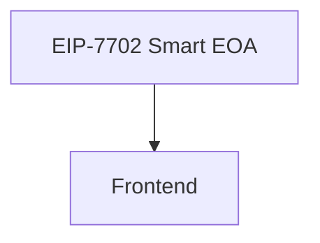

# My Dapp

> A Web3 application - composed with [N]skills

**Network**: Arbitrum Sepolia (Chain ID: 421614) — Testnet
**Keywords**: web3, dapp

---

## Architecture

## Components

| Component | Type | Category | User Prompt |
|-----------|------|----------|-------------|
| EIP-7702 Smart EOA | `eip7702-smart-eoa` | contracts | (none) |
| Frontend | `frontend-scaffold` | app | I want this should be able to let multiple eoa delegate tomit  |

## Implementation Order

Build the project in this order (respects dependencies):

1. **EIP-7702 Smart EOA** (`eip7702-smart-eoa`) — see `.nskils/components/eip7702-smart-eoa--3c1a1c7f.md`
2. **Frontend** (`frontend-scaffold`) — see `.nskils/components/frontend-scaffold--592189ee.md`

## Environment Variables

| Key | Description | Required | Default |
|-----|-------------|----------|---------|
| `NEXT_PUBLIC_ARBITRUM_RPC_URL` | Arbitrum RPC URL for EIP-7702 transactions | Yes | https://arb1.arbitrum.io/rpc |
| `SPONSOR_PRIVATE_KEY` | Private key for gas sponsorship | No |  |
| `NEXT_PUBLIC_WALLETCONNECT_PROJECT_ID` | WalletConnect Cloud project ID for wallet connections | Yes |  |
| `NEXT_PUBLIC_APP_NAME` | Application name displayed in wallet dialogs | No | Eip 7702  |

## Key Dependencies

| Package | Version |
|---------|---------|
| `next` | `^14.2.0` |
| `react` | `^18.3.0` |
| `react-dom` | `^18.3.0` |
| `wagmi` | `^2.12.0` |
| `viem` | `^2.21.0` |
| `@tanstack/react-query` | `^5.51.0` |
| `@rainbow-me/rainbowkit` | `^2.1.0` |
| `clsx` | `^2.1.0` |
| `tailwind-merge` | `^2.2.0` |
| `ethers` | `^6.13.0` |
| `lucide-react` | `^0.400.0` |
| `@radix-ui/react-select` | `^2.0.0` |
| `@types/node` | `^20.0.0` |
| `@types/react` | `^18.3.0` |
| `@types/react-dom` | `^18.3.0` |
| `typescript` | `^5.4.0` |
| `eslint` | `^8.57.0` |
| `eslint-config-next` | `^14.2.0` |
| `tailwindcss` | `^3.4.0` |
| `postcss` | `^8.4.0` |
| `autoprefixer` | `^10.4.0` |

## Detailed Component Specs

- [EIP-7702 Smart EOA](.nskils/components/eip7702-smart-eoa--3c1a1c7f.md)
- [Frontend](.nskils/components/frontend-scaffold--592189ee.md)

## Additional Context

- [Project Configuration](.nskils/project.md)
- [Full Architecture Details](.nskils/architecture.md)
- [All Environment Variables](.nskils/environment.md)
- [Verified Dependencies](.nskils/dependencies.md)
- [Scripts Reference](.nskils/scripts.md)
- [Integration Map](.nskils/integration-map.md)

---

*Generated by [[N]skills](https://www.nskills.xyz) — Compose N skills for your Web3 project.*

---
> Converted and distributed by [TomeVault](https://tomevault.io/claim/lackx741-tech)
> This is a context snippet only. You'll also want the standalone SKILL.md file — [download at TomeVault](https://tomevault.io/claim/lackx741-tech)
<!-- tomevault:4.0:windsurf_rules:2026-04-09 -->
