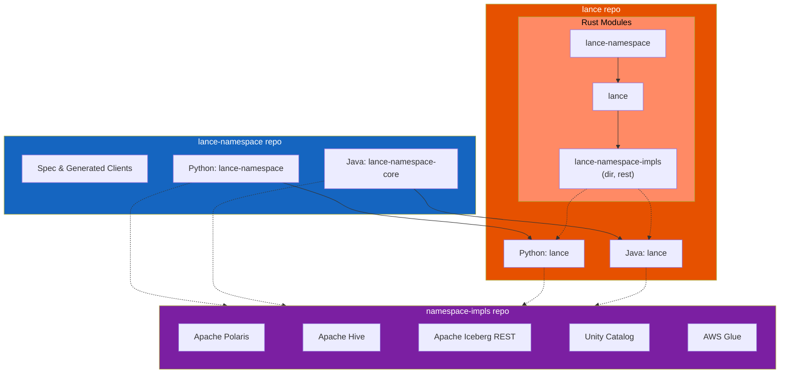

# Contributing to Lance Namespace

The Lance Namespace codebase is at [lance-format/lance-namespace](https://github.com/lance-format/lance-namespace).
This codebase contains:

- The Lance Namespace specification
- The core `LanceNamespace` interface and generic connect functionality for all languages except Rust
  (for Rust, these are located in the [lance-format/lance](https://github.com/lance-format/lance) repo)
- Generated clients and servers using OpenAPI generator

This project should only be used to make spec and interface changes to Lance Namespace,
or to add new clients and servers to be generated based on community demand.
In general, we welcome more generated components to be added as long as 
the contributor is willing to set up all the automations for generation and publication.

For contributing changes to directory and REST namespaces, please go to the [lance](https://github.com/lance-format/lance) repo.

For contributing changes to implementations other than the directory and REST namespace, 
or for adding new namespace implementations,
please go to the [lance-namespace-impls](https://github.com/lance-format/lance-namespace-impls) repo.

## Project Dependency

This project contains the core Lance Namespace specification, interface and generated modules across all languages.
The dependency structure varies by language due to different build and distribution models.

### Rust

For Rust, the interface module `lance-namespace` and implementations (`lance-namespace-impls` for REST and directory namespaces)
are located in the core [lance-format/lance](https://github.com/lance-format/lance) repository.
This is because Rust uses source code builds, and separating modules across repositories makes dependency management complicated.

The dependency chain is: `lance-namespace` → `lance` → `lance-namespace-impls`

### Other Languages (e.g. Python, Java)

For Python, Java, and other languages, the core `LanceNamespace` interface and generic connect functionality
are maintained in **this repository** (e.g., `lance-namespace` for Python, `lance-namespace-core` for Java).
The core [lance-format/lance](https://github.com/lance-format/lance) repository then imports these modules.

The reason for this import direction is that `lance-namespace-impls` (REST and directory namespace implementations)
are used in the Lance Python and Java bindings, and are exposed back through the corresponding language interfaces.
These language interfaces can also be imported dynamically without the need to have a dependency of the Lance core library bindings in those languages.

### Other Implementations

For namespace implementations other than directory and REST namespaces,
those are stored in the [lance-format/lance-namespace-impls](https://github.com/lance-format/lance-namespace-impls) repository,
with one implementation per language.

### Dependency Diagram

## Repository structure

This repository currently contains the following components:

| Component             | Language | Path                                   | Description                                                |
|-----------------------|----------|----------------------------------------|------------------------------------------------------------|
| Spec                  |          | docs/src                               | Lance Namespace Specification                              |
| Python Core           | Python   | python/lance_namespace                 | Core LanceNamespace interface and connect functionality    |
| Python UrlLib3 Client | Python   | python/lance_namespace_urllib3_client  | Generated Python urllib3 client for Lance REST Namespace   |
| Java Core             | Java     | java/lance-namespace-core              | Core LanceNamespace interface and connect functionality    |

<!-- Content truncated to meet Windsurf 6KB limit -->

---
> Source: [lance-format/lance-namespace](https://github.com/lance-format/lance-namespace) — distributed by [TomeVault](https://tomevault.io).
<!-- tomevault:4.0:windsurf_rules:2026-05-19 -->
