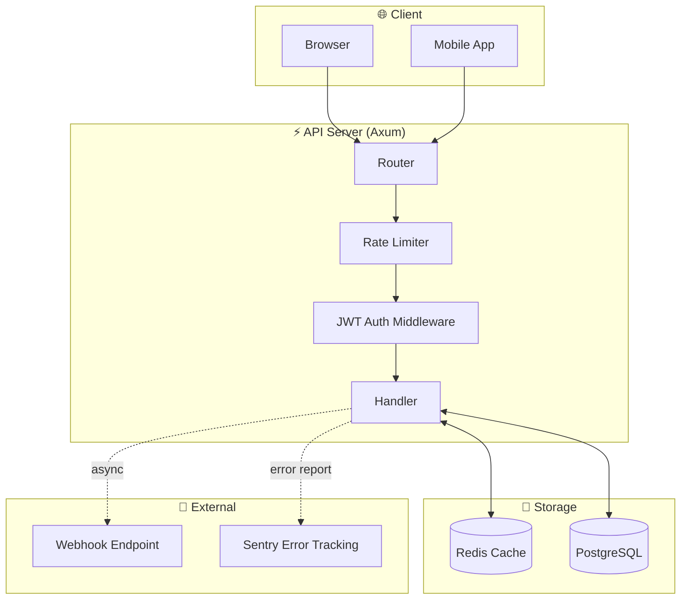
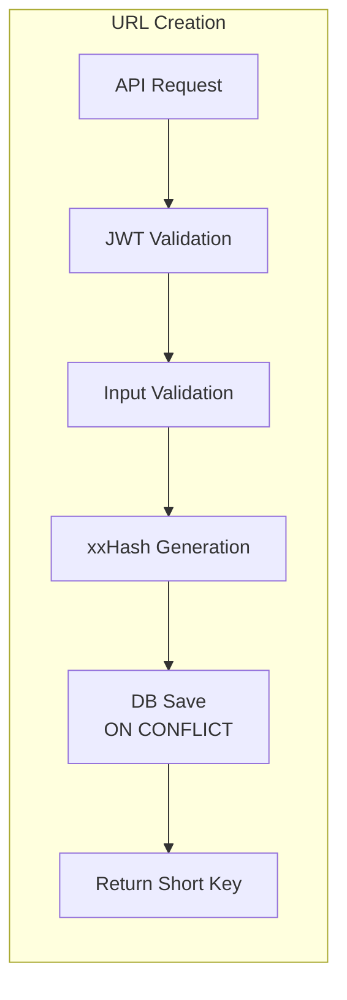
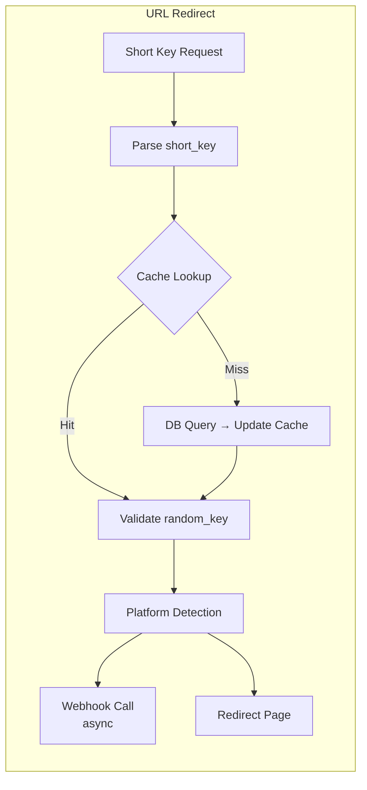
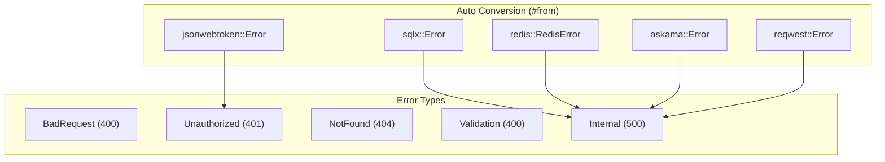

# AGENTS.md

> Project Guide for AI Coding Agents

---

## Project Overview

**url-shortener** is a high-performance URL shortening service built with Rust.

### Core Features

| Feature | Description |
|---------|-------------|
| URL Shortening | Collision-free short key generation using Base62 encoding |
| Deep Links | iOS/Android app deep links + platform-specific fallback URLs |
| OG Tags | Social media link previews |
| Webhooks | Real-time notifications on URL access (Semaphore concurrency control) |
| Redis Caching | High-speed caching with MessagePack serialization |
| JWT Auth | Token-based API authentication |
| Rate Limiting | SmartIP-based request throttling |

### Tech Stack

| Area | Technology |
|------|------------|
| Language | Rust 2021 Edition |
| Web Framework | Axum 0.8 |
| Async Runtime | Tokio |
| Database | PostgreSQL (SQLx) |
| Cache | Redis (deadpool-redis) + MessagePack |
| Templates | Askama |
| Error Handling | thiserror |
| Logging | tracing |
| Hashing | xxhash-rust (xxh3_128) |
| Memory Allocator | mimalloc |

---

## Architecture



### Data Flow





---

## Project Structure

```
src/
├── main.rs                 # Entry point, server bootstrap
├── lib.rs                  # Library crate
├── error.rs                # Centralized error types (AppError, AppResult)
├── api/
│   ├── mod.rs              # API module exports
│   ├── handlers.rs         # HTTP handlers (index, create_short_url, redirect)
│   ├── routes.rs           # Route definitions + middleware setup
│   ├── schemas.rs          # Request/Response DTOs + validation
│   ├── middlewares.rs      # JWT auth middleware (AuthUser)
│   └── state.rs            # AppState (DB pool, Redis pool)
├── config/
│   ├── mod.rs              # Config module exports
│   ├── env.rs              # Environment variable loading (APP_CONFIG)
│   ├── db.rs               # PostgreSQL connection pool
│   └── cache.rs            # Redis connection pool
├── models/
│   ├── mod.rs              # Models module exports
│   └── url.rs              # Url, UrlCacheData, UrlRepository
└── utils/
    ├── mod.rs              # Utils module exports
    ├── jwt.rs              # JWT generation/parsing (gen_token, parse_token)
    ├── rand.rs             # Random string generation
    └── short_key.rs        # Base62 encoding/decoding

tests/
└── integration_test.rs     # Integration tests (runnable without DB)

migrations/                 # SQLx migration files
views/                      # Askama HTML templates
```

---

## Core Modules

### Error Handling (`src/error.rs`)



```rust
#[derive(Error, Debug)]
pub enum AppError {
    BadRequest(String),      // 400
    Unauthorized(String),    // 401
    NotFound(String),        // 404
    Validation(String),      // 400
    Internal(String),        // 500
    Database(#[from] sqlx::Error),
    Redis(#[from] deadpool_redis::redis::RedisError),
    // ...
}

pub type AppResult<T> = Result<T, AppError>;
```

### Handler Pattern (`src/api/handlers.rs`)

```rust
pub async fn handler_name(
    State(state): State<AppState>,
    Extension(auth_user): Extension<AuthUser>,  // if auth required
    Json(body): Json<RequestType>,
) -> AppResult<impl IntoResponse> {
    // 1. Validation

<!-- Content truncated to meet Windsurf 6KB limit -->

---
> Source: [lee-lou2/url-shortener](https://github.com/lee-lou2/url-shortener) — distributed by [TomeVault](https://tomevault.io).
<!-- tomevault:4.0:windsurf_rules:2026-05-18 -->
