# Hikami-Go

> **📄 文档分工说明**
> - [`AGENTS.md`](./AGENTS.md) — **ZCode Agent 运行时上下文**(每个任务启动时自动读取)。聚焦"Agent 工作时最常用"的命令、约定、结构与边界,内容自包含、轻量。
> - `CLAUDE.md`(本文件)— **详尽的人类可读参考**:项目愿景、完整架构图(Mermaid)、28 模块逐一解析、数据流、编码规范。Claude Code 等工具读取;ZCode 仅在 onboarding 时作为一次性迁移源。
> - 修改工程约定时,**优先更新 `AGENTS.md`**(ZCode 实际依赖它);架构性大改动再同步本文件。两者共享同一份"真实信息",只是详略与受众不同。
>
> **🗂 `.claude/` 目录说明**:本仓库根的 `.claude/index.json`(及历史上的 `.claude/`)是 **Claude Code 时代的遗留物**,本项目已全面切换到 ZCode。ZCode 运行时不读取 `.claude/`(ZCode 只认 `.claude-plugin/plugin.json`,与本目录无关)。该目录按用户决定**保留但标注**,不再维护;`AGENTS.md` 才是 ZCode 的真实入口。

## 项目愿景

Hikami-Go 是面向 B 站主播的单机自动化直播音频处理服务。它用 Go 完成 B 站直播音频流录制、回放发现与下载、手动导入、ASR 转写、AI 直播回顾生成、WebDAV 归档上传和 B 站专栏发布，统一抽象为"来源适配 + 标准化 + 后处理"管道。发布成功后可选自动归档到 WebDAV（状态旁路任务，不推进会话主状态）。系统不保存视频画面，最终交付为单个服务二进制 + 外部工具运行时依赖。

## 架构总览

单机 Go 服务，SQLite 单文件数据库，Gin HTTP + WebSocket，自研 goroutine 任务池。所有来源统一进入标准化模块后，走相同的 ASR / 回顾 / 上传 / 发布管道。技术栈见下方，模块结构图见本文末。

**核心数据流：**

```text
来源适配器          标准化           后处理
  live_record  --> normalize --> asr --> recap --> upload --> publish
  replay_download                 |                              |
  manual_import                   |                              v
                          场次状态机 (state)            archive (状态旁路: published → 不改主状态, 仅写 archived_at)
```

**场次生命周期：**

```text
discovered --> downloading/recording/importing --> media_ready
  --> asr_submitted --> asr_done --> recap_done --> uploaded --> published
  (任何状态可 --> failed，失败状态可恢复到后续管道节点)

注：archive 从 published 出发，是「状态旁路任务」——不调用 states.Apply、不发 Event，
    成功后仅写 archived_at 时间戳；失败时由 cmd/hikami 特判只写 last_error，不降级 published。
```

**技术栈：**

| 组件 | 选型 |
|------|------|
| 语言 | Go 1.25.5 |
| HTTP 框架 | Gin |
| WebSocket | gorilla/websocket |
| 数据库 | SQLite (modernc.org/sqlite, 纯 Go 无 CGO) |
| 配置 | Viper (YAML) |
| 日志 | slog (结构化 JSON,输出 stdout；生产经 systemd 进 journald) |
| 定时任务 | robfig/cron/v3 |
| 外部工具 | ffmpeg, ffprobe, yt-dlp, rclone |
| AI | DashScope ASR + OpenAI-compatible/Anthropic 回顾生成 |
| 前端 | Vue 3 + Vite (内嵌 SPA)；V10 自建 H* 组件库（19 个），已移除 Element Plus |

## 模块结构图

```mermaid
graph TD
    ROOT["hikami-go (根)"] --> CMD["cmd/hikami"]
    ROOT --> INTERNAL["internal"]
    ROOT --> WEB["web"]

    INTERNAL --> CONFIG["config"]
    INTERNAL --> DB["db"]
    INTERNAL --> FSUTIL["fsutil"]
    INTERNAL --> AIPROV["aiprovider"]
    INTERNAL --> RUNTIME["runtime"]
    INTERNAL --> BILIUTIL["biliutil"]
    INTERNAL --> CHANNEL["channel"]
    INTERNAL --> SESSION["session"]
    INTERNAL --> STATE["state"]
    INTERNAL --> WORKER["worker"]
    INTERNAL --> HANDLER["handler"]
    INTERNAL --> SOURCE["来源适配"]
    INTERNAL --> PIPELINE["处理管道"]
    INTERNAL --> SCHEDULER["scheduler"]
    INTERNAL --> SECRETS["secrets"]
    INTERNAL --> RUNTIMECFG["runtimeconfig"]
    INTERNAL --> GLOSSARY["glossary"]
    INTERNAL --> NOTIFY["notify"]
    INTERNAL --> ARCHIVE["archive"]

    SOURCE --> DISCOVER["discover"]
    SOURCE --> DOWNLOAD["download"]
    SOURCE --> LIVE_REC["live_record"]
    SOURCE --> IMPORTER["importer"]

    PIPELINE --> NORMALIZE["normalize"]
    PIPELINE --> ASR["asr"]
    PIPELINE --> RECAP["recap"]
    PIPELINE --> UPLOAD["upload"]
    PIPELINE --> PUBLISHER["publisher"]
    PIPELINE --> ARCHIVE2["archive(状态旁路)"]

    click CMD "./cmd/hikami/CLAUDE.md" "查看 CLI 入口文档"
    click CONFIG "./internal/config/CLAUDE.md" "查看配置模块文档"
    click DB "./internal/db/CLAUDE.md" "查看数据库模块文档"
    click FSUTIL "./internal/fsutil/CLAUDE.md" "查看原子文件写入模块文档"
    click AIPROV "./internal/aiprovider/CLAUDE.md" "查看 AI Provider 类型文档"
    click RUNTIME "./internal/runtime/CLAUDE.md" "查看运行时探测文档"
    click BILIUTIL "./internal/biliutil/CLAUDE.md" "查看 B 站工具文档"
    click CHANNEL "./internal/channel/CLAUDE.md" "查看主播管理文档"
    click SESSION "./internal/session/CLAUDE.md" "查看场次管理文档"
    click STATE "./internal/state/CLAUDE.md" "查看状态机文档"
    click WORKER "./internal/worker/CLAUDE.md" "查看任务池文档"
    click HANDLER "./internal/handler/CLAUDE.md" "查看 API 文档"
    click DISCOVER "./internal/discover/CLAUDE.md" "查看回放发现文档"
    click DOWNLOAD "./internal/download/CLAUDE.md" "查看下载模块文档"
    click LIVE_REC "./internal/live_record/CLAUDE.md" "查看直播录制文档"
    click IMPORTER "./internal/importer/CLAUDE.md" "查看导入模块文档"
    click NORMALIZE "./internal/normalize/CLAUDE.md" "查看标准化模块文档"
    click ASR "./internal/asr/CLAUDE.md" "查看 ASR 模块文档"
    click RECAP "./internal/recap/CLAUDE.md" "查看回顾生成文档"
    click UPLOAD "./internal/upload/CLAUDE.md" "查看上传模块文档"
    click PUBLISHER "./internal/publisher/CLAUDE.md" "查看发布模块文档"
    click SCHEDULER "./internal/scheduler/CLAUDE.md" "查看调度器文档"
    click SECRETS "./internal/secrets/CLAUDE.md" "查看密钥管理文档"
    click RUNTIMECFG "./internal/runtimeconfig/CLAUDE.md" "查看运行时配置覆盖文档"
    click GLOSSARY "./internal/glossary/CLAUDE.md" "查看术语表文档"
    click NOTIFY "./internal/notify/CLAUDE.md" "查看通知模块文档"
    click ARCHIVE "./internal/archive/CLAUDE.md" "查看归档模块文档"
    click WEB "./web/CLAUDE.md" "查看前端文档"
```



## 精简模块索引

| 路径 | 职责 | 测试用例 | 文档 |
|------|------|----------|------|

<!-- Content truncated to meet Windsurf 6KB limit -->

---
> Source: [lililixxx1/hikami-go](https://github.com/lililixxx1/hikami-go) — distributed by [TomeVault](https://tomevault.io).
<!-- tomevault:4.0:windsurf_rules:2026-08-23 -->
