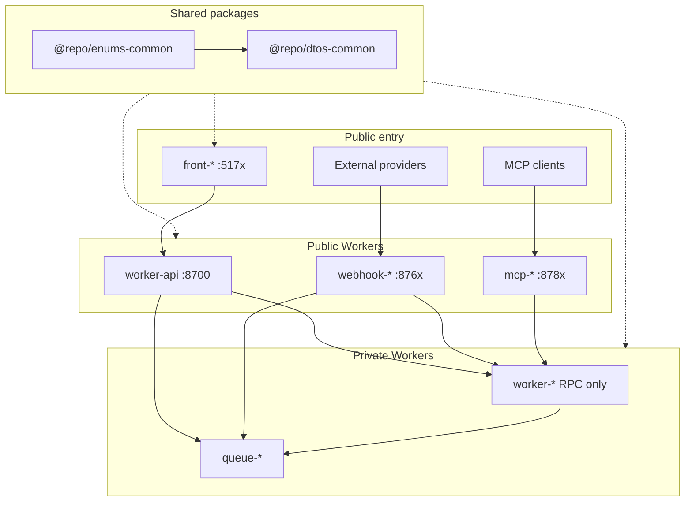

# Monorepo Agent Instructions

## Project Overview

A minimal, production-oriented monorepo starter built on **pnpm workspaces** with **Turborepo**, **Cloudflare Workers**, **Hono**, and a **React (Vite) frontend** styled with **Tailwind CSS v4**. `front-app` talks to `worker-api` over **HTTP**; service bindings are the preferred pattern for Worker-to-Worker communication when you add more Workers.

## Quick Start

```bash
pnpm install    # dependencies + workspace links
pnpm login      # Cloudflare (remote Worker features)
pnpm prepare    # Husky pre-commit hooks
pnpm dev        # all dev servers
```

After scaffolding a new worker under `apps/`, run `pnpm install` before turbo commands.

## Architecture



## Worker Prefixes

| Prefix | Example | Role | Production surface |
|--------|---------|------|--------------------|
| `worker-api` | `worker-api` | HTTP gateway (sticky name) | Public HTTP only |
| `worker-` | `worker-account` | Business logic | **RPC only** via service bindings |
| `queue-` | `queue-email` | Queue-only consumer | `queue()` handler; no public HTTP |
| `webhook-` | `webhook-example` | External webhook ingress | Public HTTP for provider callbacks |
| `mcp-` | `mcp-tools` | MCP server | Public HTTP MCP (SSE / streamable HTTP); tools call `worker-*` via RPC |
| `front-` | `front-app` | React SPA | Vite → gateway over HTTP only |

If a Worker is both RPC and a queue consumer, keep prefix **`worker-*`** (business range) and use the dual-handler layout. Use **`queue-*`** only for queue-only consumers.

## Where to Put Things

| Task | Location |
|------|---------|
| New API endpoint route | `apps/worker-api/src/routes/<feature>.ts` → mount in `src/index.ts` |
| Request/response Zod schemas (HTTP) | `packages/dtos-common/src/api/<feature>.ts` |
| Service-binding RPC schemas | `packages/dtos-common/src/rpc/<feature>.ts` |
| Queue message schemas | `packages/dtos-common/src/queue/<feature>.ts` |
| Webhook payload schemas | `packages/dtos-common/src/webhook/<feature>.ts` |
| Shared constrained value set | `packages/enums-common/src/index.ts` |
| Worker-local value set | `apps/<worker>/src/enums/` |
| DB schema / migrations / query helpers | `apps/<owner>/src/db/` (one owning Worker; never `packages/db-*`; no shared DB bindings) |
| Frontend API service | `apps/front-app/src/services/worker-api/<feature>.ts` |
| Frontend page | `apps/front-app/src/pages/` + `src/routes/` (TanStack file routes) |
| Reusable UI / hooks | `apps/front-app/src/components/ui/`, `src/hooks/` |
| Worker bindings / config | `apps/<worker>/wrangler.jsonc` |
| Local dev secrets | `apps/<worker>/.dev.vars` (from `.dev.vars.example`) |

Queue-only apps (`queue-*`) and dual-handler `worker-*` use: `handlers/request.ts`, `handlers/message.ts`, shared `services/`, minimal `index.ts`.

## Environment

Use Node 24 and the exact pnpm version pinned in root `package.json`. Copy `.dev.vars.example` → `.dev.vars` per app before local runs. Agent worktrees do not copy real env files; provision isolated credentials explicitly in each worktree. Secrets and wrangler vars: path-scoped rule `backend/workers-config`. Local ports when scaffolding: `backend/ports` (human tables in [README.md](README.md)).

## Root Scripts (pnpm)

`pnpm run` lists every root script. The ones that are not guessable:

| Command | Description |
|---------|-------------|
| `pnpm run ci` | lint + format + check-types + **types:check + boundaries + build** (full-repo local PR gate; CI uses `--affected` for check-types/build) |
| `pnpm lint:agent` | Lint with `--format=agent` - one machine-readable line per diagnostic, no auto-fix |
| `pnpm types` | Regenerate `worker-configuration.d.ts` in apps (**commit the result**) |
| `pnpm types:check` | Verify committed Worker types still match `wrangler.jsonc` (apps only; inside `pnpm run ci`) |
| `pnpm boundaries` | Check package dependency tags against `turbo.json` (inside `pnpm run ci`) |

### Scoping (pnpm / Turborepo)

Pass turbo filters on turbo-backed tasks (`check-types`, `build`, `dev`, `deploy`, `preview`, `types`):

| Flag | Effect | Example |
|------|--------|---------|

<!-- Content truncated to meet Windsurf 6KB limit -->

---
> Source: [louisbrulenaudet/monorepo-template](https://github.com/louisbrulenaudet/monorepo-template) — distributed by [TomeVault](https://tomevault.io).
<!-- tomevault:4.0:windsurf_rules:2026-08-11 -->
