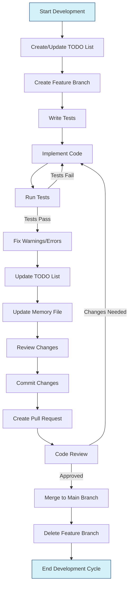

# General Development Guidelines

## Context

- Applies to all software development tasks
- Establishes consistent development workflow
- Ensures code quality and maintainability

## Requirements

- Create a plan by writing tasks on the todo list (@todo.md) before you start writing code
- Write tests before implementation
- Follow SOLID principles
- Write clean, maintainable code
- Update project documentation after completion
- Follow task completion workflow

## Task-Based Development

You should do task-based development. For every task:

1. Write tests for the feature/task
2. Implement the code
3. Run tests to verify implementation

## After Task Completion

When the tests pass:

- Update the todo list (@todo.md) to reflect the task being completed
- Update the memory file (@memory.md) to reflect the current state of the project
- Fix any warnings or errors in the code
- Commit the changes with a descriptive commit message
- Update the development guidelines if you've learned anything valuable
- Stop and wait for a new chat to begin the next task

## Core Development Principles

### SOLID Principles

- Single Responsibility: Each class/module should have only one reason to change
- Open/Closed: Open for extension, closed for modification
- Liskov Substitution: Derived types must be substitutable for base types
- Interface Segregation: Clients should not depend on methods they don't use
- Dependency Inversion: Depend on abstractions, not concrete implementations

### Clean Code Practices

- Use meaningful names for variables, functions, and classes
- Functions should do one thing
- Comments should explain "why," not "what"
- Implement comprehensive error handling
- Write automated and maintainable tests

### Engineering Excellence

- Verify requirements before implementing
- Deliver complete solutions without TODOs or placeholders
- Consider edge cases and future requirements
- Validate fixes with tests
- Balance readability with performance

### Code Quality

- Use descriptive, explicit variable names
- Replace hardcoded values with named constants
- Follow consistent coding style
- Implement robust error handling and logging
- Design for modularity and reusability

### Intellectual Honesty

- Acknowledge uncertainty
- Admit knowledge gaps
- Verify information before presenting it
- Consider alternative approaches
- Question assumptions when appropriate

## Development Workflow Diagram

The following diagram illustrates the complete development workflow, from planning to completion:

This workflow integrates the practices from both the development guidelines and git workflow rules to provide a complete picture of the development process.

<version>1.0.0</version>

---
> Converted and distributed by [TomeVault](https://tomevault.io/claim/markdotdigital) — claim your Tome and manage your conversions.
<!-- tomevault:4.0:windsurf_rules:2026-04-09 -->
