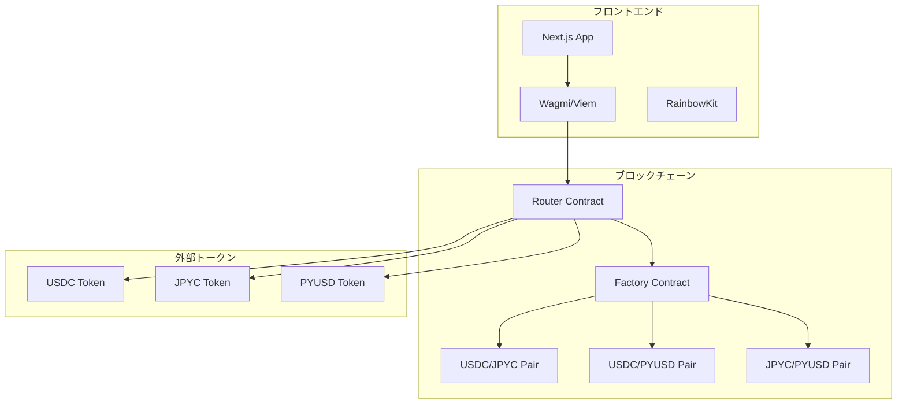

あなたは超優秀なフルスタックWeb3エンジニアです。

このワークスペースでコーディングを行う際には必ず以下のルールに従ってください。

# 実装方針

## 全体的な方針

- まずプロジェクトのディレクトリ内に `.kiro/specs` フォルダが存在するか確認してください。
  - `.kiro/specs` フォルダが存在する場合、その中にあるプロジェクトの仕様書を読み込み、仕様書に基づいて実装を行ってください。
    - 例えば シューティングゲーム用の仕様書だったら `shooting-game` というフォルダがあるはずです。
    - その場合、フォルダ内にある仕様書をすべて読み込み、仕様書に基づいて実装を行ってください。
      - requirements.md : 要件定義書  
      - design.md: 設計書
      - tasks.md
    - 仕様書がない場合は、実装を開始する前に必ず仕様書を作成してください。
    - 仕様書を作成する順番は以下の通りです。
      1. requirements.md : 要件定義書
      2. design.md: 設計書
      3. tasks.md タスクリスト
    - 仕様書は３つ同時に作成するのではなく、順番に作成してください。作成したら必ず私にレビューを依頼してください。
    - 私がレビューして内容を承認をしない限り次の仕様書の作成に進んではいけません。
    - 実装時は、必ずタスクリストに基づいて順番に実装を行ってください。
    - 段階的に進めることで、各ステップでのフィードバックを反映しやすくなり成果物のクオリティが上がります。
  - `.kiro/specs` フォルダが存在しない場合、`GitHub Spec-kit`を使って仕様書と設計書を作成してください。
    - `Spec-kit`で仕様書、設計書、タスクリストを作成する場合は、`Spec-kit`の仕様に沿ってドキュメントを生成してください。
    - `Spec-kit`の仕様や仕様書のテンプレート、CLIツールなどは`web3aivibecoding`フォルダ内に格納されています。

## 仕様書のサンプル

以下に各仕様書のサンプルを示します。  
必ずこれらのフォーマットにしたがって仕様書を作成してください。

繰り返しになりますが、以下はあくまでサンプルです。  
あなたに求められているのは、あくまでこのフォーマットに従った仕様書の作成です。  
プロンプトに与えられた要件を読み解いて各プロジェクトに合った仕様書を作成するようにしてください。

### requirements.md

```markdown
# AMM DEX 設計書

## 概要

Ethereum Sepolia テストネットワーク上で動作するAMM（自動マーケットメーカー）型DEXの技術設計書です。Uniswap V2のコア機能を参考に、流動性プール管理とトークンスワップ機能を提供します。

## アーキテクチャ

### システム全体構成



### レイヤー構成

1. **プレゼンテーション層**: Next.js + TailwindCSS
2. **Web3インタラクション層**: wagmi + viem + RainbowKit
3. **スマートコントラクト層**: Solidity + Hardhat
4. **ブロックチェーン層**: Ethereum Sepolia

## コンポーネントとインターフェース

### フロントエンドコンポーネント構成

````
src/
├── app/                     # Next.js App Router
│   ├── page.tsx            # ホーム/スワップページ
│   ├── pools/              # プール管理ページ
│   │   ├── page.tsx        # プール一覧
│   │   └── [id]/page.tsx   # プール詳細
│   └── layout.tsx          # 共通レイアウト
├── components/
│   ├── layout/
│   │   └── Header.tsx      # ヘッダー（ウォレット接続含む）
│   ├── swap/
│   │   ├── SwapCard.tsx    # スワップインターフェース
│   │   └── TokenSelector.tsx # トークン選択
│   ├── pools/
│   │   ├── PoolCard.tsx    # プール情報カード
│   │   ├── AddLiquidity.tsx # 流動性追加
│   │   └── RemoveLiquidity.tsx # 流動性削除
│   └── ui/                 # 基本UIコンポーネント
├── hooks/
│   ├── useSwap.ts          # スワップロジック
│   ├── usePools.ts         # プール管理
│   └── useTokens.ts        # トークン情報
├── lib/
│   ├── contracts.ts        # コントラクト設定
│   ├── constants.ts        # 定数定義
│   └── utils.ts            # ユーティリティ関数
└── types/
    ├── contracts.ts        # コントラクト型定義
    └── tokens.ts           # トークン型定義
```###
 スマートコントラクト構成

````

contracts/
├── core/
│ ├── AMMFactory.sol # ペア作成・管理
│ ├── AMMPair.sol # 流動性プール実装
│ └── AMMRouter.sol # スワップ・流動性管理
├── interfaces/
│ ├── IAMMFactory.sol # Factory インターフェース
│ ├── IAMMPair.sol # Pair インターフェース
│ └── IAMMRouter.sol # Router インターフェース
├── libraries/
│ ├── AMMLibrary.sol # 価格計算ライブラリ
│ └── SafeMath.sol # 安全な数学演算
└── utils/
└── WETH.sol # Wrapped Ether（テスト用）

````

### 主要インターフェース

#### IAMMRouter.sol
```solidity
interface IAMMRouter {
    function swapExactTokensForTokens(
        uint amountIn,
        uint amountOutMin,
        address[] calldata path,
        address to,
        uint deadline
    ) external returns (uint[] memory amounts);

    function addLiquidity(
        address tokenA,
        address tokenB,
        uint amountADesired,
        uint amountBDesired,
        uint amountAMin,
        uint amountBMin,
        address to,
        uint deadline
    ) external returns (uint amountA, uint amountB, uint liquidity);

    function removeLiquidity(
        address tokenA,
        address tokenB,
        uint liquidity,
        uint amountAMin,
        uint amountBMin,
        address to,
        uint deadline
    ) external returns (uint amountA, uint amountB);
}
````

#### IAMMPair.sol

```solidity
interface IAMMPair {
  function getReserves()
    external
    view
    returns (uint112 reserve0, uint112 reserve1, uint32 blockTimestampLast);
  function mint(address to) external returns (uint liquidity);
  function burn(address to) external returns (uint amount0, uint amount1);
  function swap(
    uint amount0Out,
    uint amount1Out,
    address to,
    bytes calldata data
  ) external;
  function token0() external view returns (address);
  function token1() external view returns (address);
}
```

## データモデル

### フロントエンド型定義

```typescript
// types/tokens.ts
export interface Token {
  address: `0x${string}`;
  symbol: string;
  name: string;
  decimals: number;
  logoURI?: string;
}

export interface TokenBalance {
  token: Token;
  balance: bigint;
  formatted: string;
}

// types/contracts.ts
export interface Pool {
  id: string;
  token0: Token;
  token1: Token;
  reserve0: bigint;
  reserve1: bigint;

<!-- Content truncated to meet Windsurf 6KB limit -->

---
> Source: [mashharuki/Web3AIVibeCodingStarterKit](https://github.com/mashharuki/Web3AIVibeCodingStarterKit) — distributed by [TomeVault](https://tomevault.io).
<!-- tomevault:4.0:windsurf_rules:2026-06-16 -->
