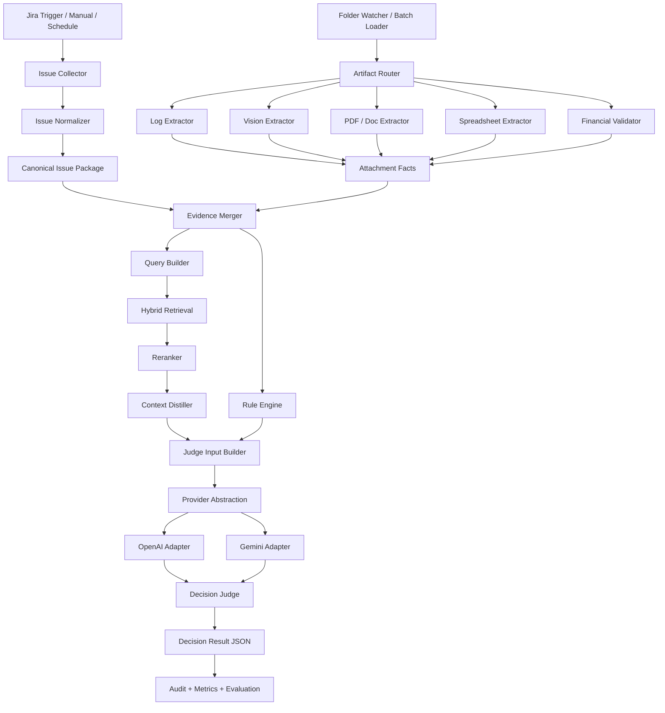
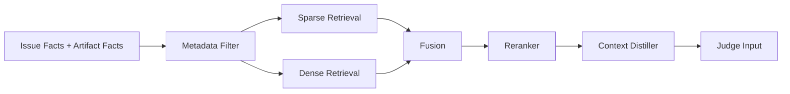
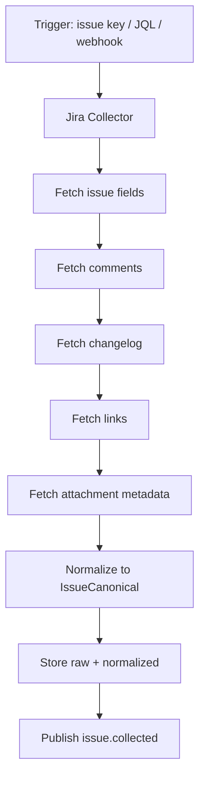
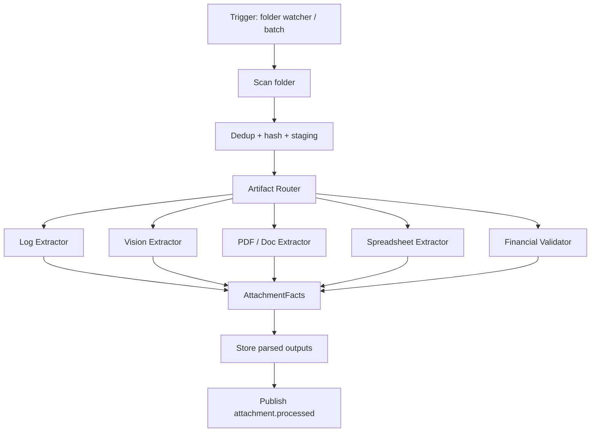

# Advanced Jira Issue Validation RAG

Production-grade architecture for **validating Jira issues as real bugs**, checking **completeness/readiness for development**, and processing **multimodal evidence** such as logs, screenshots, PDFs, spreadsheets, and financial artifacts.

This README is designed to be pasted into Copilot/Codex as the technical north star for implementation.

---

## 1) Goal

Build the **most accurate practical RAG system** for issue triage and bug validation with these constraints:

- highest possible precision for bug/completeness/readiness decisions
- support for **OpenAI API** and **Gemini API** without vendor lock-in
- low latency for common cases
- low unit cost at scale
- strong auditability
- strong support for logs, images, PDFs, spreadsheets, and financial evidence
- retrieval quality that remains high even with exact tokens like issue IDs, versions, request IDs, tenant IDs, stack traces, error codes, SQL names, and internal acronyms

This is **not** a generic chatbot RAG.
It is an **evidence-driven decision system**.

---

## 2) Final Recommendation (short version)

### Architecture to build

**Issue-Centric Evidence RAG** with:

1. **canonical issue package**
2. **specialized extractors per artifact type**
3. **deterministic rules before LLM judgment**
4. **hybrid retrieval** (dense + sparse + metadata filters)
5. **reranking**
6. **context distillation/compression**
7. **facts-first -> judge-later pipeline**
8. **provider abstraction for OpenAI + Gemini**
9. **evaluation loop with golden dataset + RAGAS + disagreement review**
10. **optional GraphRAG layer for connected enterprise knowledge**

### Best default storage choices for this use case

- **Primary vector DB:** **Qdrant**
- **Graph DB (optional, second store):** **Neo4j**
- **Do not use graph DB as primary vector store** for this problem
- **Do not couple retrieval to provider-native file search** if you want dual-provider portability

### Best orchestration choices

- **Workflow/orchestration:** **LangGraph**
- **Prompt/program optimization:** **DSPy + GEPA**
- **RAG evaluation:** **RAGAS**
- **Document parsing:** **Docling first**, with fallback to **Unstructured** for difficult PDFs and layout-specific paths

### Best default model routing

- **Fast extraction / cheap classification:**
  - OpenAI: `gpt-5-mini` or `gpt-5-nano`
  - Gemini: `gemini-2.5-flash-lite` or `gemini-3.1-flash-lite-preview`
- **Standard judge / main multimodal reasoning:**
  - OpenAI: `gpt-5-mini`
  - Gemini: `gemini-2.5-flash`
- **Critical cases / second opinion / eval:**
  - OpenAI: `gpt-5.4`
  - Gemini: `gemini-3.1-pro-preview` if you accept preview risk

### Core principle

**Use all available evidence, but never pass all raw evidence directly to the final judge.**
Everything must be converted into **structured facts** first.

---

## 3) Why this architecture is the right fit

The uploaded articles strongly converge on the same pattern:

- vanilla RAG fails on complex, multi-source tasks
- multi-stage retrieval improves answer correctness materially
- reranking is essential
- context compression/distillation is essential
- prompt engineering alone is insufficient; pipelines should be explicit DAGs/modules
- evaluation must be continuous and objective, not based on “looks good”

From the uploaded material, the strongest recurring design patterns were:

- **hybrid retrieval -> rerank -> distill**
- **facts first, synthesis later**
- **confidence-aware/self-corrective loops**
- **optimize prompts/programs with DSPy/GEPA instead of hand-editing forever**
- **evaluate with RAGAS / objective metrics**
- **use cheaper retrieval representations early and more expressive scoring later**

Key takeaways from the uploaded PDFs:

- advanced pipelines outperform baseline RAG by a wide margin on context precision/recall and answer correctness fileciteturn11file3L16-L20
- the recommended retrieval funnel is broad recall -> cross-encoder rerank -> distillation fileciteturn11file7L13-L21
- DSPy makes each reasoning step explicit, measurable, and optimizable as a DAG instead of a monolithic prompt fileciteturn11file9L3-L16
- GEPA improves prompts/program behavior using metric feedback, not only scalar reward fileciteturn11file4L10-L18
- extracting bullet-point facts before synthesis helps with complex multi-source questions fileciteturn11file5L36-L40
- binary/int8 retrieval cascades can dramatically reduce retrieval cost at scale by using cheap recall first and more expressive rescoring later fileciteturn11file2L45-L79
- REFRAG-style compression is a useful inspiration for context efficiency: compress aggressively, preserve exact text only where fidelity matters (numbers, IDs, rare entities) fileciteturn11file8L14-L45

---

## 4) Architecture overview



---

## 5) Core design principles

### 5.1 Facts first, judge later

Never ask the final LLM directly:

> “Is this a bug and is it ready for dev?”

Instead:

1. extract structured facts from issue + artifacts
2. validate deterministic facts in code
3. retrieve related evidence
4. rerank and compress context
5. only then run the final judge

### 5.2 Use all evidence, but not in raw form

All evidence types are valuable:

- issue body
- comments
- changelog
- issue links
- logs
- screenshots
- PDFs
- spreadsheets
- financial exports
- historical similar issues
- runbooks / docs / PRs / changelogs / incidents

But the final judge should consume:

- normalized issue facts
- artifact facts
- contradictions
- missing information
- top reranked evidence
- deterministic validation outputs

### 5.3 Separate retrieval from inference vendor

The retrieval layer should remain external and provider-agnostic.
OpenAI and Gemini should be used as **LLM engines**, not as the authoritative knowledge substrate.

This avoids lock-in and keeps the same business logic, data model, and evaluation loop across both providers.

### 5.4 Prefer a multi-stage retrieval funnel

Recommended sequence:

1. metadata prefilter
2. sparse retrieval (keywords/BM25 or sparse vectors)
3. dense retrieval
4. merge/fuse
5. rerank
6. compress/distill
7. final judge

### 5.5 Deterministic code must validate financial and numerical claims

If the issue contains:

- duplicated debit suspicion
- reconciliation mismatch
- spreadsheet totals
- PDF totals
- refund/chargeback amounts
- timestamps and ordering

then:

- the LLM may **extract**
- the LLM may **explain**
- but **code must verify the arithmetic and consistency**

---

## 6) Best database choices

## 6.1 Recommended default vector database: **Qdrant**

### Why Qdrant is the best default here

Qdrant is the strongest default choice for this architecture because it combines the features that matter most for issue validation RAG:

- dense vectors
- sparse vectors
- hybrid search
- named vectors
- multivectors
- payload filtering
- quantization options
- multitenancy / payload-driven isolation
- self-hosted and managed options

Important Qdrant capabilities from current docs:

- supports sparse vector search and hybrid search flows [Ref 1]
- supports payload filtering during semantic search, not only pre/post filtering [Ref 2]
- supports named vectors / multivectors, which helps multimodal or multi-representation retrieval [Ref 3]
- explicitly teaches hybrid search, multivectors, quantization, and distributed deployment in its production material [Ref 4]

### Why it wins for this use case

This system needs all of the following simultaneously:

- exact token sensitivity (`PAY-1421`, `NullPointerException`, `BR_PRD_07`)
- semantic similarity for vague or noisy issue descriptions
- strong metadata filters (`project`, `component`, `service`, `env`, `tenant`, `version`)
- ability to store multiple vector representations for the same artifact
- optional quantization for scale

Qdrant fits that profile better than a simpler “just vectors inside SQL” choice.

### When to choose Qdrant

Choose Qdrant if you want:

- best default production fit
- external retrieval core shared across OpenAI and Gemini
- flexible hybrid retrieval
- lower operational complexity than a graph+vector all-in-one design

---

## 6.2 Recommended graph database: **Neo4j** (optional second store)

### What Neo4j is best at here

Neo4j should be added **only when relationships materially improve retrieval**.
Examples:

- issue -> duplicates -> root cause cluster
- issue -> service -> owner squad
- issue -> release -> changelog -> PR
- error fingerprint -> incident -> workaround -> runbook
- payment flow -> step -> downstream service -> log source
- customer/tenant -> environment -> integration -> known problem

### Why Neo4j is not the primary vector DB

For this problem, most retrieval load is still:

- issue similarity
- artifact similarity
- keyword-sensitive search
- filter-heavy search

That is primarily a vector/hybrid retrieval problem.
Graph traversal is a **high-value secondary capability**, not the default retrieval path.

Neo4j is strong when you need graph-aware retrieval. Its GraphRAG docs explicitly support retrievers that combine vector similarity with graph traversal through Cypher, enriching retrieved results with relational context [Ref 5].

### When to add Neo4j

Add Neo4j if one or more are true:

- the issue domain is highly relational
- incident / dependency / ownership chains matter a lot
- duplicate/root-cause clustering is important
- you need explainable traversal through enterprise entities

### When to skip Neo4j

Skip it in the first version if:

- you need to ship quickly
- most value comes from issue similarity + artifact retrieval + filters
- your metadata already captures enough structure

---

## 6.3 Why not use only pgvector as the default

`pgvector` is excellent when you want:

- one datastore
- simpler ops
- close coupling with transactional data
- modest scale

It supports HNSW and IVFFlat, and recent releases improved planner/filtering behavior [Ref 6].

However, for this specific system, pgvector is **not the best default** because the architecture needs advanced hybrid retrieval and vector-centric search ergonomics as first-class capabilities.

### Recommendation

- **Use pgvector** if you want the simplest deployment and lower ops burden
- **Use Qdrant** if you want the strongest retrieval layer for this architecture

---

## 6.4 Why not make Weaviate or Milvus the default

Both are strong options.

### Weaviate

Pros:
- hybrid search
- reranking modules
- good developer ergonomics [Ref 7]

Why not my default pick:
- for this project I prefer keeping reranking and orchestration more explicit and less embedded inside the storage layer
- Qdrant’s filtering model and vector-search-first ergonomics fit this issue-evidence workload slightly better

### Milvus

Pros:
- strong scale story
- multi-vector search
- full-text and hybrid options [Ref 8]

Why not my default pick:
- better fit for organizations optimizing primarily for very large-scale vector workloads
- not the simplest default for this Jira validation stack unless you already run Zilliz/Milvus comfortably

### Final ranking for this use case

1. **Qdrant** — best default
2. **pgvector** — best simple/minimal-ops fallback
3. **Milvus** — best if extreme scale is the main concern
4. **Weaviate** — good managed/productive alternative if you want more in-database features

---

## 7) Best library choices

## 7.1 Orchestration: **LangGraph**

Use LangGraph as the workflow runtime.

Why:

- stateful workflows
- persistence/checkpointing
- fault tolerance
- human-in-the-loop
- deterministic workflow control with agentic escape hatches

LangGraph’s docs explicitly position it as infrastructure for long-running, stateful workflows/agents with persistence and debugging support [Ref 9].

### Use LangGraph for

- workflow state
- retries
- checkpoints
- human review pause/resume
- split execution paths
- disagreement handling between providers

### Do not use LangGraph for

- prompt optimization
- evaluation
- vector retrieval itself

---

## 7.2 Prompt/program optimization: **DSPy + GEPA**

Use DSPy to define modules/signatures and GEPA to optimize the pipeline against your metrics.

Why:

- turns prompt strings into explicit modules
- makes each substep measurable and replaceable
- enables optimization with metric feedback instead of endless hand tuning

DSPy’s docs describe signatures as declarative input/output behavior and optimizers as metric-driven tuning of prompts/programs [Ref 10]. GEPA is the reflective prompt optimizer for evolving complex systems [Ref 11].

### Use DSPy for

- fact extraction modules
- contradiction detection modules
- completeness checker modules
- judge modules
- optimization against your golden dataset

### Important note

Do **not** build your whole production runtime inside DSPy first.
The safer pattern is:

- runtime = LangGraph + typed services
- optimization lab = DSPy + GEPA

Then port the best prompts/programs back into production configs.

---

## 7.3 Evaluation: **RAGAS**

Use RAGAS for component and end-to-end evaluation.

Why:

- context precision
- context recall
- faithfulness
- answer correctness
- metrics for RAG and agentic workflows

RAGAS is specifically built to move evaluation from subjective “vibe checks” to systematic loops [Ref 12].

### Use RAGAS for

- comparing retrievers
- comparing chunking strategies
- comparing rerankers
- comparing OpenAI vs Gemini judge outputs
- validating improvements before rollout

---

## 7.4 Document parsing: **Docling first**, **Unstructured fallback**

### Docling

Use Docling as the first parser for PDFs and structured documents.

Why:
- strong PDF/document understanding posture
- easy conversion/export flows
- explicit table export support [Ref 13]

### Unstructured

Use Unstructured as fallback or complementary parser for difficult PDFs/images and when you want partition strategies and explicit structural elements [Ref 14].

### Recommended parsing strategy

1. Try **Docling**
2. If structure quality is poor, try **Unstructured hi_res / alternate strategy**
3. If artifact is still ambiguous, use provider multimodal extraction directly
4. Always normalize final output into your own schema

---

## 7.5 Spreadsheet and financial processing

For spreadsheets and finance-heavy artifacts, prefer deterministic Python code:

- `pandas`
- `openpyxl`
- `numpy`
- domain validators in plain Python

LLMs should not be your arithmetic engine.

---

## 7.6 API/server/runtime libs

Recommended:

- `fastapi`
- `pydantic`
- `httpx`
- `tenacity`
- `orjson`
- `uvicorn`
- `python-multipart`

---

## 8) Provider strategy: OpenAI + Gemini

## 8.1 Core rule

Build one business architecture and two provider adapters.

```text
LLMProvider
  - extract_issue_facts()
  - extract_log_facts()
  - extract_visual_facts()
  - extract_pdf_facts()
  - classify_issue()
  - judge_issue()
  - summarize_context()
  - embed()
```

Implement:

- `OpenAIProvider`
- `GeminiProvider`

---

## 8.2 Why this is the correct integration strategy

### OpenAI current capabilities relevant here

- Responses API is the main modern surface [Ref 15]
- Structured Outputs guarantees adherence to JSON Schema [Ref 16]
- file inputs are supported in Responses [Ref 17]
- file search supports semantic + keyword search over uploaded files, but should be optional in this architecture [Ref 18]
- prompt caching can reduce latency and input cost substantially for repeated prefixes [Ref 19]

### Gemini current capabilities relevant here

- structured outputs can be streamed as valid partial JSON [Ref 20]
- embeddings support retrieval tasks and configurable dimensionality [Ref 21]
- explicit caching is supported [Ref 22]
- document processing supports text, images, diagrams, charts, and tables in PDFs up to large document sizes [Ref 23]

### Architectural conclusion

Use provider-native features where they help, but keep:

- retrieval index
- evidence schemas
- rules
- evaluation
- audit trail

outside the provider.

---

## 8.3 Model routing recommendation

### OpenAI

- `gpt-5-nano`: very cheap classification/summarization path [Ref 24]
- `gpt-5-mini`: best default high-volume extraction/judging path [Ref 25]
- `gpt-5.4`: strongest professional-work judge for hard cases [Ref 26]
- `text-embedding-3-large`: strongest OpenAI embedding option [Ref 27]

### Gemini

- `gemini-2.5-flash-lite` or `gemini-3.1-flash-lite-preview`: cheap extraction/classification [Ref 28]
- `gemini-2.5-flash`: best stable price-performance default [Ref 29]
- `gemini-3.1-pro-preview`: optional strongest judge path if you accept preview risk [Ref 30]
- `gemini-embedding-001`: embedding option with controllable dimensionality [Ref 21]

### Recommended production routing

#### Fast path

- issue obvious
- low business impact
- enough evidence
- no contradictions

Use one cheap model only.

#### Standard path

- issue moderately complex
- multimodal evidence present
- needs retrieval + judge

Use one strong/cheap main model.

#### Critical path

- financial impact
- ambiguous evidence
- conflicting artifacts
- high severity
- low confidence

Use:
- primary judge
- secondary judge from other provider
- disagreement router
- optional human review

---

## 9) Retrieval architecture

## 9.1 Retrieval layers



### Layer 1: metadata filters

Filter by:

- `project`
- `issue_type`
- `component`
- `service`
- `environment`
- `tenant`
- `affected_version`
- `labels`
- `artifact_type`
- `error_fingerprint`
- `financial_flow`

### Layer 2: sparse retrieval

Use sparse/keyword-aware retrieval for:

- issue keys
- stack traces
- request IDs
- SQL names
- versions
- endpoints
- acronyms
- exact error strings

### Layer 3: dense retrieval

Use dense retrieval for:

- semantic similarity
- vague issue descriptions
- paraphrased symptoms
- natural-language evidence

### Layer 4: reranking

Rerank merged candidates using a stronger relevance model.

### Layer 5: context distillation

Distill top evidence into compact structured summaries, while preserving exact numbers/IDs/quoted strings where fidelity matters.

---

## 9.2 Recommended chunking strategy

Chunk by **semantic unit**, not by arbitrary token size only.

### Issue chunks

- summary
- description
- acceptance criteria
- reproduction steps
- comments (thread-aware)
- changelog events

### Log chunks

- event groups by correlation/request/trace id
- time windows
- stack traces as preserved blocks

### PDF/document chunks

- section-aware
- table-aware
- figure-aware
- preserve page number and layout metadata

### Spreadsheet chunks

- sheet-aware
- row-window by business key
- totals / summary sections separated

### Keep these uncompressed where possible

- monetary values
- dates/times
- versions/builds
- IDs and fingerprints
- exact errors
- policy thresholds

---

## 9.3 Quantization and scale strategy

For very large corpora, adopt a cascade inspired by the uploaded article:

- cheap recall representation early
- more expressive rescoring late

Practical version:

1. dense embeddings at ingest
2. optional quantized / cheaper retrieval representation for large collections
3. rescore the top candidates with a stronger reranker
4. only fetch full text for the shortlist

This pattern reduces cost while preserving precision when implemented carefully fileciteturn11file2L16-L19 fileciteturn11file2L64-L79

---

## 10) Two ingestion flows to implement

## 10.1 Flow A — fetch issue from Jira



### Output

`IssueCanonical`

Contains:

- issue fields
- normalized description
- comments
- acceptance criteria
- reproduction steps
- expected vs actual
- environment
- component/service metadata
- linked issues
- attachment metadata
- changelog snapshot

---

## 10.2 Flow B — process attachments from folder



### Folder conventions

Preferred:

```text
/input/
  /PAY-1421/
    screenshot_01.png
    payment_logs.txt
    evidence.pdf
    reconciliation.xlsx
```

Alternative:

```text
/input/
  PAY-1421__screenshot_01.png
  PAY-1421__payment_logs.txt
  PAY-1421__evidence.pdf
  PAY-1421__reconciliation.xlsx
```

---

## 11) Canonical schemas

## 11.1 IssueCanonical

```json
{
  "issue_key": "PAY-1421",
  "summary": "PIX payment shows failure but customer may have been charged",
  "description": "...",
  "comments": [],
  "acceptance_criteria": [],
  "reproduction_steps": [],
  "expected_behavior": "...",
  "actual_behavior": "...",
  "priority": "High",
  "issue_type": "Bug",
  "status": "Triagem",
  "project": "PAY",
  "component": "checkout",
  "service": "payment-service",
  "environment": "prod",
  "affected_version": "2.4.1",
  "labels": ["pix", "financeiro"],
  "issue_links": [],
  "attachments": [],
  "changelog": [],
  "collected_at": "2026-03-06T14:00:00Z"
}
```

## 11.2 AttachmentFacts

```json
{
  "issue_key": "PAY-1421",
  "artifacts": [
    {
      "artifact_id": "sha256:...",
      "artifact_type": "image",
      "source_path": "/input/PAY-1421/screenshot_01.png",
      "extracted_text": "Erro ao processar pagamento",
      "facts": {
        "visible_error_message": "Erro ao processar pagamento",
        "visible_amount": "R$ 120,50",
        "visible_timestamp": "2026-03-06 09:11:43"
      },
      "confidence": 0.94
    }
  ],
  "contradictions": [],
  "missing_information": []
}
```

## 11.3 DecisionResult

```json
{
  "issue_key": "PAY-1421",
  "classification": "bug",
  "is_bug": true,
  "is_complete": false,
  "ready_for_dev": false,
  "missing_items": [
    "expected_result_detail",
    "affected_version_confirmation"
  ],
  "evidence_used": [
    "issue.description",
    "attachment:screenshot_01.png",
    "attachment:reconciliation.xlsx",
    "similar_issue:PAY-1308"
  ],
  "contradictions": [
    "UI showed failure but backend indicates transaction completed"
  ],
  "financial_impact_detected": true,
  "confidence": 0.91,
  "requires_human_review": true
}
```

---

## 12) Module breakdown

## 12.1 Services

```text
/services
  /api
  /jira_collector
  /folder_watcher
  /artifact_router
  /extractors
    /issue
    /logs
    /vision
    /pdf
    /spreadsheet
    /financial
  /retrieval
    /dense
    /sparse
    /fusion
    /rerank
    /distill
  /decision
    /rules
    /judge
    /confidence
    /escalation
  /providers
    /openai
    /gemini
  /evaluation
  /shared
    /schemas
    /telemetry
    /cache
```

## 12.2 Event topics

```text
jira.issue.collected
jira.issue.normalized
attachment.file.discovered
attachment.file.processing
attachment.file.processed
issue.package.ready
issue.validation.started
issue.validation.completed
issue.validation.failed
human.review.required
```

---

## 13) Decision engine design

## 13.1 Rules before LLM

Run deterministic checks first:

- missing environment
- missing expected behavior
- missing actual behavior
- missing reproduction steps
- issue type mismatch
- duplicated issue candidate
- financial sum mismatch
- timestamp ordering anomalies
- screenshot/log contradiction

### Why

Cheap rules remove trivial cases and reduce hallucination.

---

## 13.2 Final judge input

The final judge should receive only:

- issue facts
- artifact facts
- deterministic rule outputs
- top reranked evidence
- contradictions
- missing fields
- business policy snippets

Not the entire raw corpus.

---

## 13.3 Confidence and escalation

Escalate when:

- `confidence < threshold`
- conflicting evidence
- financial impact detected
- very high severity
- provider disagreement
- missing mandatory fields but model still wants to classify as ready

---

## 14) Prompt/program strategy

## 14.1 Do not maintain one giant prompt

Instead create separate typed modules:

- `extract_issue_facts`
- `extract_log_facts`
- `extract_visual_facts`
- `extract_pdf_facts`
- `extract_spreadsheet_facts`
- `detect_contradictions`
- `check_completeness`
- `judge_bug`
- `judge_ready_for_dev`

## 14.2 Use DSPy signatures

Examples:

```python
"issue_text -> issue_facts"
"log_text -> log_facts"
"image_context -> visual_facts"
"issue_facts, artifact_facts, retrieved_evidence -> decision_result"
```

## 14.3 Optimize with GEPA

Feed the optimizer:

- golden examples
- metric outputs
- textual feedback about what was wrong

Optimize per module, not just the final step.

---

## 15) Evaluation plan

## 15.1 Build a golden dataset

Each labeled example should include:

- canonical issue package
- artifact set
- expected classification
- completeness label
- ready-for-dev label
- mandatory missing items
- high-signal evidence references
- optional rationale

## 15.2 Metrics to track

Using RAGAS and custom metrics:

- context precision
- context recall
- faithfulness
- answer correctness
- extraction F1 for structured fields
- completeness accuracy
- ready-for-dev accuracy
- provider disagreement rate
- human override rate
- false-positive bug rate
- false-ready-for-dev rate

## 15.3 Replay harness

Every change should be replayed against:

- fixed golden set
- recent production set
- hard multimodal set
- financial issues set

---

## 16) Caching and cost control

## 16.1 OpenAI caching

OpenAI prompt caching works automatically and can significantly reduce latency and input token costs for repeated prefixes [Ref 19].

### Best practice

- put stable instructions and schemas at the beginning of the prompt
- append dynamic evidence later

## 16.2 Gemini caching

Gemini explicit caching is useful when reusing the same corpus or policy instructions across many requests [Ref 22].

## 16.3 General cost tactics

- use cheap extractor models first
- only escalate complex cases
- cache normalized artifact outputs
- cache embeddings
- rerank only top N candidates
- compress context before judgment
- batch offline evaluation and preprocessing

Gemini Batch API supports large-scale non-urgent processing at reduced cost [Ref 31].

---

## 17) Security and privacy notes

Recommended:

- redact secrets before model calls
- hash IDs when possible in eval datasets
- keep raw artifacts encrypted at rest
- store provenance for every extracted fact
- log every model/version/prompt/schema used in decisions
- separate production inference data from evaluation datasets

---

## 18) Minimal production roadmap

## Phase 1 — MVP with real value

Build:

- Jira collector
- folder watcher
- canonical issue package
- log/image/pdf/spreadsheet extractors
- rules engine
- Qdrant hybrid retrieval
- simple reranker
- final judge with one provider
- audit logs

## Phase 2 — serious production

Add:

- second provider adapter
- disagreement router
- DSPy optimization lab
- RAGAS evaluation harness
- context distiller
- confidence calibration
- human review UI

## Phase 3 — advanced enterprise

Add:

- Neo4j GraphRAG layer
- quantized retrieval cascade
- learned policy for continue/revise/finish routing
- automatic duplicate/root-cause clustering
- provider A/B online traffic splitting

---

## 19) Final decisions to adopt now

### Use these defaults unless there is a strong reason not to

- **Vector DB:** Qdrant
- **Graph DB:** Neo4j only if relationship retrieval matters materially
- **Orchestration:** LangGraph
- **Optimization:** DSPy + GEPA
- **Evaluation:** RAGAS
- **Document parsing:** Docling first, Unstructured fallback
- **Spreadsheet/financial validation:** pandas/openpyxl + deterministic Python
- **OpenAI runtime:** Responses API + Structured Outputs
- **Gemini runtime:** Gemini API + Structured Outputs + embeddings + caching
- **Primary retrieval pattern:** metadata filter + sparse + dense + rerank + distill
- **Final inference pattern:** facts first, judge later

---

## 20) Anti-patterns to avoid

Do **not**:

- send the entire raw issue + all raw attachments directly to the judge
- use only dense retrieval
- use only BM25
- skip reranking
- skip context compression
- trust LLM arithmetic for financial validation
- hardcode all logic into one giant prompt
- tie retrieval to a single provider-native file search tool if portability matters
- introduce Neo4j on day one unless you know relationships are central

---

## 21) Reference implementation sketch

```python
# pseudo-flow
issue = jira_collector.fetch(issue_key)
issue_canonical = issue_normalizer.normalize(issue)

artifact_facts = artifact_pipeline.process_folder(folder_for_issue(issue_key))

issue_package = issue_package_builder.merge(
    issue_canonical=issue_canonical,
    artifact_facts=artifact_facts,
)

rule_results = rules_engine.evaluate(issue_package)
retrieval_query = query_builder.build(issue_package, rule_results)
retrieved = retriever.hybrid_search(retrieval_query)
reranked = reranker.rank(retrieval_query, retrieved)
distilled = distiller.compress(issue_package, reranked)

judge_input = judge_input_builder.build(
    issue_package=issue_package,
    rule_results=rule_results,
    distilled_context=distilled,
)

decision = provider_router.select(judge_input).judge_issue(judge_input)

audit_store.write(issue_package, rule_results, reranked, distilled, decision)
```

---

## 22) References

[Ref 1] Qdrant search and sparse vector docs: https://qdrant.tech/documentation/concepts/search/

[Ref 2] Qdrant overview and payload filtering on HNSW: https://qdrant.tech/documentation/overview/

[Ref 3] Qdrant points, named vectors, multivectors: https://qdrant.tech/course/essentials/day-1/embedding-models/

[Ref 4] Qdrant Essentials course: https://qdrant.tech/course/essentials/

[Ref 5] Neo4j GraphRAG retrievers: https://neo4j.com/docs/neo4j-graphrag-python/current/user_guide_rag.html

[Ref 6] pgvector improvements / PostgreSQL news: https://www.postgresql.org/about/news/pgvector-080-released-2952/

[Ref 7] Weaviate hybrid search and reranking docs:
- https://docs.weaviate.io/weaviate/concepts/search/hybrid-search
- https://docs.weaviate.io/weaviate/search/rerank

[Ref 8] Milvus hybrid and multi-vector docs:
- https://milvus.io/docs/overview.md
- https://milvus.io/docs/hybrid_search_with_milvus.md
- https://milvus.io/docs/multi-vector-search.md

[Ref 9] LangGraph docs:
- https://docs.langchain.com/oss/python/langgraph/overview
- https://docs.langchain.com/oss/python/langgraph/persistence
- https://docs.langchain.com/oss/python/langgraph/workflows-agents

[Ref 10] DSPy docs:
- https://dspy.ai/
- https://dspy.ai/learn/programming/signatures/
- https://dspy.ai/learn/optimization/optimizers/

[Ref 11] GEPA docs:
- https://dspy.ai/api/optimizers/GEPA/overview/

[Ref 12] RAGAS docs:
- https://docs.ragas.io/en/stable/
- https://docs.ragas.io/en/stable/concepts/metrics/available_metrics/

[Ref 13] Docling docs:
- https://docling-project.github.io/docling/
- https://docling-project.github.io/docling/examples/export_tables/

[Ref 14] Unstructured docs:
- https://docs.unstructured.io/welcome
- https://docs.unstructured.io/open-source/core-functionality/partitioning
- https://docs.unstructured.io/open-source/concepts/partitioning-strategies

[Ref 15] OpenAI Responses API:
- https://developers.openai.com/api/reference/resources/responses/

[Ref 16] OpenAI Structured Outputs:
- https://developers.openai.com/api/docs/guides/structured-outputs/

[Ref 17] OpenAI file inputs:
- https://developers.openai.com/api/docs/guides/file-inputs/

[Ref 18] OpenAI file search:
- https://developers.openai.com/api/docs/guides/tools-file-search/

[Ref 19] OpenAI prompt caching:
- https://developers.openai.com/api/docs/guides/prompt-caching/

[Ref 20] Gemini structured outputs:
- https://ai.google.dev/gemini-api/docs/structured-output

[Ref 21] Gemini embeddings:
- https://ai.google.dev/gemini-api/docs/embeddings
- https://docs.cloud.google.com/vertex-ai/generative-ai/docs/embeddings/get-text-embeddings

[Ref 22] Gemini explicit caching:
- https://ai.google.dev/gemini-api/docs/caching

[Ref 23] Gemini document processing:
- https://ai.google.dev/gemini-api/docs/document-processing

[Ref 24] OpenAI GPT-5 nano:
- https://developers.openai.com/api/docs/models/gpt-5-nano

[Ref 25] OpenAI GPT-5 mini:
- https://developers.openai.com/api/docs/models/gpt-5-mini

[Ref 26] OpenAI GPT-5.4:
- https://developers.openai.com/api/docs/models/gpt-5.4

[Ref 27] OpenAI embeddings and text-embedding-3-large:
- https://developers.openai.com/api/docs/guides/embeddings/
- https://developers.openai.com/api/docs/models/text-embedding-3-large

[Ref 28] Gemini Flash-Lite models:
- https://ai.google.dev/gemini-api/docs/models/gemini-2.5-flash-lite
- https://ai.google.dev/gemini-api/docs/models/gemini-3.1-flash-lite-preview

[Ref 29] Gemini 2.5 Flash:
- https://ai.google.dev/gemini-api/docs/models/gemini-2.5-flash

[Ref 30] Gemini 3.1 Pro Preview:
- https://ai.google.dev/gemini-api/docs/models/gemini-3.1-pro-preview

[Ref 31] Gemini Batch API:
- https://ai.google.dev/gemini-api/docs/batch-api

---

## 23) Bottom line

If you want the **best advanced practical design** for this Jira triage problem:

- build an **Issue-Centric Evidence RAG**
- choose **Qdrant** as the default vector core
- add **Neo4j** only if relationships clearly improve retrieval quality
- orchestrate with **LangGraph**
- optimize prompts/programs with **DSPy + GEPA**
- evaluate relentlessly with **RAGAS**
- use **Docling + Unstructured + deterministic financial validation** for artifacts
- keep retrieval external and provider-agnostic
- use **OpenAI and Gemini as swappable inference engines**
- adopt **facts-first, judge-later** as a hard rule

That is the architecture I would actually ship.

---
> Converted and distributed by [TomeVault](https://tomevault.io/claim/matheusen)
> This is a context snippet only. You'll also want the standalone SKILL.md file — [download at TomeVault](https://tomevault.io/claim/matheusen)
<!-- tomevault:4.0:windsurf_rules:2026-04-08 -->
