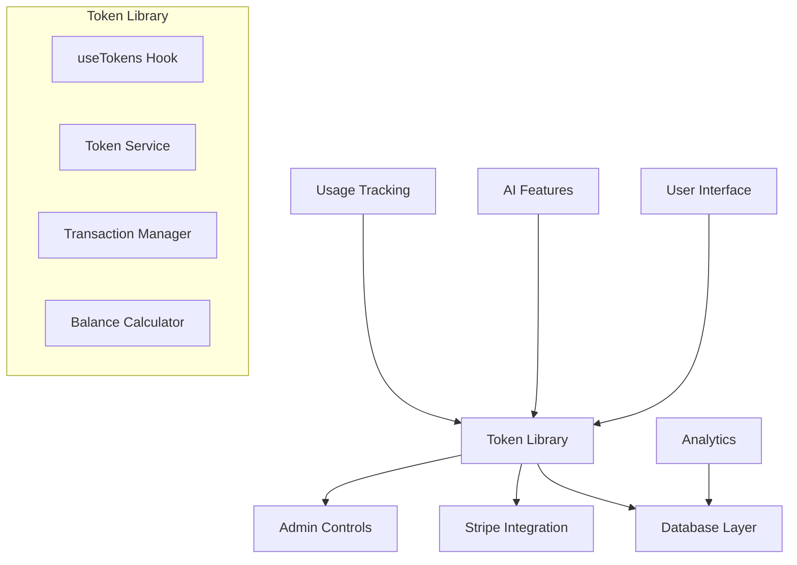
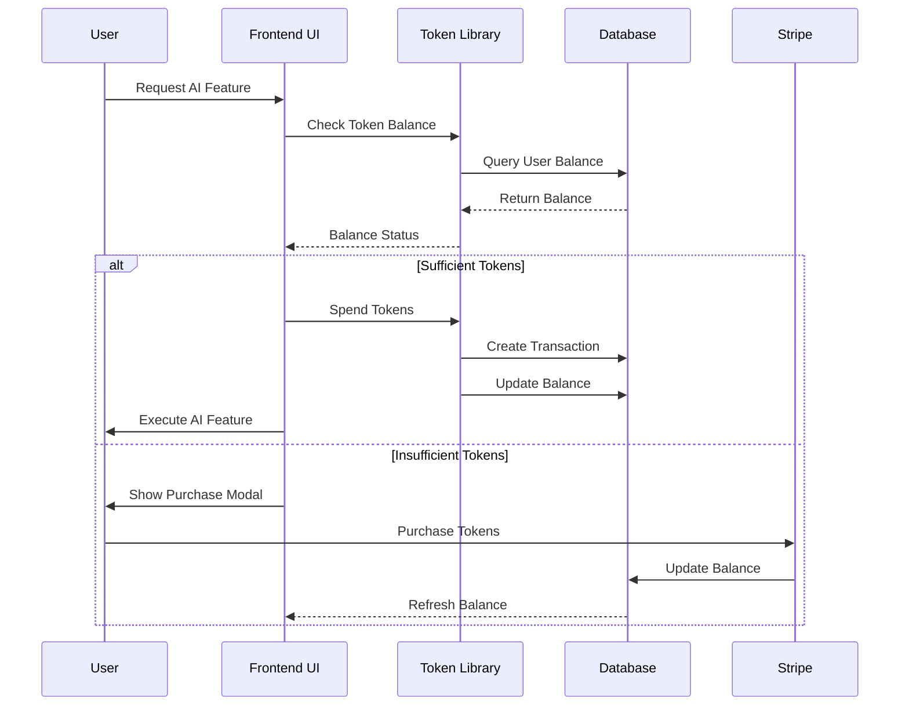

# Token/Credits System SOP - OfferGen AI Platform

## Table of Contents
1. [Overview](#overview)
2. [System Architecture](#system-architecture)
3. [Database Schema](#database-schema)
4. [Backend Implementation](#backend-implementation)
5. [Frontend Token Library](#frontend-token-library)
6. [UI Components](#ui-components)
7. [Admin Management](#admin-management)
8. [Integration Guide](#integration-guide)
9. [Testing Procedures](#testing-procedures)
10. [Deployment & Monitoring](#deployment--monitoring)
11. [Troubleshooting](#troubleshooting)

## Overview

The Token/Credits System is a modular, reusable library that provides a unified way to manage AI feature access across the OfferGen AI platform. It acts as a virtual currency system where users purchase tokens and spend them on AI-powered features.

### Key Features
- **Modular Design**: Easy to add/remove from any feature
- **Real-time Balance**: Live token balance updates
- **Transaction History**: Complete audit trail
- **Admin Controls**: Full administrative management
- **Stripe Integration**: Seamless payment processing
- **Usage Analytics**: Detailed consumption tracking
- **Flexible Pricing**: Configurable token costs per feature

## System Architecture

### Core Components



### Data Flow



## Database Schema

### Core Tables

```sql
-- Token Transactions (Main ledger)
CREATE TABLE token_transactions (
  id UUID PRIMARY KEY DEFAULT gen_random_uuid(),
  user_id UUID REFERENCES auth.users(id) ON DELETE CASCADE NOT NULL,
  transaction_type TEXT NOT NULL CHECK (transaction_type IN ('purchase', 'usage', 'refund', 'bonus', 'expiration')),
  amount INTEGER NOT NULL, -- Positive for credits, negative for debits
  description TEXT NOT NULL,
  metadata JSONB DEFAULT '{}',
  created_at TIMESTAMPTZ DEFAULT NOW(),
  expires_at TIMESTAMPTZ, -- For expiring tokens
  
  -- Indexes for performance
  INDEX idx_token_transactions_user_id (user_id),
  INDEX idx_token_transactions_type (transaction_type),
  INDEX idx_token_transactions_created (created_at DESC)
);

-- Token Purchases (Stripe integration)
CREATE TABLE token_purchases (
  id UUID PRIMARY KEY DEFAULT gen_random_uuid(),
  user_id UUID REFERENCES auth.users(id) ON DELETE CASCADE NOT NULL,
  limit_type limit_type NOT NULL,
  token_amount INTEGER NOT NULL,
  price_paid NUMERIC(10,2) NOT NULL,
  stripe_payment_intent_id TEXT,
  status TEXT DEFAULT 'pending' CHECK (status IN ('pending', 'completed', 'failed', 'refunded')),
  created_at TIMESTAMPTZ DEFAULT NOW(),
  updated_at TIMESTAMPTZ DEFAULT NOW(),
  
  -- Indexes
  INDEX idx_token_purchases_user_id (user_id),
  INDEX idx_token_purchases_status (status)
);

-- User Usage Tracking (Current balances and limits)
CREATE TABLE user_usage (
  id UUID PRIMARY KEY DEFAULT gen_random_uuid(),
  user_id UUID REFERENCES auth.users(id) ON DELETE CASCADE NOT NULL,
  limit_type limit_type NOT NULL,
  current_usage INTEGER DEFAULT 0,
  additional_tokens INTEGER DEFAULT 0, -- Purchased tokens
  token_balance INTEGER DEFAULT 0, -- Current token balance
  last_reset_at TIMESTAMPTZ DEFAULT NOW(),
  created_at TIMESTAMPTZ DEFAULT NOW(),
  updated_at TIMESTAMPTZ DEFAULT NOW(),
  
  UNIQUE(user_id, limit_type),
  INDEX idx_user_usage_user_id (user_id)
);

-- Admin Settings (Token pricing and rates)
CREATE TABLE admin_settings (
  id UUID PRIMARY KEY DEFAULT gen_random_uuid(),
  setting_key TEXT UNIQUE NOT NULL,
  setting_value JSONB NOT NULL,
  description TEXT,
  updated_by UUID REFERENCES auth.users(id),
  created_at TIMESTAMPTZ DEFAULT NOW(),
  updated_at TIMESTAMPTZ DEFAULT NOW()
);
```

### Database Functions

```sql
-- Get user token balance
CREATE OR REPLACE FUNCTION get_user_token_balance(p_user_id UUID)
RETURNS INTEGER AS $$
DECLARE
  balance INTEGER := 0;
BEGIN
  SELECT COALESCE(SUM(amount), 0) INTO balance
  FROM token_transactions
  WHERE user_id = p_user_id
    AND (expires_at IS NULL OR expires_at > NOW());
  
  RETURN GREATEST(balance, 0);
END;
$$ LANGUAGE plpgsql SECURITY DEFINER;

-- Add tokens to user account
CREATE OR REPLACE FUNCTION add_user_tokens(
  p_user_id UUID,
  p_amount INTEGER,
  p_transaction_type TEXT,
  p_description TEXT,
  p_metadata JSONB DEFAULT '{}'
) RETURNS BOOLEAN AS $$
BEGIN
  INSERT INTO token_transactions (

<!-- Content truncated to meet Windsurf 6KB limit -->

---
> Converted and distributed by [TomeVault](https://tomevault.io/claim/maverick-software) — claim your Tome and manage your conversions.
<!-- tomevault:4.0:windsurf_rules:2026-04-13 -->
