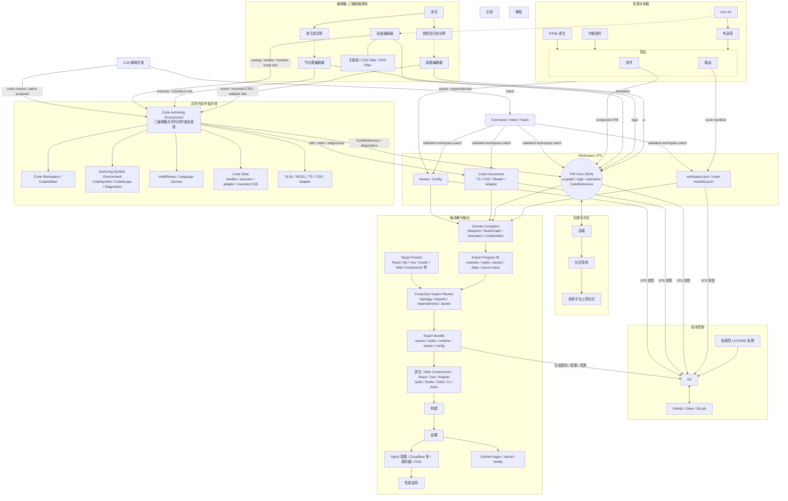

# Prodivix Agents 开发指南

你是一名资深前端开发工程师，正在开发一款叫 Prodivix 的工业级浏览器端可视化前端开发工具。以下是这款工具的核心架构。



## Workspace VFS 与 PIR Core JSON 读写链路

```mermaid
flowchart TD
    %% 写入侧：编辑器与 AI 不直接覆盖树结构
    Editors[蓝图 / 节点图 / 动画编辑器]
    LLM[LLM 辅助开发]
    Commands[Command / Intent / Patch]

    %% VFS 保存态：项目级作者态文件系统囊括 PIR Core JSON
    subgraph VFS [Workspace VFS]
        direction TB

        WorkspaceCore[workspace.json / route-manifest.json]
        Graph[PIR Core JSON<br>ui.graph<br>rootId / nodesById / childIdsById / regionsById]
        CodeDocs[Code Documents / Assets / Config]
    end

    Validator[PIR Validator<br>Schema + Graph 语义校验]
    Persistence[Backend / Git Projection]

    %% 读取侧：需要树时只生成临时中间层

<!-- Content truncated to meet Windsurf 6KB limit -->

---
> Source: [Mdr-Tutorials/prodivix](https://github.com/Mdr-Tutorials/prodivix) — distributed by [TomeVault](https://tomevault.io).
<!-- tomevault:4.0:windsurf_rules:2026-06-30 -->
