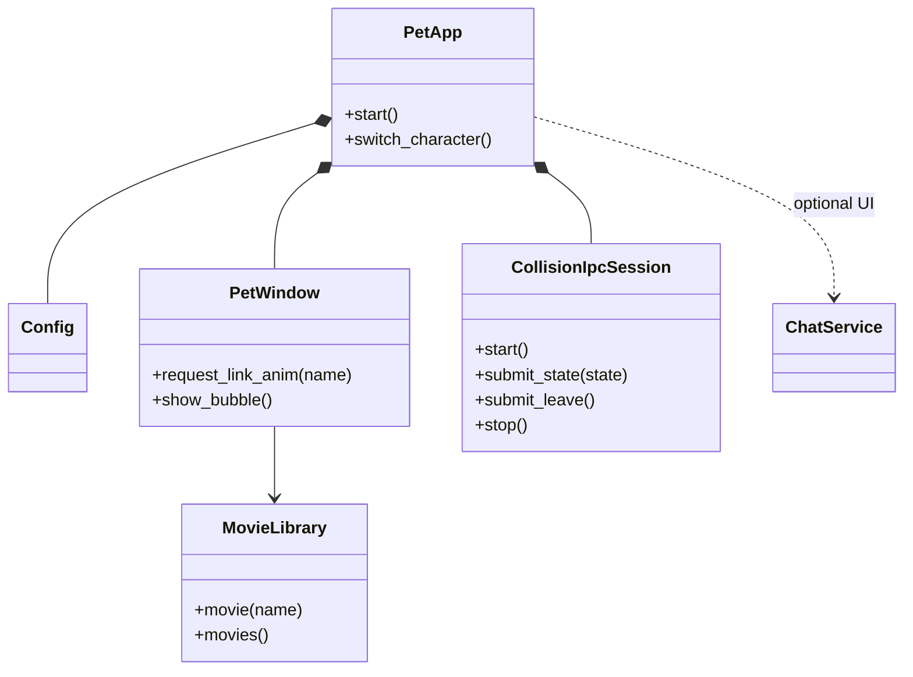
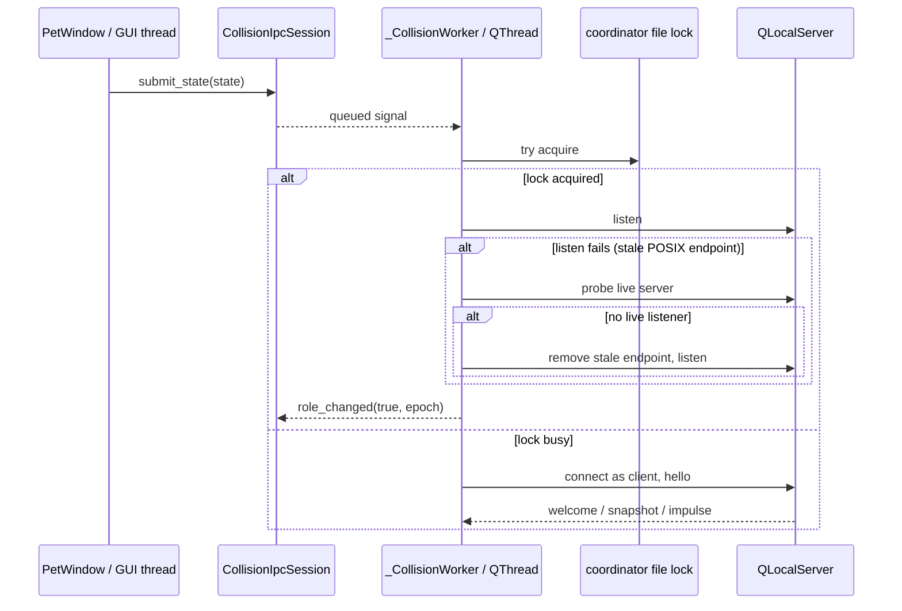

# Engineering guide

## Project shape

This is a PySide6 desktop-pet application. `python -m pet` enters through
`pet/__main__.py`; `PetApp` owns application-level services, `PetWindow` owns
interactive pet behavior, and `MovieLibrary` owns animation media. Keep Qt
objects on their owning thread and communicate across threads with queued
signals.

The IPC facade belongs to the GUI thread; `_CollisionWorker` and every
`QLocalServer`, `QLocalSocket`, and IPC timer belong to its dedicated `QThread`.
The shared kernel file lock is the coordinator authority. On POSIX, a lock
holder that fails to `listen()` because of a stale Unix socket first probes
for a live listener, and only removes the stale endpoint when nobody answers.

## Change discipline

- Preserve user changes in a dirty worktree and keep generated build output out
  of commits.
- Fix behavior test-first at a public seam. For Qt/IPC regressions, use real
  event loops and process boundaries; mock only operating-system or network
  boundaries that cannot run deterministically.
- A fix is complete when the focused regression is red before the product
  change, green afterward, and verification matches the risk gate below.
- Run the full suite for shared models/config migrations, application lifecycle,
  threading/IPC, packaging/dependencies, platform branches, changes spanning
  multiple test domains, or the final accumulated branch before merge.
- Focused plus related tests are sufficient for a local presentation token or
  isolated widget behavior when interfaces, persisted data, lifecycle, and
  platform dispatch are unchanged. Record why the full suite was skipped.
- Keep `CollisionIpcSession.stop()` ordering intact: stop producers, send leave,
  close local endpoints and timers, then quit/wait for the worker thread.
- Keep QLocal test server names short. POSIX converts names to Unix socket paths,
  whose limit includes the system temporary-directory prefix.

## Delivery evidence discipline (2026-09-22 起，硬要求)

每个 PR 必须交付**三份证据**，缺一即视为未完成，审查时按缺陷提出
（模板：`docs/PR-REPORT-TEMPLATE.md`；细则：`docs/DEV-HANDOVER.md` §8.2/§8.3）：

1. **修改文件说明**：逐文件写「改了什么 + 为什么」，含增删行数（`git diff
   --numstat`）与新增/删除文件。只写「修了 bug」不算说明。
2. **性能分析**：受影响路径的**实测**数字（命令 + 环境 + 样本量），并逐条回答
   稳态开销、新增路径成本与触发频率、有无新的系统调用/网络/磁盘/线程、内存有无
   增长。**形容词不算分析**——用「可忽略 / 更快 / 优化了」代替数字视为没写。
3. **实机运行记录或报告**：在本机真实环境（不是 CI、不是 mock）跑过什么的记录：
   命令、真实输出、以及用户可见行为的确认。无法自动验证的能力，必须给出
   「为什么不能自动」的排查证据（探针结果），不许用沉默代替结论。

落地形式：报告写入 `docs/PR-REPORT-<主题>-<YYYY-MM-DD>.md`，在 `docs/INDEX.md`
的「PR 报告存档」登记（新文档入场规则），PR 描述放摘要 + 链接。
`tests/test_pr_report_discipline.py` 对本日期之后的报告强制校验四个必备章节与索引
登记；历史报告豁免。**豁免**：纯文档/文案/依赖版本号这类不改变运行行为的改动，
可只保留第 1 条，但必须在 PR 描述里写明豁免理由。

## CI cost discipline (learned 2026-09-06, PR76 CI loop)

CI 反复红的代价极高（每轮 5-10 分钟 + 诊断烧调用额度）。硬性规矩：

- **推送前必过三道本地门**：ruff、全量 pytest、受影响时序测试族的高负载
  复跑（本地 CPU 打满跑 3 遍）。缝合/脚本化改动后必须重跑 ruff——
  重复定义/残留 import 这类一眼问题不许交给 CI 去发现。
- **写时序测试 = CI 优先纪律**：新测试涉及真实线程/Qt 事件循环时，一律
  事件同步（Event/Condition）+ 宽预算（CI 慢 runner 是本地数倍慢），
  禁止固定 sleep 猜测时序、禁止赌目录枚举顺序、禁止用 monotonic 绝对值
  做回拨算术（CI runner 是新开机的，uptime 可能只有几百秒）。
- **CI 红先读日志再动手**：连续两轮修同一族测试不绿，停止重试，把族
  隔离出主套件（对齐 webm 生命周期族先例），别在 PR 门禁里赌时序。
- 诊断类排查能本地复现就不派付费子代理；派子代理必须给齐已知排除项，
  避免重复劳动烧额度。

Run focused tests before `python -m pytest -q`. Set
`QT_QPA_PLATFORM=offscreen` in headless environments. A restricted macOS
sandbox may deny Unix socket creation; rerun QLocalServer tests with local IPC
permission rather than treating errno 1 as a product failure.

## Agent skills

### Issue tracker

Issues and specs use Local Markdown under `.scratch/<feature-slug>/`. See
`docs/agents/issue-tracker.md`.

### Triage labels

Use the five canonical local triage states. See
`docs/agents/triage-labels.md`.

### Domain docs

Use the single-context layout: root `CONTEXT.md` and system ADRs under
`docs/adr/`. See `docs/agents/domain.md`.

### Qt UI review

Use `.agents/skills/qt-ui-review/SKILL.md` when reviewing settings, menus,

<!-- Content truncated to meet Windsurf 6KB limit -->

---
> Source: [MerZlin/dsh-pet-indesktop](https://github.com/MerZlin/dsh-pet-indesktop) — distributed by [TomeVault](https://tomevault.io).
<!-- tomevault:4.0:windsurf_rules:2026-09-23 -->
