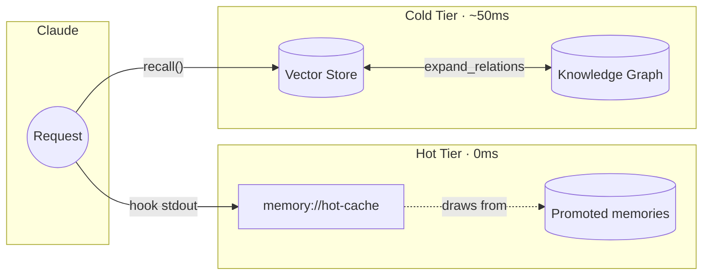

# Memory MCP - Project Instructions

## Core Value Proposition

**The Engram Insight**: Frequently-used patterns should be instantly available, not searched for.

This project differentiates from generic memory servers (like mcp-memory-service) through:

1. **Two-Tier Memory Architecture**
   - **Hot Cache**: Session-aware context printed into Claude's context at 0ms by the
     `SessionStart` and `UserPromptSubmit` hooks (no tool call needed)
   - **Cold Storage**: Semantic search for everything else

2. **Salience-Based Promotion**
   - Unified salience score: importance + trust + access count + recency
   - Auto-promote when salience ≥ 0.5 AND access count ≥ 3
   - Auto-demote after 14 days without access
   - Pin important memories to prevent auto-eviction

3. **Hot Cache Resource**
   - `memory://hot-cache`: Session-aware active context (~10 items)
   - Combines: recently recalled, predicted next, top promoted items
   - Backed by promoted memories (~20 items)

4. **Multi-Hop Recall**
   - `expand_relations=true` traverses knowledge graph
   - Finds associated memories via typed relationships
   - Score decay prevents dilution of results

5. **Episodic Memory**
   - Session-bound short-term context (7-day retention)
   - `end_session()` promotes top memories to long-term storage
   - Consolidates session context automatically

6. **Knowledge Graph**
   - Link related memories with typed relationships
   - Relation types: `relates_to`, `depends_on`, `contradicts`, `supersedes`, `refines`, `elaborates`

7. **Trust Management**
   - Strengthen/weaken memory confidence with contextual reasons
   - Per-memory-type trust decay rates
   - Audit trail for trust changes

8. **Memory Consolidation**
   - `consolidate` CLI merges semantically similar memories
   - Reduces redundancy while preserving information

## Architecture



## Key Files

| Path | Purpose |
|------|---------|
| `.claude-plugin/` | Plugin and marketplace manifests only |
| `commands/`, `skills/` | Plugin components, which Claude Code loads from the plugin root |
| `src/memory_mcp/server/` | MCP server package (tools, resources) |
| `src/memory_mcp/storage/` | Storage package (SQLite, vectors, hot cache) |
| `src/memory_mcp/cli.py` | CLI commands |
| `src/memory_mcp/config.py` | Settings and bootstrap file detection |

## Plugin-First Approach

The Claude Code plugin is the primary distribution. Its manifest lives in
`.claude-plugin/plugin.json`, and every component sits at the repo root, because
Claude Code does not look inside `.claude-plugin/` for components:

- **Slash commands** (`/memory-mcp:*`) - 10 commands in `commands/`
- **Hooks** - SessionStart and UserPromptSubmit (print the hot cache for injection),
  Stop (mark used memories, then run hot cache maintenance), PreCompact (`end_session`)
- **Skills** - recall-nudge, which prompts a `recall` call on retrospective questions

Users install via `claude plugins add michael-denyer/memory-mcp`.
The CLI (`memory-mcp-cli`) and MCP tools power the plugin internally.

## Key Features by Version

### v0.7.x (Current)
- **Renamed resources for clarity**: `working-set` → `hot-cache`, `hot-cache` → `promoted-memories`
- **Hot cache is primary injection**: Session-aware context (~10 items), printed by
  `memory-mcp-cli hot-cache` from the `SessionStart` and `UserPromptSubmit` hooks
- **Promoted memories backing store**: ~20 items, disabled by default
- **Beads integration**: `import-beads` CLI command to seed memories from beads issues
- **Dynamic versioning**: Version pulled from pyproject.toml via importlib.metadata

See [CHANGELOG.md](CHANGELOG.md) for full version history.

## CLI Entrypoints

Two separate entrypoints exist - don't confuse them:

```bash
# MCP server (stdio transport) - used by Claude Code
memory-mcp

# CLI tools (dashboard, bootstrap, consolidate, etc.)
memory-mcp-cli dashboard --port 8050
memory-mcp-cli bootstrap
memory-mcp-cli consolidate
memory-mcp-cli import-beads      # Import beads issues as memories
```

## Testing

```bash
uv run pytest -v              # All tests
uv run pytest -k hot          # Hot cache tests only
uv run pytest -k bootstrap    # Bootstrap tests
uv run pytest -k relationship # Knowledge graph tests
uv run ruff check .           # Lint
uv run ruff format .          # Format
```

## Design Principles

### Zero-Config by Default

**The system must work out of the box with no configuration.** This is non-negotiable.

- All defaults should be optimized for immediate value
- `auto_promote=True`, `auto_demote=True`
- One embedding provider, `sentence-transformers`, with no backend to pick
- Bootstrap from project docs with one `memory-mcp-cli bootstrap` run (`auto_bootstrap` is off
  by default, and no hook runs it)
- Configuration exists for power users, not as a requirement


<!-- Content truncated to meet Windsurf 6KB limit -->

---
> Source: [michael-denyer/memory-mcp](https://github.com/michael-denyer/memory-mcp) — distributed by [TomeVault](https://tomevault.io).
<!-- tomevault:4.0:windsurf_rules:2026-09-22 -->
