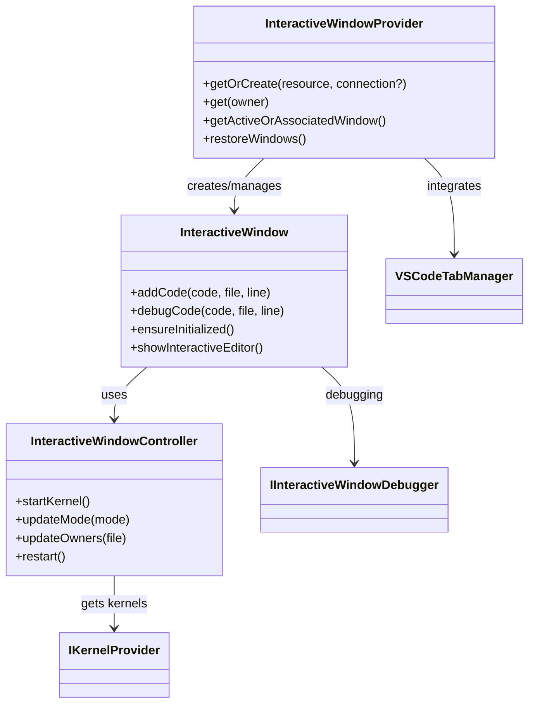

# Interactive Window System Architecture

The `src/interactive-window` directory contains the core components responsible for providing a REPL-like experience that bridges traditional Python files with notebook-style execution. This system enables users to execute code cells marked with `#%%` directly from Python files in a notebook-like interface.

## Project Structure and Organization

The Interactive Window system follows a modular architecture with clear separation between editor integration, window management, and debugging:

```
src/interactive-window/
├── types.ts                           # Core interfaces and types
├── interactiveWindow.ts               # Main window implementation
├── interactiveWindowProvider.ts       # Window factory and registry
├── interactiveWindowController.ts     # Kernel and lifecycle management
├── serviceRegistry.{node,web}.ts      # Dependency injection registration
├── editor-integration/               # Python file integration
│   ├── codeLensFactory.ts            # "Run Cell" code lenses
│   ├── codeWatcher.ts                # File monitoring and execution
│   ├── cellMatcher.ts                # Cell boundary detection
│   └── generatedCodeStorage*.ts      # Source mapping for debugging
├── debugger/                         # Debugging capabilities
│   ├── interactiveWindowDebugger.ts  # Main debugger integration
│   ├── debuggingManager.ts           # Session management
│   └── helper.ts                     # Debug utilities
└── commands/                         # User commands and API
    ├── commandRegistry.ts            # Command registration
    └── export.ts                     # Export functionality
```

## Core Components

### 1. Window Management System

**Interactive Window Provider** (`interactiveWindowProvider.ts`):

-   Central factory for creating and managing Interactive Window instances
-   Handles window-to-file associations and workspace persistence
-   Manages window lifecycle (creation, restoration, disposal)
-   Tracks active windows and ownership relationships

**Interactive Window** (`interactiveWindow.ts`):

-   Core ViewModel representing a single Interactive Window instance
-   Manages notebook document integration and cell execution
-   Provides debugging capabilities and kernel lifecycle management
-   Handles code transformation from Python files to notebook cells

**Interactive Window Controller** (`interactiveWindowController.ts`):

-   Manages kernel selection, startup, and lifecycle for Interactive Windows
-   Handles system info cell management and kernel restart logic
-   Tracks owner file associations for kernel context



### 2. Editor Integration System (`editor-integration/`)

**Code Watcher** (`codeWatcher.ts`):

-   Monitors Python files for code cells marked with `#%%`
-   Provides execution capabilities for individual cells or entire files
-   Handles various execution modes (run cell, run all, debug, etc.)
-   Manages cell navigation and manipulation

**Code Lens Factory** (`codeLensFactory.ts`):

-   Creates "Run Cell" and "Debug Cell" code lenses for Python files
-   Detects cell boundaries and provides performance monitoring
-   Handles cell range caching for large files
-   Integrates with VS Code's code lens API

**Cell Matcher** (`cellMatcher.ts`):

-   Parses Python files to identify code cell boundaries
-   Extracts cell ranges and metadata from cell markers
-   Handles different cell marker formats (`#%%`, `# %%`, etc.)
-   Provides cell navigation utilities

**Generated Code Storage** (`generatedCodeStorage*.ts`):

-   Manages mapping between source Python files and generated notebook cells
-   Tracks code generation for debugging support
-   Maintains source maps for breakpoint handling
-   Provides storage for generated code metadata

### 3. Debugging System (`debugger/`)

**Interactive Window Debugger** (`interactiveWindowDebugger.node.ts`):

-   Provides debugging capabilities for Interactive Window code execution
-   Attaches to kernels for debugging and manages source maps
-   Handles debugger protocol communication with Python debugger (debugpy)
-   Enables/disables tracing for step debugging


<!-- Content truncated to meet Windsurf 6KB limit -->

---
> Source: [microsoft/vscode-jupyter](https://github.com/microsoft/vscode-jupyter) — distributed by [TomeVault](https://tomevault.io).
<!-- tomevault:4.0:windsurf_rules:2026-07-27 -->
