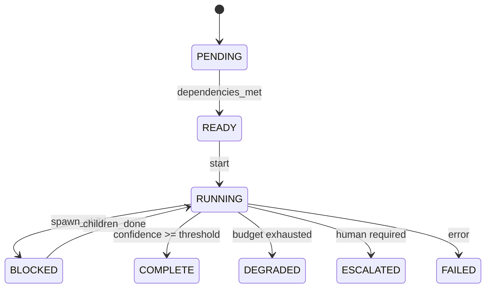

# CLAUDE.md

This file provides guidance to Claude Code (claude.ai/code) when working with code in this repository.

## Project Overview

GOTN (Goal-Oriented Task Network) is a recursive workflow orchestration framework that unifies knowledge acquisition, artifact production, decision-making, and validation under a single abstraction: the **WorkNode**.

## Build & Run

```bash
# Create virtual environment and install
uv venv
uv pip install -e ".[dev]"

# Run CLI
gotn --help
gotn init "Your goal" --mode epistemic
gotn run --continuous
gotn status --tree

# Run tests
pytest tests/
```

The CLI is installed as `gotn` and provides commands for initializing goal trees, running nodes, checking status, and managing the workflow.

## Architecture

The core insight: questions and objectives are the same thing at different abstraction levels. A question is an objective with `deliverable_type: knowledge`; a build task produces `artifact`; a decision produces `commitment`; a validation produces `verification`.

### Three-Layer WorkNode Structure
1. **Intent Layer**: Goal statement, acceptance criteria, parent relationship, production_anchor
2. **Evidence Layer**: Claims (propositions with confidence + domain for decay), supporting evidence, aggregated confidence score
3. **Control Layer**: Autonomy gate (confidence threshold for auto-proceed), budget constraints, resource_usage tracking, exit policies, escalation_context

### Node Modes
- **Epistemic** (Research): Acquires knowledge to reduce uncertainty
- **Instrumental** (Build): Produces artifacts (code, content, configs)
- **Decision**: Makes binding choices that downstream work depends on
- **Validation**: Verifies artifacts or claims against acceptance criteria

### State Machine
Nodes follow a formal lifecycle with event-driven transitions:



Key transitions:
- `dependencies_met`: pending → ready
- `start`: ready → running (if within MAX_CONCURRENT_NODES)
- `spawn_child`: running → blocked
- `children_done`: blocked → running
- `cancel`: any non-terminal → cancelled (cascades to children)

### Key Control Mechanisms
- **Shipping Gates**: Research must terminate in Decision nodes to prevent infinite exploration
- **VOI Gating**: Value-of-Information check before spawning research (is it worth the cost?)
- **Confidence Aggregation**: Per-criterion confidence scores combine to determine autonomy
- **Global Circuit Breakers**: MAX_DEPTH=5, MAX_NODES=200, MAX_EPISTEMIC_RATIO=0.4, MAX_CONCURRENT_NODES=10
- **Semantic Cache**: Hierarchical L1 (exact-match) + L2 (vector similarity) with context fingerprint

### DAG Edge Types
| Edge Type | Blocking? | Cycle Detection | Behavior |
|-----------|-----------|-----------------|----------|
| `depends_on` | Yes | Included | Must complete before source starts |
| `blocks` | Conditional | Included | Risk monitoring; triggers escalation on failure |
| `informs` | No | Excluded | Opportunistic waiting; retroactive integration |
| `enables` | No | Excluded | Unlocks target when source completes |
| `spawned_by` | N/A | Excluded | Parent-child; cascades cancellation |
| `supersedes` | N/A | Excluded | Replaces old node; migrates dependencies |

## Documentation Structure

```
docs/
├── architecture.md      # Complete GOTN specification with state machine
├── worknode-schema.md   # TypeScript/JSON/YAML interface definitions (comprehensive)
├── mechanisms.md        # Control mechanisms (shipping gates, VOI, caching, etc.)
└── examples/
    └── bedtime-story-pipeline.md  # Worked example with full node definitions
```

## Implementation Structure

```
src/gotn/
├── __init__.py       # Package exports
├── node.py           # WorkNode Pydantic models (Goal, Criterion, Budget, etc.)
├── state.py          # State machine + StateManager persistence
├── scheduler.py      # DAG scheduling with priority queue, cycle detection
├── executor.py       # Claude Code subprocess execution
├── confidence.py     # Confidence aggregation with recency decay
├── cache.py          # Semantic cache (L1 exact + L2 vector similarity)
└── cli.py            # Typer CLI (gotn command)

src/prompts/          # Mode-specific prompt templates
.claude/skills/       # Claude Code skill for /gotn command
```

### Key Implementation Details

- **node.py**: Complete Pydantic models matching worknode-schema.md
- **state.py**: Event-driven state machine with InvalidTransition exceptions
- **scheduler.py**: Priority queue (decision > instrumental > validation > epistemic)
- **executor.py**: Runs `claude --print --dangerously-skip-permissions` subprocess
- **confidence.py**: Weighted aggregation, recency decay by ClaimDomain
- **cache.py**: SQLite + sentence-transformers for semantic similarity

## When Implementing

- Refer to `docs/worknode-schema.md` for complete TypeScript interfaces and JSON Schema
- The confidence model uses weighted aggregation where `must_pass` criteria use minimum, others use weighted mean
- Exit states: `complete`, `degraded`, `escalated`, `failed`, `cancelled`
- Production anchor pattern: epistemic nodes should specify `production_anchor` for what they enable
- Claims require a `domain` field for proper recency decay calculation
- ResourceUsage tracks actual consumption (time_ms, tokens, steps, cost_dollars)
- Edge semantics: `blocks` and `depends_on` both participate in deadlock prevention

---
> Converted and distributed by [TomeVault](https://tomevault.io/claim/mikewrather)
> This is a context snippet only. You'll also want the standalone SKILL.md file — [download at TomeVault](https://tomevault.io/claim/mikewrather)
<!-- tomevault:4.0:windsurf_rules:2026-04-08 -->
