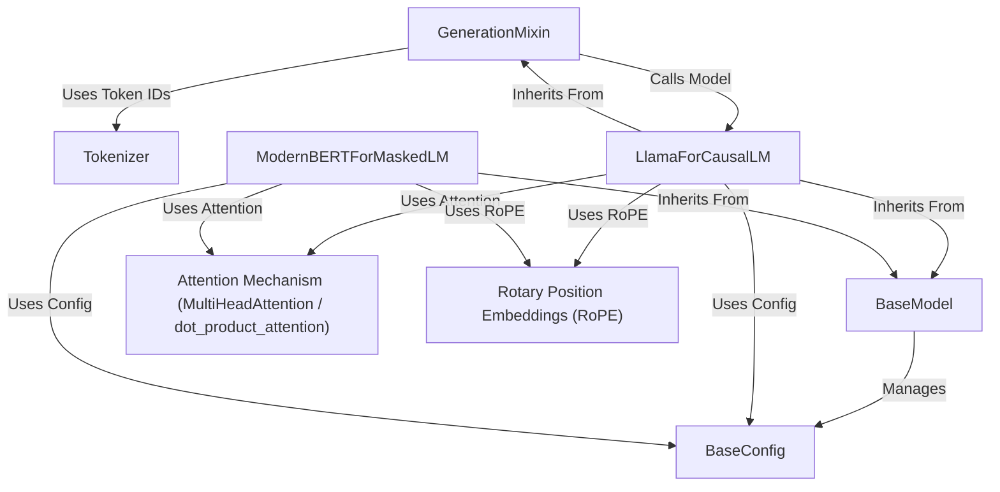

---
description: Guidelines for using jaxgarden
globs: 
alwaysApply: true
---
The `jaxgarden` project provides a library for building and utilizing neural network models, primarily focused on **Transformer architectures**, using *JAX* and *Flax NNX*. It establishes a structured framework through abstract base classes: `BaseModel` defines the core model interface, including state management (parameters, mutable states via `nnx.State`), checkpointing (*Serialization*) with Orbax, and a standardized mechanism for importing and converting weights from Hugging Face's *Safetensors* format. `BaseConfig` offers a consistent way to manage model hyperparameters (*Configuration Management*).

The library implements specific models like `LlamaForCausalLM` (a decoder-only model) and `ModernBERTForMaskedLM` (an encoder model), showcasing modern techniques. Key architectural components are modularized:
- `Attention Mechanism`: Provides multi-head attention, potentially leveraging hardware acceleration like *Flash Attention* via cuDNN backend selection in `dot_product_attention`.
- `Rotary Position Embeddings (RoPE)`: Implements relative position encoding within the attention mechanism itself, used by both Llama and ModernBERT variants.

Functionality includes:
- **Text Generation**: The `GenerationMixin` adds autoregressive text generation capabilities to causal models like Llama, supporting various sampling strategies (temperature, top-k, top-p, min-p) and efficient implementation via `jax.lax.scan`.
- **Tokenization**: A `Tokenizer` class wraps the Hugging Face `tokenizers` library, providing a JAX-friendly API for encoding/decoding text and applying chat templates.
- **Interoperability**: Facilitates using pretrained models from the Hugging Face Hub.

Overall, `jaxgarden` aims for high performance and *modularity*, enabling researchers and developers to work with modern NLP models within the JAX ecosystem, promoting *code reuse* and *extensibility* through its base classes and focused components.

**Source Repository:** [https://github.com/ml-gde/jaxgarden.git](https://github.com/ml-gde/jaxgarden.git)

## Chapters

[Tokenizer](tokenizer.mdc)
[BaseModel](basemodel.mdc)
[BaseConfig](baseconfig.mdc)
[LlamaForCausalLM](llamaforcausallm.mdc)
[GenerationMixin](generationmixin.mdc)
[ModernBERTForMaskedLM](modernbertformaskedlm.mdc)
[Attention Mechanism (MultiHeadAttention / dot_product_attention)](attention_mechanism__multiheadattention___dot_product_attention_.mdc)
[Rotary Position Embeddings (RoPE)](rotary_position_embeddings__rope_.mdc)

---

Generated by [Rules for AI](https://github.com/altaidevorg/rules-for-ai)

---
> Source: [ml-gde/jaxgarden](https://github.com/ml-gde/jaxgarden) — distributed by [TomeVault](https://tomevault.io).
<!-- tomevault:4.0:windsurf_rules:2026-05-22 -->
