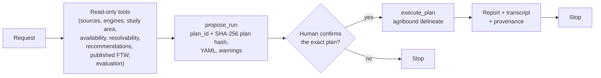

# Agent Layer

The optional agent layer lets a language model plan an agribound run from a
natural-language request. It is opt-in (`pip install "agribound[agent]"`,
which installs `anthropic` and `mcp`) and works at a deliberately low level of
autonomy:

1. the model investigates with **read-only tools** and proposes **one**
   configuration as a plan (`propose_run`);
2. a **human reviews the full plan** and approves or denies that exact plan;
3. at most **one** approved plan runs per session (`execute_plan` →
   `agribound.pipeline.delineate`);
4. the session **stops** after the run or the denial, without another model
   turn. There is no automatic re-run, re-tuning or retry; another run needs a
   new request by the human.

The deterministic `delineate()` API and CLI remain the way to run scripted,
reproducible pipelines; a plan is an ordinary configuration YAML that
`agribound delineate --config` runs without the agent.



## Usage

```python
import agribound

result = agribound.agent(
    "Delineate fields in this area for 2024 with a label-free approach",
    study_area="area.geojson",
    gee_project="my-gee-project",
)
print(result.status)  # "executed", "denied", "completed", ...
print(result.report)  # deterministic summary written by agribound, not by the model
```

```bash
agribound agent "Delineate fields in this area for 2024 with a label-free approach" \
    --study-area area.geojson --gee-project my-gee-project
agribound agent "..." --study-area area.geojson --dry-run     # plan YAML only, never executes
```

`agribound.agent(...)` and `agribound.agent.agent(...)` are the same call.
Importing `agribound.agent` does not import `anthropic`, `mcp` or `pydantic`;
a missing dependency is reported when a session starts
(`AgentDependencyError`, an `ImportError` with the install hint).

Main arguments (CLI flags in parentheses):

| Argument | Meaning |
|---|---|
| `request` | natural-language request |
| `study_area` (`--study-area`), `gee_project` (`--gee-project`), `reference_boundaries` (`--reference`) | defaults the tools use |
| `model` (`--model`) | model ID; default `$AGRIBOUND_AGENT_MODEL`, else `claude-opus-5` |
| `base_url` (`--base-url`) | Anthropic-compatible endpoint (see [Local models](#local-models)) |
| `dry_run` (`--dry-run`) | do not offer `execute_plan`; plans are written as YAML |
| `workdir` (`--workdir`) | session directory; default `./agribound_agent/<session id>` |
| `max_turns` (`--max-turns`, 20) | maximum model responses |
| `allow_network=False` (`--offline`) | see [Offline sessions](#offline-sessions) |
| `confirm` | Python only: `None` (typed prompt when standard input is a terminal, else deny every plan), `"prompt"`, `"deny"`, or a callable `confirm(plan) -> bool` |
| `max_executions` | Python only: execution limit of the gate (default 1); the loop stops after the first execution attempt whatever the value |

The CLI has no option to skip the confirmation. Without an interactive
terminal it refuses to start unless `--dry-run` is given.

`AgentResult` holds `status` (`completed`, `executed`, `execution_failed`,
`denied`, `refused`, `max_tokens`, `max_turns`, `error`), the model's last
text, the deterministic `report`, the plans and their YAML paths, the
executions, and the transcript path.

## Tools

The same typed tools (`agribound.agent.tools.TOOL_SPECS`, pydantic input and
output models) drive the local loop and the MCP server.

| Tool | Kind | What it does |
|---|---|---|
| `list_sources` | read-only | sources with resolutions, years, coverage, value scale, Earth Engine/restricted access |
| `list_engines` | read-only | engines with approach, `label_free`, `fine_tunable`, supported sources, bands, references, notes (`source_notes` for notes that apply to one source only), and whether their package is installed |
| `describe_study_area` | read-only | area, bounding box, centroid, UTM zones, and the estimated composite size per source |
| `check_availability` | read-only | registry year ranges and coverage; with `live=True`, Earth Engine image counts or TESSERA tile counts over the study area |
| `estimate_resolvability` | read-only | pixels per field (area / GSD²) per source and the share of fields (by count and area) the SAM stage would refine, from one of: a reference layer (default: the session's), published FTW polygons (one prediction year, the latest unless `year` is given), or a representative field area |
| `recommend_configurations` | read-only | ranks (source, engine) candidates with deterministic, documented rules (years, restrictions, US-only coverage, engine-source support, label availability, resolution); every rule is listed in the output; it does not predict accuracy |

<!-- Content truncated to meet Windsurf 6KB limit -->

---
> Source: [montimaj/agribound](https://github.com/montimaj/agribound) — distributed by [TomeVault](https://tomevault.io).
<!-- tomevault:4.0:windsurf_rules:2026-10-04 -->
