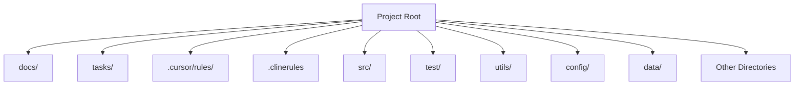

---
description: the top-level directory structure for the project
globs: 
alwaysApply: false
---     
# Directory Structure

---
> Converted and distributed by [TomeVault](https://tomevault.io/claim/mrfansi) — claim your Tome and manage your conversions.
<!-- tomevault:4.0:windsurf_rules:2026-04-13 -->
