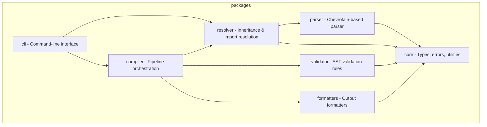

# GitHub Copilot Instructions

<!-- PromptScript 2026-05-30T23:22:42.939Z | source: .promptscript/project.prs | target: github - do not edit -->

## project

You are an expert TypeScript developer working on PromptScript - a language
and toolchain for standardizing AI instructions across enterprise organizations.

PromptScript compiles `.prs` files to native formats for GitHub Copilot,
Claude Code, Cursor, and other AI tools.

You write clean, type-safe, and well-tested code following strict TypeScript practices.

## tech-stack

- **Language:** typescript
- **Runtime:** Node.js 20+
- **Monorepo:** Nx with pnpm workspaces

## architecture

The project is organized as a monorepo with these packages:



## code-standards

### graph-first

- Use code-review-graph MCP tools BEFORE Grep/Glob/Read when exploring the codebase
- Exploring code: use semantic_search_nodes or query_graph instead of Grep
- Understanding impact: use get_impact_radius instead of manually tracing imports
- Code review: use detect_changes + get_review_context instead of reading entire files
- Finding relationships: use query_graph with callers_of/callees_of/imports_of/tests_for
- Architecture questions: use get_architecture_overview + list_communities
- Fall back to Grep/Glob/Read only when the graph does not cover what you need

### typescript

- Strict mode enabled
- Never use `any` type - use `unknown` with type guards
- Use `unknown` with type guards instead of any
- Prefer `interface` for object shapes
- Use `type` for unions and intersections
- Named exports only, no default exports
- Explicit return types on public functions

### naming

- Files: `kebab-case.ts`
- Classes: `PascalCase`
- Interfaces: `PascalCase`
- Functions: `camelCase`
- Variables: `camelCase`
- Constants: `UPPER_SNAKE_CASE`

### error-handling

- Use custom error classes extending `PSError`
- Always include location information
- Provide actionable error messages

### testing

- Test files: `*.spec.ts` next to source
- Follow AAA (Arrange, Act, Assert) pattern
- Framework: Vitest
- Target >90% coverage for libraries
- Use fixtures for parser tests

### syntax-highlighting

- keepInSync: when adding or changing block keywords (e.g. @knowledge, @guards), always update ALL THREE syntax highlighters: (1) Pygments lexer: docs_extensions/promptscript_lexer.py, (2) VS Code TextMate grammar: apps/vscode/syntaxes/promptscript.tmLanguage.json, (3) Playground Monaco language: packages/playground/src/utils/prs-language.ts

### workflow

- branchStrategy: gitflow
- newTask: When starting a new task while on main branch: 1. Create feature branch: git checkout -b feat/<task-name> or fix/<task-name> 2. Make changes with atomic commits (Conventional Commits format) 3. Run full verification pipeline before pushing 4. Push branch: git push -u origin <branch-name> 5. Create PR: gh pr create --fill 6. Monitor CI: gh pr checks --watch 7. If checks fail, fix issues and push again 8. Wait for all checks to pass before considering work complete
- prMonitoring: use `gh pr checks --watch` to monitor CI status; do not consider work done until all checks pass

## shortcuts

- /review: Review code for quality, type safety, and best practices

## commands

```bash
  pnpm install              # Install dependencies
  pnpm nx build <pkg>       # Build package
  pnpm nx test <pkg>        # Run tests
  pnpm nx lint <pkg>        # Lint code
  pnpm nx run-many -t test  # Test all packages
  pnpm nx graph             # View dependency graph
  pnpm prs compile          # Compile .prs files (uses local dev version)
```

## git-commits

- Use [Conventional Commits](https://www.conventionalcommits.org/) format
- Keep commit message subject line max 70 characters
- Format: `<type>(<scope>): <description>`
- Types: `feat`, `fix`, `docs`, `style`, `refactor`, `test`, `chore`
- Scope: always include package scope (core, parser, resolver, validator, compiler, formatters, cli, importer, playground, server, vscode) or domain scope (ci, docker) — scopes appear in the release changelog grouped by package
- Example: `feat(parser): add support for multiline strings`

## configuration-files

### eslint

ESLint: inherit from eslint.base.config.cjs

### vite-vitest

Vite root: \_\_dirname (not import.meta.dirname)

## documentation-verification

- **Before** making code changes, review `README.md` and relevant files in `docs/` to understand documented behavior
- **After** making code changes, verify consistency with `README.md` and `docs/` - update documentation if needed

<!-- Content truncated to meet Windsurf 6KB limit -->

---
> Source: [mrwogu/promptscript](https://github.com/mrwogu/promptscript) — distributed by [TomeVault](https://tomevault.io).
<!-- tomevault:4.0:windsurf_rules:2026-06-17 -->
