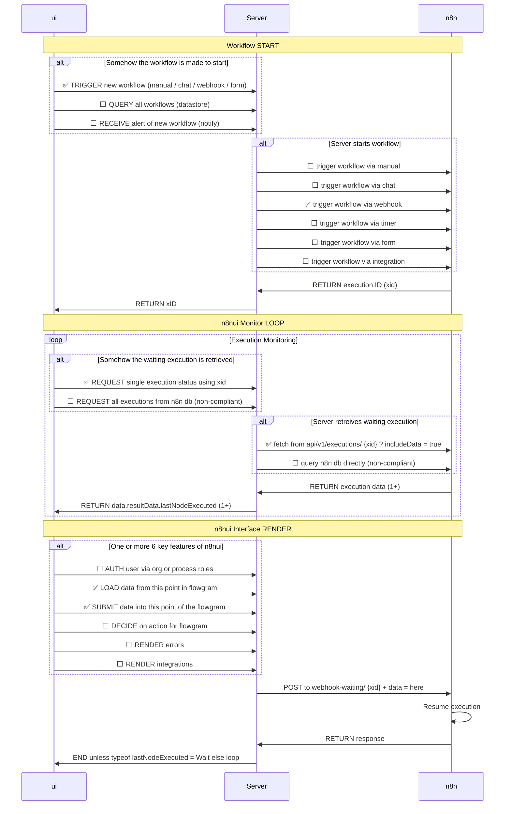

# CLAUDE.md

This file provides guidance to Claude Code (claude.ai/code) when working with code in this repository.

## Project Overview
This is a simple Express.js demo showcasing the core pattern for n8n integration with custom UIs. The integration follows a specific flow based on n8n execution IDs and Wait nodes.

## Key n8n Concepts
- Every n8n flow is assigned a unique **Execution ID** (**`xid`**) on start
- Running flows have a JSON representation available via **`api/v1/executions/{xid}`**
- Every Wait node exposes the same **`resumeUrl`** (you can also append a custom suffix)
  - format is **`https://N8N_SERVER/webhook-waiting/{xid}`**
- Wait nodes respond to webhooks either **(a)** immediately or **(b)** later using Respond to Webhook

## Key n8n Integration Pattern
1. We choose to start our flow in any way (webhook, timer, trigger, subflow … it doesn't matter)
2. We get `xid` (via webhook response on start, via lookup in some datastore, or query n8n db directly)
3. We use n8n API to fetch execution via **`api/v1/executions/{xid}?includeData=true`**
4. JSON includes the **`data.resultData.lastNodeExecuted`**
5. We use `lastNodeExecuted` to lookup a UUID of the node and map it to the proper UI/UX

## Flow Diagram

## Code Style Guidelines
- Maintain the core integration pattern described above
- Use environment variables for n8n connection settings (.env)
- Handle webhook responses and execution status properly
- Implement proper error handling for API calls
- Log API calls and execution progress for debugging
- Use consistent JSON formatting for data sent to resume Wait nodes

---
> Source: [n8nui/examples](https://github.com/n8nui/examples) — distributed by [TomeVault](https://tomevault.io).
<!-- tomevault:4.0:windsurf_rules:2026-05-22 -->
