# xbot - 智能微信机器人系统

> **本文档为 AI 辅助开发优化而设计**
> 最后更新：2026-01-22 18:38:56

---

## ⚠️ 重要：AI 开发规范

### 强制使用 auto-doc 技能

**所有代码变更必须使用 `/auto-doc` 技能自动维护文档**

当进行以下操作时，**必须**在完成后立即调用 `/auto-doc`：

- ✅ 创建新文件
- ✅ 修改现有文件
- ✅ 删除文件
- ✅ 移动/重命名文件
- ✅ 重构代码结构

**使用方法**：
```bash
# 在完成代码修改后执行
/auto-doc
```

**auto-doc 技能说明**：详见 [/auto-doc/SKILL.md](/auto-doc/SKILL.md)

**为什么强制使用**：
- 📝 自动维护三层文档体系（ARCHITECTURE.md、INDEX.md、文件头注释）
- 🔄 确保文档与代码同步
- 🎯 提升代码可维护性
- 📚 为后续 AI 辅助开发提供准确上下文

---

## 📋 变更记录 (Changelog)

### 2026-01-22 18:38:56 - 文档同步：路由契约与统计对齐
- **对齐当前事实**：更新统计数据、关键路径与示例语义（排除 plugins/ 文档）
- **补充管理后台说明**：新增路由注册中心（registry.py）与契约自检工具（tools/route_audit.py）指引
- **修正文档偏差**：对齐 WebChat API 端点说明；修正 README 插件示例返回值语义（True=继续，False=停止）

### 2026-01-22 10:44:12 - 项目文档更新
- **完成全仓清点**：识别 8 个核心模块，12 个插件目录
- **统计数据更新**：186 个配置/代码文件，46,733 行 Python 代码，152 个 Python 文件
- **文档覆盖率**：8/8 核心模块已有 CLAUDE.md（100% 覆盖）
- **导航体系**：所有模块文档已包含面包屑导航
- **Mermaid 图表**：根级文档已包含完整的模块结构图

### 2026-01-22 09:27:29 - 项目文档初始化完成
- **完成全仓清点**：识别 8 个核心模块，13 个插件目录
- **统计数据更新**：188 个配置/代码文件，47,271 行 Python 代码
- **文档覆盖率**：8/8 核心模块已有 CLAUDE.md（100% 覆盖）
- **导航体系**：所有模块文档已包含面包屑导航
- **Mermaid 图表**：根级文档已包含完整的模块结构图

### 2026-01-20 - 统一依赖注入机制
- **修复系统更新功能**：解决"更新进度管理器不可用"错误
- **新增 `init_app_state()` 函数**：统一管理所有全局依赖注入
- **修复导入路径**：修正 `admin.update_with_progress` 模块导入
- **优化依赖管理**：所有依赖通过 `app.state` 统一获取
- **更新文档**：添加依赖注入机制说明到 admin/CLAUDE.md

### 2026-01-20 12:42:09 - 核心模块文档更新（排除插件）
- **新增 bot_core/ 模块文档**：详细说明重构后的 7 个子模块（约 983 行）
- **更新 adapter/ 模块文档**：补充 base.py 基类说明（约 3,170 行）
- **更新 utils/ 模块文档**：更新代码统计（32 个文件，约 9,263 行）
- **确认其他模块文档**：WechatAPI、database、admin 模块文档已完善
- **代码统计更新**：核心模块（不含插件）约 132 个 Python 文件

### 2026-01-19 21:10:00 - 架构文档重构
- **聚焦核心架构**：简化插件系统描述，突出核心模块
- **更新模块统计**：113 个核心 Python 文件，56 个插件
- **优化 Mermaid 图**：清晰展示核心模块关系
- **补充容器化信息**：Docker 部署与 Redis 集成

### 2026-01-18 20:57:24 - 初始化 AI 上下文文档
- 创建根级 CLAUDE.md 及模块级文档
- 完成项目结构扫描与架构分析
- 建立模块索引与导航体系

---

## 🎯 项目愿景

xbot 是一个**基于微信协议的智能机器人系统**，通过插件化架构和多平台适配器设计，提供了以下核心能力：

- **智能对话**：集成多种 AI 平台（Dify、OpenAI、FastGPT、SiliconFlow 等）
- **插件生态**：内置 13 个插件（`plugins/`），并支持通过插件市场扩展更多能力
- **多协议支持**：支持 pad/ipad/mac/ipad2/car/win 等多种微信协议版本
- **管理后台**：基于 FastAPI + Bootstrap 5 的 Web 管理界面
- **容器化部署**：Docker + Docker Compose 开箱即用

**设计哲学**：通过事件驱动的插件系统与优先级调度机制，实现灵活、可扩展、高可维护性的机器人服务。

---

## 🏗️ 架构总览

### 技术栈

| 层级 | 技术选型 |
|------|----------|
| **语言** | Python 3.11+ |
| **Web 框架** | FastAPI + Uvicorn |
| **数据库** | SQLite (aiosqlite) + SQLAlchemy ORM |
| **缓存** | Redis (aioredis) |
| **消息队列** | RabbitMQ (可选，aio_pika) |
| **任务调度** | APScheduler (AsyncIOScheduler) |
| **日志系统** | Loguru |
| **前端** | Bootstrap 5 + Chart.js + Vue 3 |
| **容器化** | Docker + Docker Compose |
| **微信协议** | xywechatpad-binary (多版本支持) |

### 核心架构原则

- **SOLID**：单一职责、开闭原则、依赖倒置
- **DRY**：代码复用通过 `utils/` 模块与基类实现
- **KISS**：插件通过装饰器快速开发，降低心智负担
- **YAGNI**：功能通过插件按需启用，核心保持精简

### 系统分层

```
┌─────────────────────────────────────────┐
│        Web 管理后台 (FastAPI)           │
│    - 插件管理 - 文件管理 - 监控面板      │
├─────────────────────────────────────────┤
│       适配器层 (Adapter Layer)          │
│  QQ | Telegram | Web | Windows         │
├─────────────────────────────────────────┤
│        核心调度 (bot_core/)             │
│  - 消息路由 - 事件分发 - 优先级队列      │
├─────────────────────────────────────────┤
│       插件系统 (Plugin System)          │
│  13 个内置插件 | 装饰器驱动 | 热加载支持  │
├─────────────────────────────────────────┤
│     WechatAPI 客户端 (封装层)           │
│  好友 | 群聊 | 朋友圈 | 红包 | 登录      │
├─────────────────────────────────────────┤
│      数据持久化 (Database Layer)        │
│  SQLite | Redis | KeyvalDB | MessageDB │
└─────────────────────────────────────────┘
```

---

## 📊 模块结构图

```mermaid
graph TD
    A["xbot 项目根目录"] --> B["核心引擎"];
    A --> C["插件系统"];
    A --> D["管理后台"];
    A --> E["适配器层"];
    A --> F["基础设施"];

    B --> B1["bot_core/<br/>986 行 | 核心调度引擎"];
    B --> B2["main.py<br/>477 行 | 程序入口"];
    B --> B3["WechatAPI/<br/>微信客户端封装"];

    C --> C1["plugins/<br/>13 个内置插件"];
    C --> C2["utils/plugin_manager.py<br/>581 行 | 插件管理器"];
    C --> C3["utils/plugin_base.py<br/>插件基类"];

    D --> D1["admin/server.py<br/>279 行 | FastAPI 后台"];
    D --> D2["admin/routes/<br/>模块化路由"];
    D --> D3["admin/static/<br/>前端资源"];

    E --> E1["adapter/qq<br/>QQ 适配器"];
    E --> E2["adapter/tg<br/>Telegram 适配器"];
    E --> E3["adapter/web<br/>Web 适配器"];
    E --> E4["adapter/win<br/>Windows 适配器"];

    F --> F1["database/<br/>数据持久化"];
    F --> F2["utils/<br/>工具模块"];
    F --> F3["Docker<br/>容器化部署"];

    click B1 "./bot_core/CLAUDE.md" "查看核心调度文档"
    click C1 "./plugins/CLAUDE.md" "查看插件系统文档"
    click D1 "./admin/CLAUDE.md" "查看管理后台文档"
    click E1 "./adapter/CLAUDE.md" "查看适配器文档"
    click F1 "./database/CLAUDE.md" "查看数据层文档"
    click F2 "./utils/CLAUDE.md" "查看工具模块文档"
    click B3 "./WechatAPI/CLAUDE.md" "查看 WechatAPI 文档"

    style B1 fill:#e1f5ff
    style D1 fill:#fff3e0
    style C2 fill:#f3e5f5
    style E1 fill:#e8f5e9
```



---

## 📚 模块索引

| 模块路径 | 职责 | 核心文件 | 代码量 | 文档链接 |
|---------|------|----------|--------|---------|
| **核心引擎** | 启动编排、消息调度、插件协调 | `bot_core/` | 986 行（7 文件） | [详细文档](./bot_core/CLAUDE.md) |
| **主程序** | 启动流程、配置管理、监控重启 | `main.py` | 477 行 | - |
| **WechatAPI/** | 微信协议封装（好友/群聊/朋友圈） | `Client/*.py` | 12 个文件 | [详细文档](./WechatAPI/CLAUDE.md) |

<!-- Content truncated to meet Windsurf 6KB limit -->

---
> Source: [NanSsye/xbot](https://github.com/NanSsye/xbot) — distributed by [TomeVault](https://tomevault.io).
<!-- tomevault:4.0:windsurf_rules:2026-05-06 -->
