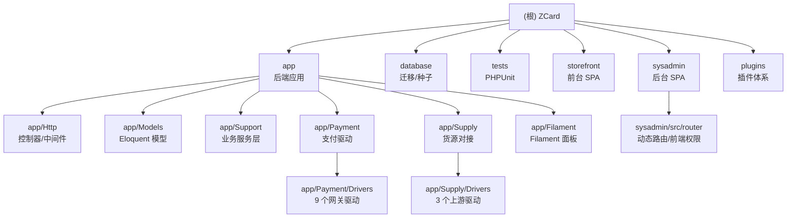

# ZCard — AI 上下文索引（根）

> 本文件由 `init-project` 自动生成，供 AI 助手快速建立全局认知。
> 生成时间：2026-08-04 21:06:24 ｜ 仓库版本：`VERSION` = **1.9.5**

---

## 项目愿景

ZCard 是一套**现代化自动发卡 / 虚拟商品销售平台**，目标是替代传统 PHP 发卡系统（如 acg-faka、独角数卡），
以 **Laravel 13 + PHP 8.3 + Filament 5 + Vue 3** 的现代技术栈提供：

- **API-First**：所有业务能力先落在 `app/Support` 服务层与 `routes/api.php`，后台（Filament / sysadmin SPA）与前台（storefront SPA）都只是 API 的消费者。
- **开箱即用的商业化能力**：多货币、多语言、三级分销、分站/白标、优惠券、会员等级、在线更新、Web 安装向导。
- **可对接的生态位**：既能作为**下游**从上游货源（独角数卡 / acg-faka / 另一套 ZCard）拿货，也能作为**上游**对外提供供货 API（HMAC 签名）。
- **Open Core 预留**：`config/zcard.php` 中的 `features.*` 开关用于区分开源版与商业版功能。

法律声明与部署说明见 `README.md`；详细设计规格与迭代计划见 `docs/superpowers/`。

---

## 架构总览

### 分层

| 层 | 位置 | 说明 |
|---|---|---|
| 入口/路由 | `bootstrap/app.php`、`routes/api.php`、`routes/web.php` | 中间件装配、SPA 回退、全部 REST 端点 |
| HTTP 接口层 | `app/Http/Controllers`（45）、`app/Http/Middleware`（11） | 薄控制器，只做参数校验 + 调服务层 |
| 业务服务层 | `app/Support`（22 个 Service） | **真正的业务真理源**，Filament 与 API 共用 |
| 支付适配层 | `app/Payment`（2 契约 + 1 值对象 + 9 驱动） | `PaymentDriver` 接口，统一 `pay()` / `verifyCallback()` |
| 货源适配层 | `app/Supply`（契约 + 3 个驱动 + 编排服务，共 18 文件） | `SupplyDriver` 接口 + HMAC 签名 + Nonce 防重放 |
| 数据层 | `app/Models`（32 个模型）、`database/migrations`（68 个迁移） | 金额一律以「分」整数存储 |
| 事件/异步 | `app/Events`、`app/Listeners`、`app/Jobs` | `OrderPaid` 为核心事件，挂 5 个监听器 |
| 管理端 | `app/Filament`（Filament v5 面板，`/filament`） + `sysadmin/`（Vue3 SPA，`/admin`） | 两套后台并存：Filament 为开发期 CRUD，sysadmin 为正式后台 |
| 前台 | `storefront/`（Vue3 + Tailwind v4 SPA，`/`） | 编译产物落到 `public/storefront/` |
| 插件 | `plugins/` | Phase 2 规划中，当前仅骨架、未接入 |

### 关键运行链路

**下单 → 支付 → 发货**

```
POST /api/orders           OrderService::createOrder()   锁卡(lockForUpdate) → order(pending)
POST /api/payments/create  PaymentService::createPayment() → PaymentDriver::pay()
POST /api/payments/callback/{channel}
                           PaymentService::handleCallback() → verifyCallback + 金额核对 + 幂等
                           → event(OrderPaid)
                              ├─ DeliveryService              本地卡密发货（status/delete 两模式）
                              ├─ FetchFromUpstreamOnOrderPaid 上游商品去货源拿货
                              ├─ CommissionService            三级分销发佣
                              ├─ SubsiteSettlementService     分站利润入账本
                              └─ UpgradeUserGroupOnOrderPaid  会员等级升级
```

**对外供货 API（本站作上游）**：`/api/supply/*`，四头签名
`X-Supply-Key / X-Supply-Timestamp / X-Supply-Nonce / X-Supply-Signature`，
由 `SupplyAuth` + `SupplyRateLimit` 中间件守卫，签名串见 `app/Supply/HmacSigner.php`。

### 模块结构图



---

## 模块索引

| 模块路径 | 语言/技术 | 一句话职责 | 文档 |
|---|---|---|---|
| `app/` | PHP 8.3 / Laravel 13 | 后端应用总入口，聚合下列子模块（214 个 PHP 文件） | [AGENTS.md](./app/AGENTS.md) |
| `app/Http/` | PHP | 45 个控制器 + 11 个中间件，REST API 与 SPA 回退 | [AGENTS.md](./app/Http/AGENTS.md) |
| `app/Models/` | PHP / Eloquent | 32 个数据模型，金额以「分」存储 | [AGENTS.md](./app/Models/AGENTS.md) |
| `app/Support/` | PHP | 22 个业务服务（订单/支付/发货/分销/分站/货币/卡密…） | [AGENTS.md](./app/Support/AGENTS.md) |
| `app/Payment/` | PHP | 支付契约 + 9 个网关驱动（支付宝/微信/Stripe/易支付/USDT…） | [AGENTS.md](./app/Payment/AGENTS.md) |
| `app/Supply/` | PHP | 货源对接：3 个上游驱动 + HMAC 签名 + 同步/拿货编排 | [AGENTS.md](./app/Supply/AGENTS.md) |
| `app/Filament/` | PHP / Filament v5 | 开发期 CRUD 面板（`/filament`），Resources/Pages/Widgets | [AGENTS.md](./app/Filament/AGENTS.md) |
| `database/` | PHP / SQL | 68 个迁移 + 3 个 Seeder + 1 个 Factory | [AGENTS.md](./database/AGENTS.md) |
| `tests/` | PHP / PHPUnit 12 | 36 个测试文件，Unit + Feature 双套件 | [AGENTS.md](./tests/AGENTS.md) |
| `storefront/` | Vue 3 + Vite 8 + Tailwind v4 | 顾客前台 SPA，产物 → `public/storefront/` | [AGENTS.md](./storefront/AGENTS.md) |

<!-- Content truncated to meet Windsurf 6KB limit -->

---
> Source: [NovaWorks/ZCard](https://github.com/NovaWorks/ZCard) — distributed by [TomeVault](https://tomevault.io).
<!-- tomevault:4.0:windsurf_rules:2026-09-24 -->
