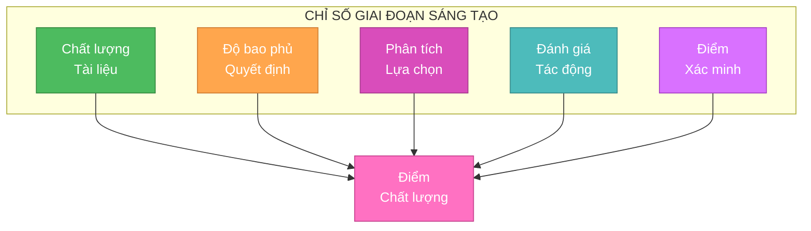
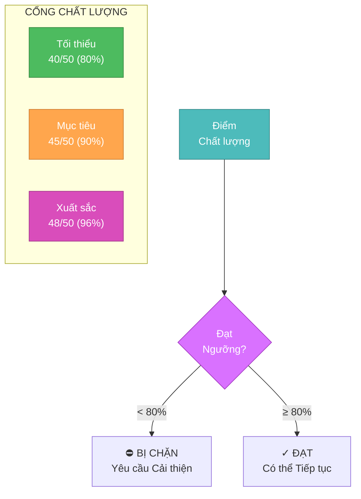
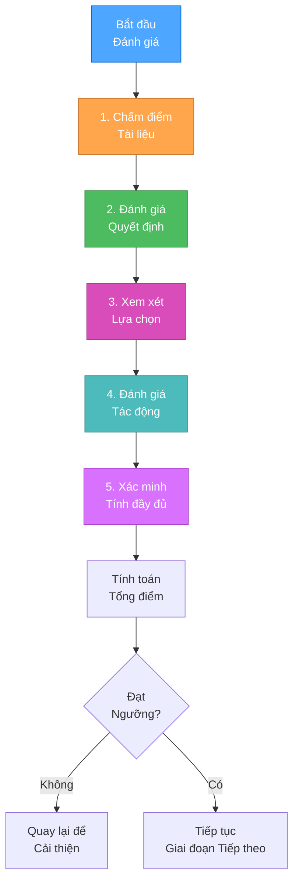

# CHỈ SỐ GIAI ĐOẠN SÁNG TẠO

> **TL;DR:** Tài liệu này xác định các chỉ số chất lượng toàn diện và tiêu chí đo lường cho các giai đoạn sáng tạo, đảm bảo rằng các quyết định thiết kế đáp ứng các tiêu chuẩn yêu cầu và được ghi lại đúng cách.

## 📊 TỔNG QUAN CHỈ SỐ



## 📋 BẢNG ĐIỂM CHỈ SỐ CHẤT LƯỢNG

```markdown
# Đánh giá Chất lượng Giai đoạn Sáng tạo

## 1. Chất lượng Tài liệu [0-10]
- [ ] Phát biểu vấn đề rõ ràng (2 điểm)
- [ ] Mục tiêu được xác định rõ (2 điểm)
- [ ] Danh sách yêu cầu toàn diện (2 điểm)
- [ ] Định dạng và cấu trúc phù hợp (2 điểm)
- [ ] Tham chiếu chéo đến các tài liệu liên quan (2 điểm)

## 2. Độ bao phủ Quyết định [0-10]
- [ ] Tất cả quyết định cần thiết được xác định (2 điểm)
- [ ] Mỗi điểm quyết định được ghi lại (2 điểm)
- [ ] Phụ thuộc được lập bản đồ (2 điểm)
- [ ] Phân tích tác động được bao gồm (2 điểm)
- [ ] Các cân nhắc tương lai được ghi chú (2 điểm)

## 3. Phân tích Lựa chọn [0-10]
- [ ] Nhiều lựa chọn được xem xét (2 điểm)
- [ ] Ưu/nhược điểm được ghi lại (2 điểm)
- [ ] Tính khả thi kỹ thuật được đánh giá (2 điểm)
- [ ] Nhu cầu tài nguyên được ước tính (2 điểm)
- [ ] Yếu tố rủi ro được xác định (2 điểm)

## 4. Đánh giá Tác động [0-10]
- [ ] Tác động hệ thống được ghi lại (2 điểm)
- [ ] Ảnh hưởng hiệu suất được đánh giá (2 điểm)
- [ ] Các cân nhắc bảo mật được giải quyết (2 điểm)
- [ ] Tác động bảo trì được đánh giá (2 điểm)
- [ ] Ảnh hưởng chi phí được phân tích (2 điểm)

## 5. Điểm Xác minh [0-10]
- [ ] Yêu cầu được lần vết (2 điểm)
- [ ] Ràng buộc được xác nhận (2 điểm)
- [ ] Kịch bản kiểm thử được xác định (2 điểm)
- [ ] Phản hồi đánh giá được kết hợp (2 điểm)
- [ ] Xác minh cuối cùng được hoàn thành (2 điểm)

Tổng điểm: [Tổng tất cả các danh mục] / 50
Điểm Tối thiểu Yêu cầu: 40/50 (80%)
```

## 📈 NGƯỠNG CHẤT LƯỢNG



## 🎯 QUY TRÌNH ĐÁNH GIÁ CHỈ SỐ



## 📊 KHUYẾN NGHỊ CẢI THIỆN

Cho điểm dưới ngưỡng:

```markdown
## Cải thiện Chất lượng Tài liệu
- Thêm phát biểu vấn đề rõ ràng
- Bao gồm mục tiêu cụ thể
- Liệt kê tất cả yêu cầu
- Cải thiện định dạng
- Thêm tham chiếu chéo

## Cải thiện Độ bao phủ Quyết định
- Xác định quyết định còn thiếu
- Ghi lại tất cả điểm quyết định
- Lập bản đồ phụ thuộc
- Thêm phân tích tác động
- Xem xét hệ quả tương lai

## Cải thiện Phân tích Lựa chọn
- Xem xét thêm lựa chọn thay thế
- Chi tiết ưu/nhược điểm
- Đánh giá tính khả thi kỹ thuật
- Ước tính nhu cầu tài nguyên
- Xác định rủi ro

## Cải thiện Đánh giá Tác động
- Ghi lại tác động hệ thống
- Đánh giá hiệu suất
- Giải quyết vấn đề bảo mật
- Đánh giá bảo trì
- Phân tích chi phí

## Cải thiện Xác minh
- Lần vết yêu cầu
- Xác nhận ràng buộc
- Xác định kịch bản kiểm thử
- Kết hợp phản hồi
- Hoàn thành xác minh
```

## ✅ DANH SÁCH KIỂM TRA XÁC MINH CHỈ SỐ

```markdown
## Xác minh Trước Đánh giá
- [ ] Tất cả các phần được chấm điểm
- [ ] Tính toán được xác minh
- [ ] Bằng chứng hỗ trợ được đính kèm
- [ ] Các lĩnh vực cải thiện được xác định
- [ ] Phản hồi đánh giá được kết hợp

## Xác minh Chỉ số Cuối cùng
- [ ] Đạt điểm tối thiểu
- [ ] Tất cả các danh mục đều đạt
- [ ] Tài liệu đầy đủ
- [ ] Các cải thiện được giải quyết
- [ ] Có được phê duyệt cuối cùng
```

## 🔄 QUẢN LÝ TÀI LIỆU

```mermaid
graph TD

<!-- Content truncated to meet Windsurf 6KB limit -->

---
> Converted and distributed by [TomeVault](https://tomevault.io/claim/nvkhai603) — claim your Tome and manage your conversions.
<!-- tomevault:4.0:windsurf_rules:2026-04-09 -->
