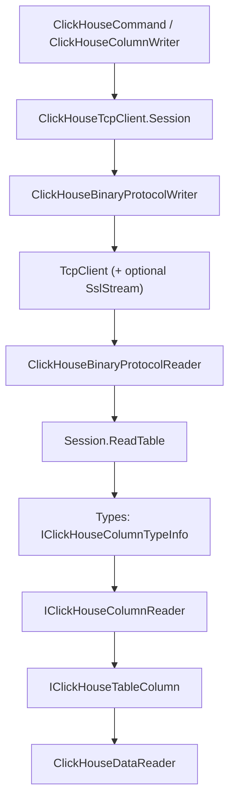

# AGENTS.md

Orientation for AI agents working in this repository.

For anything about the contribution process itself — bug reports, licensing headers, the changelog,
dependencies — read [CONTRIBUTING.md](CONTRIBUTING.md) before you start editing. It also contains a
block of instructions specifically for agents.

## What this is

`Octonica.ClickHouseClient` is a .NET driver for [ClickHouse](https://clickhouse.com/), exposed as an
ADO.NET provider (`DbConnection` / `DbCommand` / `DbDataReader` / `DbProviderFactory`).

It speaks the **ClickHouse native TCP binary protocol** (port 9000 by default), not HTTP. This matters
more than anything else here: almost every non-trivial bug is a wire-format bug. The protocol is
versioned by a revision number that the client advertises during the handshake, and the server uses
that number to decide which wire features it may use. The current value lives in
[ClickHouseProtocolRevisions.cs](src/Octonica.ClickHouseClient/Protocol/ClickHouseProtocolRevisions.cs)
as `CurrentRevision`. Raising it makes the server enable more features, so the client must be able to
read everything below it.

## Projects

All three live under [src](src) and are in [Octonica.ClickHouseClient.sln](src/Octonica.ClickHouseClient.sln).

* `Octonica.ClickHouseClient` — the library. Targets `net6.0`, `net8.0` and `net10.0`.
  `Nullable` is enabled, `TreatWarningsAsErrors` is on, and `GenerateDocumentationFile` is on.
* `Octonica.ClickHouseClient.Tests` — xUnit v3. Targets `net8.0` and `net10.0`. Most tests need a
  live server; see [CONTRIBUTING.md](CONTRIBUTING.md) for how to point them at one. Pass `--framework`
  so the two TFMs do not run against that server at once. The library grants the test assembly
  `InternalsVisibleTo`, so internal classes can be tested directly.
* `Octonica.ClickHouseClient.Benchmarks` — BenchmarkDotNet.

## Repository layout

Within `src/Octonica.ClickHouseClient`:

* **Root namespace** — the public ADO.NET surface plus the transport. `ClickHouseConnection`,
  `ClickHouseCommand`, `ClickHouseDataReader`, `ClickHouseColumnWriter` (the proprietary bulk-insert
  API), `ClickHouseParameter`, `ClickHouseConnectionStringBuilder`, and the socket-level
  `ClickHouseTcpClient`, `ClickHouseBinaryProtocolReader` and `ClickHouseBinaryProtocolWriter`.
* **`Protocol/`** — the wire format. Client and server message classes, message codes, block header and
  field codes, LZ4 compression, CityHash, and the revision constants.
* **`Types/`** — the ClickHouse type system. The largest folder by far.
* **`Utils/`** — internal helpers: buffers, read-only list adapters, type dispatch, timezones, TLS.
* **`Exceptions/`** — the exception hierarchy and `ClickHouseErrorCodes`.

## Query flow

A `Session` is one unit of work on the connection, guarded by a semaphore so only one query runs at a
time. `ClickHouseCommand` substitutes parameters, builds a `ClientQueryMessage`, and hands it to
`Session.SendQuery`; the response is read message by message until a data block arrives, and
`Session.ReadTable` turns that block into columns.

The transport layer is deliberately type-agnostic: it reads a column's name, type name and
serialization mode, then asks the type registry for a reader and feeds bytes into it. If you are
fixing how a *value* is decoded, you want `Types/`. If you are fixing block framing, message order or
compression, you want the root and `Protocol/`.

## Type system

Each ClickHouse type is a small family of cooperating classes:

* `XxxTypeInfo : SimpleTypeInfo` (or `IClickHouseColumnTypeInfo` directly) — metadata plus factories.
  Parametric types like `Array(T)` or `Nullable(T)` implement `GetDetailedTypeInfo` to parse their
  arguments.
* An `IClickHouseColumnReader` — decodes bytes from a `ReadOnlySequence<byte>` and produces a table
  column in `EndRead`. A skipping variant discards the data instead.
* An `IClickHouseColumnWriter` — encodes .NET values into a `Span<byte>`.
* An `XxxTableColumn : IClickHouseTableColumn<T>` — the in-memory column that `ClickHouseDataReader`
  reads values from.

To add a type, write those four and register the type info in
`ClickHouseTypeInfoProvider.GetDefaultTypes()` in
[ClickHouseTypeInfoProvider.cs](src/Octonica.ClickHouseClient/Types/ClickHouseTypeInfoProvider.cs).
Types whose behavior depends on the server (timezones, revision-gated formats) are reconfigured
through `Configure(serverInfo)` when the connection opens.

Columns may arrive under a non-default serialization mode (sparse, replicated, and combinations of
them). Those are handled by `CustomSerializationColumnReader`, which reads the mode prefix and then

<!-- Content truncated to meet Windsurf 6KB limit -->

---
> Source: [Octonica/ClickHouseClient](https://github.com/Octonica/ClickHouseClient) — distributed by [TomeVault](https://tomevault.io).
<!-- tomevault:4.0:windsurf_rules:2026-09-24 -->
