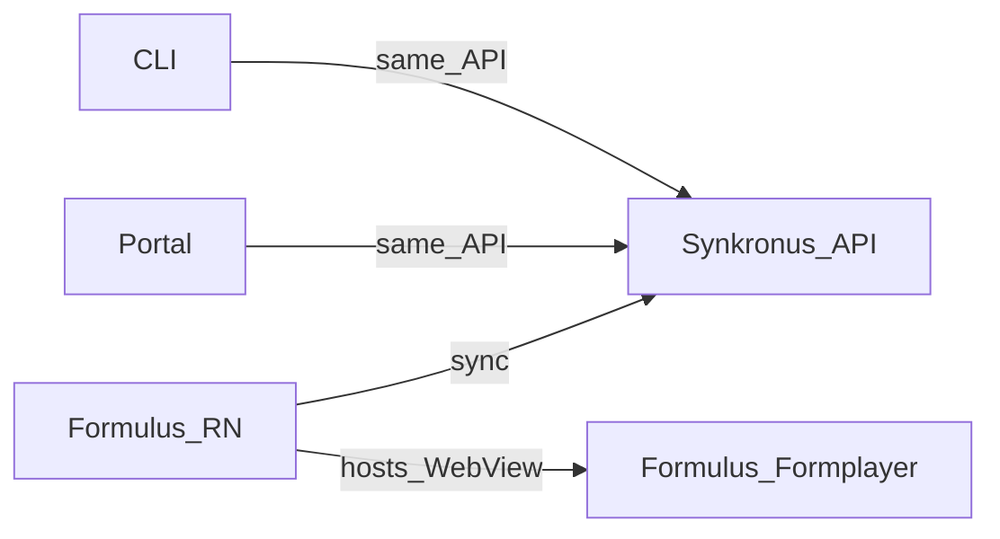

# Open Data Ensemble (ODE) — AI and developer guide

This monorepo contains the core platform for **offline-first data collection** and **synchronization**. Use this file when you work across packages or need the big picture. For deep dives, open the **`AGENTS.md`** in the package you are changing.

**Published architecture (users and external readers):** [Architecture overview](https://opendataensemble.org/docs/getting-started/architecture-overview) on [opendataensemble.org](https://opendataensemble.org/).

---

## Ecosystem map

ODE is a **clearinghouse** model: data is collected on devices, synchronized through **Synkronus**, and is intended to **flow through** the system for local analysis and stewardship—not to live only on the server.

- **Formulus** — React Native mobile app: runs forms (JSON Forms) and **custom app bundles** in WebViews, offline-first, syncs with Synkronus.
- **Formulus Formplayer** — React web app embedded in Formulus: renders forms inside a WebView; shares the same bridge contract as custom apps.
- **Synkronus** — Go backend: auth, sync, app bundle distribution, export, shared HTTP API.
- **Synkronus Portal** — Web admin UI (React + Vite): same API as other clients; no privileged backend channel.
- **Synkronus CLI** — `synk` command-line client: automation, bundles, sync, export.
- **ODE Desktop** — Tauri app: **Data management** + **Forms / app workbench**; source in [`desktop/`](desktop/). See [ROADMAP.md](ROADMAP.md).

**Design principle:** [One backend, many clients](https://opendataensemble.org/docs/getting-started/architecture-overview) — prefer the public API for all user-facing tools.

---

## User profiles (what to optimize for)

| Profile | Typical focus | Where to work |
|--------|----------------|---------------|
| **Platform developer** | You are editing **this repo**: RN, Go, React, shared packages, CI. | Package `AGENTS.md` below. |
| **Custom app author** | You ship an **HTML/JS/CSS** app bundle and JSON forms for Formulus; you may **not** clone this monorepo. | [Custom app template (AI + author context)](https://github.com/OpenDataEnsemble/custom_app), [documentation](https://opendataensemble.org/docs/), and [FORM_LOCALIZATION_GUIDE.md](FORM_LOCALIZATION_GUIDE.md) for form i18n. |

Do not assume custom app authors have local checkouts of **ODE** or internal example repos.

---

## Monorepo layout

| Package | Role | Stack | Agent guide |
|---------|------|-------|-------------|
| [formulus](formulus/) | Mobile runtime, WebViews, native bridge | React Native | [formulus/AGENTS.md](formulus/AGENTS.md) |
| [formulus-formplayer](formulus-formplayer/) | Form UI in WebView | React, Vite, JSON Forms | [formulus-formplayer/AGENTS.md](formulus-formplayer/AGENTS.md) |
| [synkronus](synkronus/) | Sync API and coordination | Go | [synkronus/AGENTS.md](synkronus/AGENTS.md) |
| [synkronus-cli](synkronus-cli/) | CLI for API operations | Go | [synkronus-cli/AGENTS.md](synkronus-cli/AGENTS.md) |
| [synkronus-portal](synkronus-portal/) | Web administration | React, TypeScript, Vite | [synkronus-portal/AGENTS.md](synkronus-portal/AGENTS.md) |
| [packages/tokens](packages/tokens/) | Design tokens (`@ode/tokens`) | Style Dictionary | [packages/tokens/AGENTS.md](packages/tokens/AGENTS.md) |
| [packages/components](packages/components/) | Shared UI (`@ode/components`) | React | [packages/components/AGENTS.md](packages/components/AGENTS.md) |
| [desktop](desktop/) | Data management + Forms / app workbench (Tauri) | React, Rust | [desktop/AGENTS.md](desktop/AGENTS.md) |

---

## Release version bump checklist

Use this when preparing a new ODE release (pre-release or stable). Full tagging and CI behaviour: [RELEASE.md](RELEASE.md). Android Play/F-Droid `versionCode` rules: [formulus/android/ANDROID_RELEASE.md](formulus/android/ANDROID_RELEASE.md).

### Pre-release vs stable

| Layer | Pre-release (e.g. `v1.1.1-alpha.3`) | Stable (e.g. `v1.1.1`) |
|-------|--------------------------------------|-------------------------|
| Client manifests (`package.json`, `versionName`, CLI, Desktop, Portal) | Target semver **without** suffix (`1.1.1`) | Same (`1.1.1`) |
| Git tag + GitHub release | `v1.1.1-alpha.3` (mark **pre-release**) | `v1.1.1` |
| Synkronus Docker / server `BuildVersion()` | From release tag via CI ldflags | From release tag |

For stable, you usually **do not** re-bump client manifests if they already match the target version; bump Android `versionCode` only when shipping a new Play build.

### What to edit

| File | Field | Purpose |
|------|-------|---------|
| `formulus/package.json` | `version` | Source for `ODE_VERSION` / `x-ode-version` ([`formulus/src/version.ts`](formulus/src/version.ts)) |

<!-- Content truncated to meet Windsurf 6KB limit -->

---
> Source: [OpenDataEnsemble/ode](https://github.com/OpenDataEnsemble/ode) — distributed by [TomeVault](https://tomevault.io).
<!-- tomevault:4.0:windsurf_rules:2026-07-25 -->
